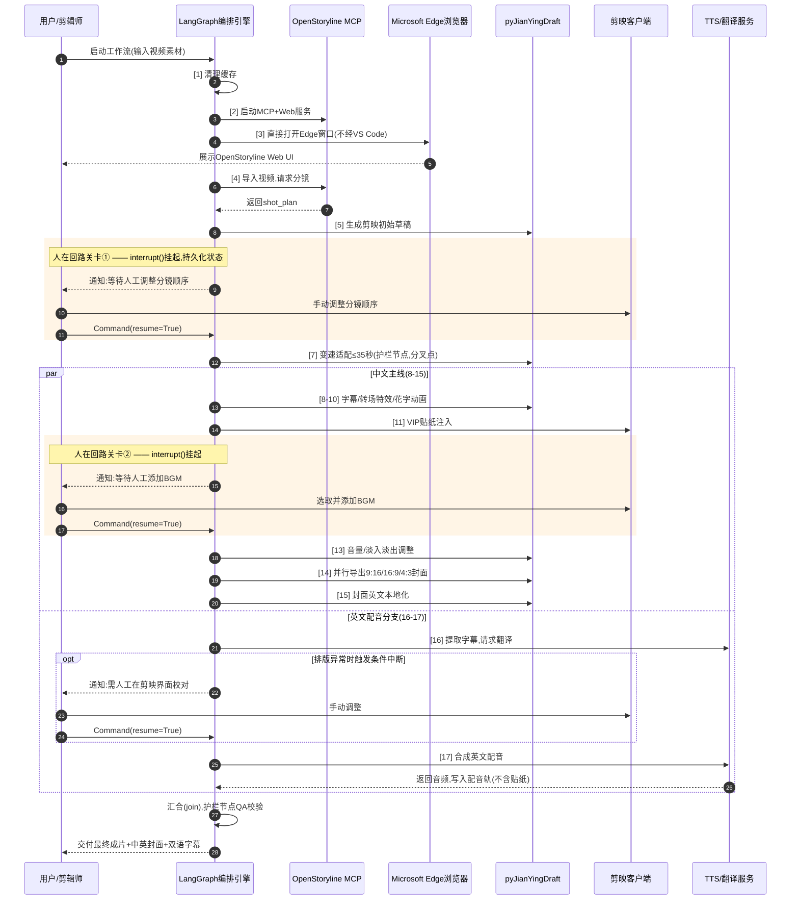
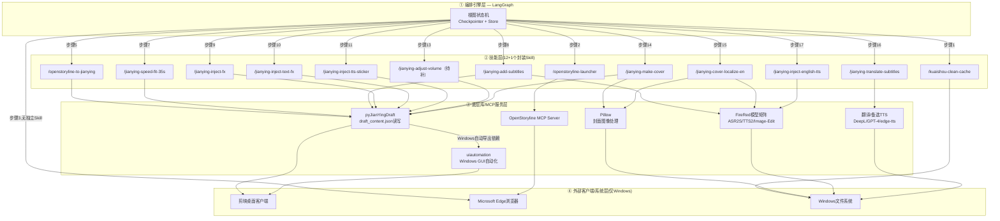

# AI视频剪辑自动化工作流开发执行计划

> 本文档整合 6 份参考 md 文档，并按本轮讨论确定的 4 项架构变更重新生成，作为可直接落地的开发执行计划。另有 1 份 docx 附件（框架对比与工作流规划）已通读，其核心推荐（Grok Build 框架）已被本文档的技术选型取代，仅作背景参考，未纳入正式技术栈。
>
> **v2 更新**：新增第14节，整合《AI视频剪辑自动化工作流环境确认与组件选型评估.md》与《AI视频剪辑自动化工作流第三方视频Skills生态评估.md》两份补充分析文档的核心结论（本地剪映环境确认、第三方组件与Skills生态评估），并同步更新第1、11、12、13.2节的相应条目；两份补充文档均明确不改变本文档已确定的正式技术栈选型，第2节架构总览、第6节剪映草稿操作层技术细节、第9-10节两张流程图保持不变。

## 1. 变更摘要与来源文档说明

本轮讨论确定的 4 项架构变更：

| 编号 | 变更内容 | 替代对象 |
|---|---|---|
| 变更① | OpenStoryline Web UI 通过独立 Microsoft Edge 浏览器窗口直接访问 | VS Code 的 Microsoft Edge DevTools 插件 |
| 变更② | 宏观编排引擎统一使用 LangGraph，承担全部 17 步流程编排（含人工关卡挂起/恢复） | Temporal |
| 变更③ | 全流程仅在 Windows 平台运行 | 原 Windows/Linux 混合架构 |
| 变更④ | 全部自动化代码使用纯 Python 实现 | 原方案中作为假设性顾虑提出的 .NET SDK（如 FlaUI） |

参考来源文档：

1. `video-editing-orchestration-rfc.md` —— 原始 RFC，含 17 步依赖关系与并行结构分析
2. `deep-research-report.md` —— 原始执行计划与技术选型、错误处理策略
3. `AI视频剪辑自动化工作流技术栈组件汇总.md` —— 技术栈全量汇总
4. `宏观编排引擎从Temporal迁移到LangGraph的要点与优缺点.md` —— 编排引擎迁移风险分析
5. `AI_Agent_框架与视频剪辑工作流编排.md` —— 开源 Agent 框架横向对比与编排架构设计
6. `AI视频剪辑工作流编排.md` —— 剪映草稿底层结构映射、加密防护与部署运维建议
7. `AI视频剪辑自动化工作流环境确认与组件选型评估.md` —— 本地剪映版本确认（v5.9.0）与5个第三方组件（capcut-cli/CapCutAPI/VectCutAPI/JianYing MCP Server/SmartCut MCP Server）选型评估，结论见第14节
8. `AI视频剪辑自动化工作流第三方视频Skills生态评估.md` —— 腾讯云开发者社区文章《一览7个视频合成Skills》中7个开源项目的横向对照评估，重点展开jianying-editor-skill，结论见第14节

---

## 2. 架构总览

| 组件 | 本次选型 | 相对旧方案的变化 | 说明 |
|---|---|---|---|
| 宏观编排引擎 | **LangGraph**（Checkpointer + Store 双层持久化） | 替代 Temporal，见变更② | 承担 17 步全流程编排，含 3 个人在回路关卡 |
| 剪映草稿操作 | pyJianYingDraft | 不变 | 直接读写 `draft_content.json`，微秒级时间戳，模板模式绕过 VIP 限制 |
| 前端预览/调试 | 独立 Microsoft Edge 浏览器窗口 | 替代 VS Code Edge DevTools 插件，见变更① | 交互场景手动打开；无人值守场景由 Playwright `channel: 'msedge'` 驱动同一浏览器内核 |
| GUI 自动化 | Python `uiautomation` | 排除 .NET/FlaUI，见变更④ | 与原技术选型一致，本次明确排除了曾被提出的 .NET 备选路径 |
| 运行环境 | 纯 Windows | 排除 Linux，见变更③ | 剪映客户端本身即 Windows 专属功能完整；不再需要跨系统任务派发 |
| AI 模型底座 | FireRed 系列（OpenStoryline / ASR2S / TTS2 / Image-Edit） | 不变 | 需验证 Windows 原生部署路径，见第 11 节风险清单 |
| 状态持久化 | 开发：`AsyncSqliteSaver`；生产：`PostgresSaver` | 不变 | LangGraph Checkpointer 后端 |
| 长期记忆 | LangGraph Store | 不变 | 跨视频复用验证过的转场风格/字幕样式/BGM 偏好等"剪辑技能" |
| 互操作协议 | MCP（+ 可选 A2A） | 不变 | 统一 OpenStoryline / 剪映 / TTS / 翻译服务的调用接口 |

**关键说明**：变更②（Temporal→LangGraph）原本在风险分析文档中被列出 5 个坑，但变更③（仅 Windows）与变更④（不用 .NET）分别直接消解了其中"Windows/Linux 排班"和"接入 .NET 代码"这两个坑——四项变更放在一起看，比单独评估"是否换编排引擎"更站得住脚。剩余 3 个坑及应对方案见第 5.2 节。

---

## 3. 17 步工作流总表

| 步骤 | 名称 | 执行模式 | 调用技能/机制 | 备注 |
|---|---|---|---|---|
| 1 | 清理旧缓存 | 全自动（工具节点） | `/kuaishou-clean-cache` | 清理剪映/OpenStoryline/系统临时目录 |
| 2 | 启动 OpenStoryline 服务 | 全自动（启动节点） | `/openstoryline-launcher` | 拉起 MCP Server + Web 前端（FastAPI/uvicorn） |
| 3 | 打开前端预览 | 全自动（编排器直接动作，**无独立 Skill**） | 直接调用 Microsoft Edge | **变更①**：不再经 VS Code 插件，编排引擎直接打开 Edge 窗口指向 Web 前端地址 |
| 4 | 导入视频并输出分镜 | 全自动（Agent+工具节点） | OpenStoryline 内置 VLM 规划 | 输出 shot_plan（分镜 JSON） |
| 5 | 生成剪映初始草稿 | 全自动（工具节点） | `/openstoryline-to-jianying` | 经 pyJianYingDraft 写入 `draft_content.json` |
| 6 | 人工调整分镜顺序 | **人在回路（强制中断）** | LangGraph `interrupt()` | 关卡①，恢复经 `Command(resume=True)` |
| 7 | 变速适配 ≤35 秒 | 全自动（护栏节点） | `/jianying-speed-fit-35s` | 硬约束校验，违例重试；**分叉点**（产出快照②，见第4节） |
| 8 | 添加字幕 | 全自动（工具节点） | `/jianying-add-subtitles` | 依赖 FireRedASR2S 时间戳文本 |
| 9 | 注入转场/特效 | 全自动（工具节点） | `/jianying-inject-fx` | 模板复制注入绕过 VIP 限制 |
| 10 | 字幕花字与动画 | 全自动（工具节点） | `/jianying-inject-text-fx` | 描边/投影/入场动画等样式参数 |
| 11 | 字幕贴纸关联 | 全自动（工具节点） | `/jianying-inject-tts-sticker` | 与对应字幕 target_timerange 对齐 |
| 12 | 人工添加 BGM | **人在回路（强制中断）** | LangGraph `interrupt()` | 关卡②，可由节拍同步推荐辅助 |
| 13 | 调整音量/淡入淡出 | 全自动（工具节点） | `/jianying-adjust-volume`（**当前缺口，需补齐**） | 原方案未列出对应 Skill，建议按统一命名规范补齐 |
| 14 | 制作多维度封面 | 全自动（并行工具节点） | `/jianying-make-cover` | 9:16 剪映内生成，16:9/4:3 本地 Pillow 渲染，三分支并发 |
| 15 | 封面英文本地化 | 全自动（本地模型节点） | `/jianying-cover-localize-en` | 依赖步骤 14 产出；FireRed-Image-Edit 无痕擦除+重绘 |
| 16 | 字幕翻译为英文 | **混合模式（条件中断）** | `/jianying-translate-subtitles` | 与 8-15 并行（依赖步骤7快照②）；排版异常时触发 interrupt |
| 17 | 注入英文 AI 配音 | 全自动（生成+工具节点） | `/jianying-inject-english-tts` | FireRedTTS2 合成，禁用贴纸；动态变速补偿音画时长差 |

---

## 4. 依赖关系与并行结构

步骤 1-7 为严格线性依赖；步骤 7 完成（产出"快照②"）后，流程分叉为两条相互独立、可并行执行的分支，最终在交付前汇合：

- **中文主线**（8→9→10→11→12(人工)→13→14→15）：依次完成字幕、特效、花字、贴纸、人工 BGM、音量、封面、封面本地化。
- **英文配音分支**（16→17）：只依赖步骤 7 的快照，与中文主线完全独立，可与中文主线同时跑，不必等中文主线跑完。

| 阶段 | 步骤 | 依赖 | 并行性 |
|---|---|---|---|
| 准备与初始化 | 1-3 | 线性 | 无 |
| 分镜与初始草稿 | 4-5 | 依赖前一阶段 | 无 |
| 人工重排 | 6 | 依赖 5 | 阻塞点 |
| 时长约束 | 7 | 依赖 6 | **分叉点**：产出快照②供两条分支使用 |
| 中文主线 | 8-15 | 依赖 7 | 与英文分支并行 |
| 英文配音分支 | 16-17 | 依赖 7（快照②） | 与中文主线并行，不依赖 8-15 |
| 交付 | — | 依赖 15 与 17 均完成 | 汇合 |

这一并行结构是原始依赖分析中的关键洞察，本次改用 LangGraph 后由其原生的并行分支与汇合屏障（join）直接表达，无需额外框架支持。

---

## 5. 四项变更逐条详解

### 5.1 变更①：前端预览从 VS Code Edge 插件改为直接使用 Microsoft Edge

**原方案**：步骤 3 通过 VS Code 的 Microsoft Edge DevTools 插件（或 Live Preview 插件）在编辑器内嵌打开 OpenStoryline 的 Web UI（默认地址 `http://127.0.0.1:8005`），便于开发者边写代码边观察分镜渲染进度。

**新方案**：
- **人工交互场景**：直接打开一个独立的 Microsoft Edge 浏览器窗口，导航到前端地址，不再经过 VS Code 及其插件。
- **无人值守/自动化场景**：若需脚本化验证前端渲染结果，可用 Playwright 以 `channel: 'msedge'` 参数直接驱动本机安装的 Edge 内核，同样不依赖 VS Code。

**顺带解决的问题**：原 RFC 中曾提出一个悬而未决的开放问题——"步骤3的 VS Code Edge 依赖是否为有意为之的人工可视化设计？是否需要固定为独立链接而非绑定 IDE 进程？"——本次变更直接给出了答案：是，且已改为独立链接形式。

**架构影响**：由于不再有"独立 Skill"承载这一步（VS Code 插件本身不是可封装的 MCP Skill），步骤 3 在 LangGraph 图中表现为编排引擎的一个直接动作节点，而非技能层的一次工具调用（见第 9-10 节两张图中的体现）。

### 5.2 变更②：宏观编排引擎从 Temporal 改为 LangGraph

原风险分析文档列出的 5 个坑，结合本轮另外两项变更，现状如下：

| 坑 | 现状 | 说明 |
|---|---|---|
| ① Windows/Linux 排班无现成机制 | **已消解** | 变更③使全流程仅在 Windows 运行，不存在跨系统派工需求 |
| ② .NET 代码接不进 LangGraph 图 | **已消解** | 变更④明确不使用 .NET/FlaUI，全部自动化代码为 Python，原生可作为 LangGraph 工具节点 |
| ③ 人工关卡恢复时，`interrupt()` 前置逻辑会被重放 | **需应对** | 见下方缓解方案 |
| ④ "卡住"与"死机"难以区分（心跳机制缺失） | **需应对** | 见下方缓解方案 |
| ⑤ 人工关卡挂起期间发新版本，状态结构变更无自动迁移 | **需应对** | 见下方缓解方案 |

**坑③ 缓解方案**：凡是在 `interrupt()` 调用之前带副作用的逻辑（如保存草稿快照、发送通知），一律设计为幂等操作——例如先检查目标是否已存在/已发送，再执行写入/发送；或者只要业务逻辑允许，优先把有副作用的动作挪到 `Command(resume=True)` 恢复之后执行，从根本上避免重放问题。

**坑④ 缓解方案**：由于最终只有一台 Windows 机器承担执行任务，"机器整机离线"是唯一的更底层故障域。建议：
- 编排进程定期向本地写入心跳时间戳文件；额外部署一个轻量级监控脚本（可用 Windows 任务计划程序定时触发），若心跳超过阈值未更新则告警。
- 叠加 LangGraph 自身的两级超时机制（总时长超时 + "是否还有动静"超时）作为二级防护。
- 需要明确的是：这本质是单机部署的运维问题，并非编排引擎能力问题——即便沿用 Temporal，单机故障依然是单点，只是 Temporal 的心跳机制是"自带"的，换成 LangGraph 后需要团队自己补一层。

**坑⑤ 缓解方案**：团队约定"只加字段、不删字段、新字段给默认值"的状态结构演进规范；若必须做破坏性变更，发版前先查询所有处于挂起状态的线程，逐一决定是清空重跑还是手工迁移其持久化状态。

### 5.3 变更③：仅在 Windows 平台运行

原方案中，Windows/Linux 混合架构的动因是"剪映客户端 Windows 专属、AI 计算 Linux 部署"。改为纯 Windows 后：

- 剪映客户端本身就是 Windows 专属且功能最完整的一端，现在从"混合架构里较弱的一半"变成唯一环境，反而消除了功能不对等带来的复杂度。
- **需要验证的假设**：FireRed 系列模型（OpenStoryline、ASR2S、TTS2、Image-Edit）若官方仅提供 Linux 容器镜像，需要在正式开工前用小规模 PoC 验证以下两条路径之一：（a）确认其基于 PyTorch 的推理栈是否有原生 Windows + CUDA 部署路径；（b）退而求其次，用 Docker Desktop for Windows（WSL2 后端）承载容器，不额外部署独立 Linux 主机。此项已列入第 11 节风险清单。

### 5.4 变更④：不使用 .NET SDK

- GUI 自动化统一使用 Python 的 `uiautomation` 库（封装 Win32 UI Automation API），不考虑 .NET 的 FlaUI。这与原方案的技术选型（`uiautomation`、`Playwright`）本就一致——.NET/FlaUI 只是在"Temporal 换 LangGraph"风险评估文档中作为一个假设性顾虑被提出，本次变更后这个顾虑本身也随之消失。
- 由于 Temporal 也已被替换（变更②），原本可能需要的 .NET Worker（用于承接 Temporal 的 .NET 专属任务队列）连带一起不再需要，两项变更互相强化。

---

## 6. 剪映草稿操作层技术细节

### 6.1 draft_content.json 关键字段映射

| 字段路径 | 数据类型与作用 | 关联技能 | 对应步骤 |
|---|---|---|---|
| `canvas_config` | 画布宽高比与分辨率 | `/openstoryline-to-jianying` | 5 |
| `tracks` | 时间轴轨道数组（按层级叠加） | 所有轨道操作技能 | 5,8,9,11,13,17 |
| `tracks[].segments` | 具体剪辑片段（时间区间+material_id 引用） | `/jianying-speed-fit-35s` | 7,13,16,17 |
| `materials.videos` | 影片/图片素材清单 | `/openstoryline-to-jianying` | 4,5 |
| `materials.texts` | 字幕/文本内容（样式+转义 JSON） | `/jianying-add-subtitles` | 8,10,16 |
| `materials.transitions` | 转场效果定义 | `/jianying-inject-fx` | 9 |
| `materials.video_effects` | 滤镜与特效清单 | `/jianying-inject-fx` | 9 |
| `materials.stickers` | 贴纸元数据（云端 resource_id） | `/jianying-inject-tts-sticker` | 11 |
| `materials.speeds` | 片段播放速度包络 | `/jianying-speed-fit-35s` | 7 |
| `materials.audio_fades` | 音频淡入淡出对象 | `/jianying-adjust-volume` | 13 |
| `cover_info` | 封面缩略帧配置 | `/jianying-make-cover` | 14 |

### 6.2 加密防护与版本适配策略

剪映自 6.0.0 起对本地 `draft_content.json` 引入 AES 强加密，直接导致明文读写工具失效。工作流启动初期应先执行检测：

```bash
capcut decrypt <project-dir>
```

根据检测结果二选一：

- **策略甲：全局版本锁定**——卸载 6.x+，安装 JianYing Pro v5.9.0（明文 UTF-8 JSON，可完美双向读写），并在 hosts 文件中将剪映自动升级域名指向 `127.0.0.1`，阻断静默升级路径。
- **策略乙：单向明文写入渲染**——由 pyJianYingDraft 全新创建未加密草稿；剪映一旦打开该草稿并触发加密，工作流不再对其做二次读写（只读单向使用）。

### 6.3 写入安全性

- 每次对 `draft_content.json` 的自动化写入，应封装为"临时文件写入 → 校验 JSON 合法性 → 操作系统级重命名覆盖"的原子操作，避免断电/OOM 导致草稿半途损坏。
- 生产环境 Checkpointer 使用 `PostgresSaver`，而非仅用于测试的 `InMemorySaver`。

---

## 7. 人机协同（Human-in-the-Loop）设计

| 关卡 | 步骤 | 触发方式 | 恢复方式 | 说明 |
|---|---|---|---|---|
| ① | 6 人工调整分镜顺序 | 强制中断 `interrupt()` | `Command(resume=True)` | 剪辑师在剪映客户端手动拖拽分镜片段顺序 |
| ② | 12 人工添加 BGM | 强制中断 `interrupt()` | `Command(resume=True)` | 从剪映 VIP 音乐库选取并拖入 BGM，可结合节拍同步推荐辅助 |
| ③ | 16 字幕翻译异常校对 | 条件中断（排版重叠/字体缺失时触发） | `Command(resume=True)` | 唯一的"混合模式"关卡，正常情况下全自动通过 |

三个关卡均由 LangGraph Checkpointer 在中断瞬间持久化完整状态快照，并以 `thread_id` 做会话级隔离，保证即使挂起数天，恢复时也能精确从中断节点继续，无需重跑上游步骤。中断前置副作用的幂等性处理见第 5.2 节。

---

## 8. 状态持久化与可观测性

- **Checkpointer**：开发/测试环境使用 `AsyncSqliteSaver`；生产环境使用 `PostgresSaver`，支持跨重启保留状态、强一致性。
- **Store**：跨线程长期记忆，用于归档并复用验证过的"剪辑风格技能"（转场风格、字幕样式、BGM 流派偏好等），对应 OpenStoryline 自身"剪辑技能归档"的概念——编排器可将验证过的 17 步配置作为可复用状态持久化给未来的视频复用，Checkpointer 则只管理单条视频运行的瞬时进度。
- **可观测性**：LangGraph 自带的执行追踪对"每个决策点、分支、重试为何如此"天然可审计，这方面优于 Temporal（Temporal 更擅长输入输出与耗时维度）。
- **可选埋点**：如需跨多条视频生产的运营大盘，可复用 Kafka + Doris 链路做全流程指标聚合。
- **版本快照**：对关键节点的草稿目录做 Git 提交快照，支撑回滚与差异对比。

---

## 9. Mermaid 时序图：工作流执行时序



---

## 10. Mermaid 调用堆栈层次图：系统分层调用关系



---

## 11. 风险清单

| 风险 | 类型 | 影响 | 缓解方案/状态 |
|---|---|---|---|
| `interrupt()` 前置副作用重放 | 编排引擎迁移 | 中断恢复时可能重复执行有副作用的操作 | 幂等化设计，或挪至恢复后执行（5.2节） |
| 单机心跳/离线检测缺失 | 编排引擎迁移 | 机器离线时无法区分"卡住"与"死机" | 心跳时间戳+外部监控脚本+双层超时（5.2节） |
| 状态结构变更与长时间挂起冲突 | 编排引擎迁移 | 发版可能导致挂起中的流程恢复时报错 | 只加不删字段的团队约定（5.2节） |
| FireRed系列模型Windows原生部署路径未验证 | 环境迁移 | 若仅有Linux容器镜像，需额外适配 | 开工前PoC验证（5.3节） |
| 剪映6.0+加密 | 工具兼容性 | 明文读写工具直接失效 | 版本锁定或单向写入两种策略（6.2节） |
| 步骤13缺少对应Skill | 方案完整性 | 音量/淡入淡出调整目前无封装Skill | 建议补齐为 `/jianying-adjust-volume` |
| 步骤17音画时长不匹配 | 质量风险 | 英文配音时长与镜头时长存在偏差 | 动态变速补偿阈值；偏差过大时预警人工介入 |
| draft_content.json写入中断导致损坏 | 数据安全 | 断电/OOM导致草稿半途写坏 | 临时文件+原子重命名（6.3节） |
| JianYing MCP Server的Python 3.13+兼容性未验证 | 第三方组件评估 | 若与LangGraph等现有依赖不兼容，PoC需返工 | 第2周专项PoC验证（14.2/14.5节） |
| jianying-editor-skill版本表述出入与许可证条款待核实 | 第三方组件评估 | "5.9"与"V6"两种版本边界表述不一致；许可证商用/内部使用范围未核实 | PoC阶段向仓库/issue核实边界，并核实许可证适用范围（14.4/14.5节） |

---

## 12. 分阶段实施计划

| 阶段 | 内容 | 交付物 |
|---|---|---|
| 第1周 | Windows专属环境搭建：剪映v5.9.0安装+升级域名屏蔽；LangGraph开发环境（AsyncSqliteSaver）；OpenStoryline部署路径PoC（优先原生Windows，备选Docker Desktop）；验证Edge直接访问Web UI | 环境搭建文档（含hosts屏蔽升级域名检查项，见14.1节）、缓存清理脚本、OpenStoryline启动脚本 |
| 第2周 | LangGraph节点1-5实现；pyJianYingDraft集成测试；draft_content.json加密检测与版本适配模块；JianYing MCP Server与jianying-editor-skill并列小规模PoC（Python 3.13兼容性、原子写入包装、幂等设计、许可证条款、版本表述边界核实，见14.5节） | 测试视频的故事板文件、剪映工程草稿文件、第三方组件PoC评估报告 |
| 第3周 | 节点7-11、13（含新增`/jianying-adjust-volume`）实现；关卡①/②的interrupt/resume联调；心跳监控脚本部署 | 带字幕/特效/BGM的剪映项目、心跳监控脚本 |
| 第4周 | 节点14-15与16-17并行图设计与联调；关卡③条件中断逻辑；封面中英文双语输出 | 封面图像（中英文、三种比例）、英文字幕文件 |
| 第5周 | 全流程端到端联调；人工关卡多日挂起模拟测试；状态结构变更兼容性演练；生产Checkpointer切换（PostgresSaver） | 英文配音音轨、最终成片样片 |
| 持续运维 | 定期缓存清理、日志监控、风险清单跟踪、（可选）Kafka+Doris接入 | 周期性运维报告 |

---

## 13. 附录

### 13.1 核心技能清单（12项+1项待补）

| 技能标识 | 功能说明 |
|---|---|
| `/kuaishou-clean-cache` | 清理剪映、快手工具、OpenStoryline与系统临时缓存 |
| `/openstoryline-launcher` | 一键启动FireRed-OpenStoryline的MCP服务与Web前端 |
| `/openstoryline-to-jianying` | 将OpenStoryline分镜数据转换为剪映草稿JSON文件 |
| `/jianying-speed-fit-35s` | 通过变速算法将视频总时长压缩至35秒以内 |
| `/jianying-add-subtitles` | 基于ASR结果批量生成字幕轨道 |
| `/jianying-inject-fx` | 注入VIP转场与视频特效 |
| `/jianying-inject-text-fx` | 配置字幕花字样式与入场动画 |
| `/jianying-inject-tts-sticker` | 为字幕匹配并注入关联VIP贴纸 |
| `/jianying-adjust-volume`〔待补〕 | 调整音轨音量与淡入淡出参数 |
| `/jianying-make-cover` | 生成9:16竖屏封面，本地渲染16:9与4:3横版封面 |
| `/jianying-cover-localize-en` | 本地实现封面文字的英文本地化，无需进入剪映 |
| `/jianying-translate-subtitles` | 翻译剪映草稿中的中文字幕为英文 |
| `/jianying-inject-english-tts` | 注入英文AI配音，支持禁用贴纸关联 |

### 13.2 参考来源

见文档开头"变更摘要与来源文档说明"。docx 附件（`AI_Agent框架对比与视频剪辑工作流规划.docx`）中的 Grok Build 框架方案已阅读，因其推荐已被本文档的技术选型（LangGraph）取代，故仅作背景参考未纳入正式内容。第7、8项补充分析文档的详细评估过程与结论已整合至第14节，不再仅作背景参考。

---

## 14. 环境确认与第三方组件生态评估

> 本节整合《AI视频剪辑自动化工作流环境确认与组件选型评估.md》与《AI视频剪辑自动化工作流第三方视频Skills生态评估.md》两份补充分析文档的核心结论。两份文档均为"评估性"补充材料，**不改变**第2节已确定的正式技术栈选型；涉及采纳的组件目前均处于"评估候选"阶段，采纳与否待第2周PoC结果。

### 14.1 剪映环境版本确认

本地已安装剪映 Pro v5.9.0，满足第12节"第1周"任务与6.2节"策略甲"（全局版本锁定）的前提条件。

| 约束 | 说明 | v5.9.0 是否满足 |
|---|---|---|
| 明文读写 | 剪映自6.x起对 `draft_content.json` 加密，pyJianYingDraft 官方支持范围划定在5.9及以下 | ✅ 是最后一个明文版本 |
| 自动导出 | 自动导出依赖旧版界面控件，7及以上版本通常已变更 | ✅ 仍具备旧版控件 |

v5.9.0 是"明文可读"与"自动导出控件仍存在"两个约束的**交集**，是当前唯一能同时满足读写与自动导出全部能力的版本，并非任意选定。

**待办提醒**：hosts 文件屏蔽剪映升级域名这一步实操中容易遗漏，已在第12节"第1周"交付物中列为独立检查项。

### 14.2 第三方组件选型评估汇总

评估对象共6个（原5个第三方组件 + jianying-editor-skill）：

| 组件 | 类型 | 与现有技术栈关系 | 建议 |
|---|---|---|---|
| capcut-cli | Node.js CLI，零依赖，直接读写草稿文件 | 功能与 pyJianYingDraft 重合；非 Python，与"变更④纯Python"决策有摩擦 | 不进正式技术栈，可选留作调试工具 |
| CapCutAPI | Python，HTTP API + 可选 MCP Server | 覆盖步骤5/8/9/11部分能力，不覆盖步骤7/10/13-17定制逻辑；独立进程增加心跳监控面 | 仅作接口设计参考，不整体替换 |
| VectCutAPI | Python，同 CapCutAPI 架构 + 云端渲染/预览 | 云端能力与"仅Windows本地"架构（变更③）无关；本地部分与 CapCutAPI 重复 | 不引入 |
| JianYing MCP Server（hey-jian-wei/jianying-mcp） | Python MCP服务，底层依赖 pyJianYingDraft | 与已选定底层库完全一致，可作技能层实现基座 | **建议评估采纳**，作为步骤5、8、9、10、11"基础操作类"Skill的实现基座 |
| SmartCut MCP Server（capcut-ai-editor） | Python MCP服务，口播类素材精剪专用 | 处理"原始长录制素材去停顿"，与17步流程"经OpenStoryline分镜规划后的素材"输入形态不匹配；原地写入无备份，与6.3节写入安全规范冲突 | 不引入 |
| jianying-editor-skill | 剪映桌面端自动化执行器，底层同样封装 pyJianYingDraft | 与底层库选型完全重合，且已解决字幕动效参数、云端resource_id发现等"待补齐"子问题 | 值得纳入评估，与JianYing MCP Server并列PoC，详见14.4 |

CapCutAPI / VectCutAPI 的 MCP Tool 接口设计（`create_draft` / `add_video` / `add_audio` / `add_text` / `add_effect` / `add_sticker` 等命名与参数组织方式）可作为自建 Skill 接口设计时的参考样例，但不建议整体替换现有路线。

### 14.3 第三方视频Skills生态：四层分类与逐项评估

来源：《一览7个视频合成Skills》，山行AI，腾讯云开发者社区，2026-04-22。文章将7个项目归纳为4层，前三层是在"做视频任务"，第四层是在"让Agent学会做视频工程"：

| 层级 | 项目 | 定位 |
|---|---|---|
| ① 桌面剪辑执行层 | jianying-editor-skill、videocut-skills | 直接操纵工具/FFmpeg产出成片 |
| ② 内容切片与二次分发层 | Youtube-clipper-skill、bibigpt-skill | 已有长视频的拆解、总结、转写、再分发 |
| ③ 成片流水线封装层 | narrator-ai-cli-skill | 电影解说垂直场景SOP产品化 |
| ④ 编程式视频能力层 | remotion-dev/skills、remotion-best-practices | Remotion代码驱动渲染的知识与规则库 |

逐项对照评估：

| 项目 | 与现有方案的关系 | 结论 |
|---|---|---|
| jianying-editor-skill | 与底层库选型完全重合 | 值得纳入评估，见14.4 |
| videocut-skills | 问题域与已否决的SmartCut MCP Server一致：面向未剪的原始长录制素材，与17步流程"经OpenStoryline分镜规划后"的输入形态不匹配 | 不适用，除非原始素材本身是未处理口播长录制 |
| Youtube-clipper-skill | 面向拆解已有长视频，与"从素材经OpenStoryline从零生成成片"问题域不同 | 不适用 |
| bibigpt-skill | 偏内容理解与知识提炼，非剪辑执行 | 不适用 |
| narrator-ai-cli-skill | 依赖对方资源库与API Key，是收束的垂直产品，与基于OpenStoryline的通用化架构方向相反 | 不建议整体采纳 |
| remotion-dev/skills | 代码驱动渲染范式，不经过剪映 | 不适用于当前路线 |
| remotion-best-practices | 同上，且会放弃剪映VIP特效/转场/贴纸/音乐库与步骤6/12的人工在剪映内操作设计 | 不建议替代；未来如需动效封面（而非静态）可能优于Pillow，但步骤14目前是静态封面，暂不需要 |

**总体结论**：5个项目（Youtube-clipper-skill、bibigpt-skill、narrator-ai-cli-skill、remotion-dev/skills、remotion-best-practices）在问题域或渲染范式上与现有方案不匹配，整体采纳反而可能放弃已确定的设计取舍（剪映VIP生态、通用化可自定义架构）。videocut-skills与已否决的SmartCut MCP Server属同一类工具，结论沿用不适用。唯一值得进一步动作的是jianying-editor-skill。

### 14.4 jianying-editor-skill 重点评估

来源：https://github.com/luoluoluo22/jianying-editor-skill

**技术定位核实**：该项目将pyJianYingDraft库的能力封装为可直接调用的执行单元，推荐环境是Windows+剪映专业版5.9或更低版本，只适配国内版剪映专业版、不支持CapCut国际版。这三点分别与现有底层库选型、6.2节版本锁定策略（策略甲）、"剪映而非CapCut国际版"的前提相互印证，构成一次独立的交叉验证。

**版本表述的小出入（待核实）**：项目文档一处表述为"自动导出依赖剪映5.9或更低版本"，另一处表述为"自动导出功能仅支持剪映V6及以下版本"，两者不完全一致，可能是"草稿JSON读写"与"点击导出按钮的UI自动化"两个不同机制被混合表述所致。无论采信哪个数字，现有选定的5.9均在安全范围内，不影响策略甲的正确性；建议PoC阶段直接向仓库或issue核实该表述边界。

**与JianYing MCP Server的关系：非二选一**：两者均为pyJianYingDraft的上层封装，区别在接口形态——JianYing MCP Server走MCP协议，LangGraph可用标准MCP client node直接调用；jianying-editor-skill名义上面向Claude Code/Cursor/Antigravity/Trae等交互式编码Agent，但内部打包了可直接import的Python模块（`scripts/jy_wrapper.py`中的`JyProject`类），可作为可vendor的Python库在LangGraph工具节点中直接`import`调用，无需引入"Agent读取SKILL.md再决定如何调用"这一层，从而绕开"Skill面向交互式场景、与确定性编排图不匹配"的顾虑。两者可在PoC阶段并列评估，不必二选一。

**三个可独立摘取的资产**（即使最终不采纳其整体框架，仍具备独立参考价值）：
- `references/AVAILABLE_ASSETS.md`：枚举剪映所有可用动画、特效、转场名称，可减少从零核对合法枚举值的工作量。
- 字幕动效能力：近期版本（v1.3.0/v1.3.1）新增`set_subtitle_style`像素级参数与14种动效参数，对应步骤10"字幕花字与动画"的样式参数需求。
- 云端资产库脚本（`sync_jy_assets.py`、`build_cloud_music_library.py`、`build_cloud_text_styles_library.py`）：用于从剪映本地历史工程中挖掘云端素材的`resource_id`，对应6.1节`materials.stickers`一栏——resource_id的来源是步骤11容易卡住的环节。

### 14.5 采纳前待核实清单汇总（累加版）

**JianYing MCP Server**：
1. Python 版本兼容性：要求 Python 3.13+，需验证与 LangGraph 等现有依赖是否兼容
2. 原子写入保护：需在其接口外层补充6.3节"临时文件写入→校验JSON合法性→原子重命名覆盖"，社区项目大概率未内置
3. 中断前幂等设计：需按5.2节坑③的要求，在其调用点补充幂等处理，不能假设其原生具备

**jianying-editor-skill**（在上述基础上追加）：
4. 许可证条款是否适用于当前使用场景（商业/内部使用范围需核实）
5. 14.4节所述版本号表述出入的确切边界
6. `jy_wrapper.py`内部写入是否已具备原子写入保护，还是仍需外层补齐

### 14.6 后续行动项汇总

| 行动项 | 去向 |
|---|---|
| hosts屏蔽升级域名检查项列入环境验收清单 | 已并入第12节"第1周"交付物 |
| JianYing MCP Server + jianying-editor-skill并列小规模PoC | 已并入第12节"第2周"内容与交付物 |
| 若采纳JianYing MCP Server，更新第10节调用堆栈层次图，纳入"③底层库/MCP服务层" | **条件动作**，待PoC结果确定采纳后再执行，本次不改动第10节 |
| 核实jianying-editor-skill"5.9/V6"版本表述边界 | 已并入14.5节待核实清单，PoC阶段执行 |
| 核实jianying-editor-skill许可证条款适用范围 | 已并入14.5节待核实清单，PoC阶段执行 |
| `AVAILABLE_ASSETS.md`枚举清单与云端资产库脚本可直接参考 | 无需等待PoC结论，可立即借鉴（见14.4） |
| CapCutAPI的VIP模板绕过等技巧覆盖程度暂无确证 | 不作为决策依据，仅供接口设计参考（见14.2） |

### 14.7 参考来源

- 一览7个视频合成Skills，山行AI，腾讯云开发者社区：https://cloud.tencent.com/developer/article/2658833
- jianying-editor-skill：https://github.com/luoluoluo22/jianying-editor-skill
- videocut-skills：https://github.com/Ceeon/videocut-skills
- Youtube-clipper-skill：https://github.com/op7418/Youtube-clipper-skill
- bibigpt-skill：https://github.com/JimmyLv/bibigpt-skill
- narrator-ai-cli-skill：https://github.com/jieshuo-ai/narrator-ai-cli-skill
- remotion-dev/skills：https://github.com/remotion-dev/skills
- remotion-best-practices：https://github.com/openclaw/skills/blob/main/skills/am-will/remotion-best-practices/SKILL.md

---

*本文档由 AI 辅助整合生成，关键工程决策（尤其第11节风险清单中的PoC验证项）建议在正式开工前与团队复核。*
