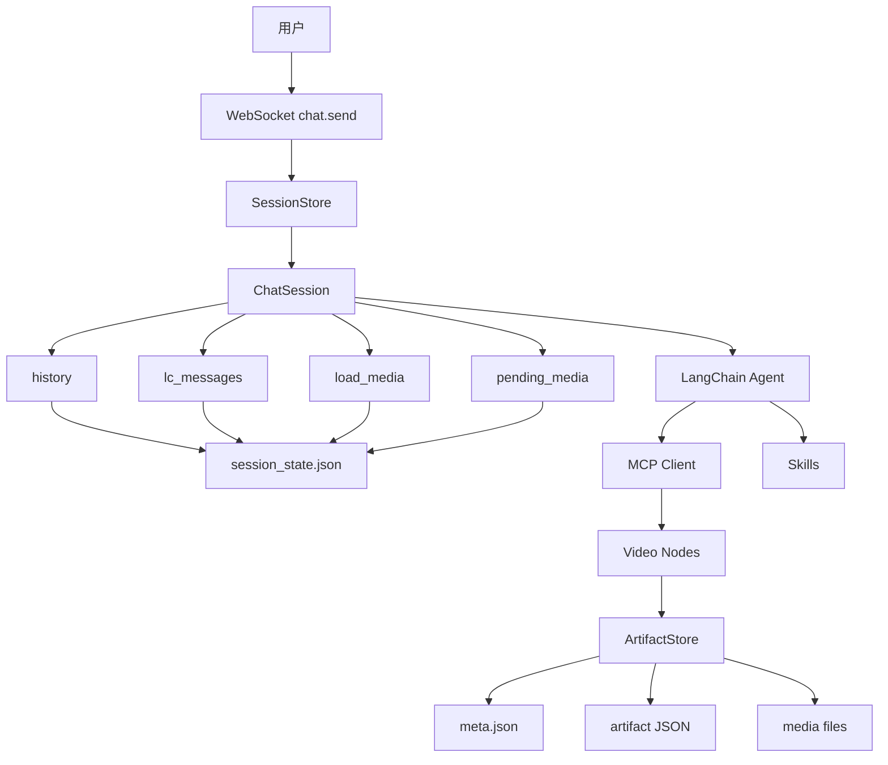

# FireRed-OpenStoryline 功能模块与长短记忆 / 历史对话机制分析

> 分析对象：`FireRedTeam/FireRed-OpenStoryline`
>
> 代码基准：GitHub `main` 分支当前公开代码（2026-09-17 前后抓取）
>
> 重点：功能模块、长短期记忆、历史对话持久化、新旧会话之间是否可以引用历史内容。

---

## 1. 项目定位

FireRed-OpenStoryline 是一个基于 **LLM + MCP + LangChain Agent + 视频处理节点** 的 AI 短视频编辑 Agent。

它的核心目标不是把所有剪辑逻辑写成固定流水线，而是：

```text
用户自然语言
    ↓
LLM Agent
    ↓
工具 / Skill 选择
    ↓
MCP Server
    ↓
视频处理 Node
    ↓
中间结果 / 媒体产物
    ↓
最终视频
```

项目 README 将核心目录划分为：

```text
src/open_storyline/
├── mcp/          MCP 协议与 Server
├── nodes/        视频处理节点
├── skills/       Agent Skill
├── storage/      持久化存储
├── utils/        工具函数
├── agent.py      Agent 构建
└── config.py     配置管理

agent_fastapi.py  Web / API / Session 管理
cli.py            CLI
web/              Web 前端
prompts/          Prompt
resource/         BGM、字体、脚本模板等资源
```

---

# 2. 功能模块

## 2.1 Web / API / Session 层

入口主要是：

```text
agent_fastapi.py
```

它承担：

- FastAPI HTTP API
- WebSocket 对话
- Session 创建、恢复、清空
- 文件上传
- 素材管理
- 对话状态保存
- 对话历史回放
- Tool Trace
- 限流与并发控制

每个会话由 `session_id` 唯一标识。

代码中明确：

```python
sid = uuid.uuid4().hex
```

同时要求 Session ID 为 UUID v4 的 32 位 hex 字符串。

---

## 2.2 Agent 构建模块

核心文件：

```text
src/open_storyline/agent.py
```

`build_agent()` 负责：

1. 创建 LLM
2. 创建 VLM
3. 创建 MCP Client
4. 获取 MCP Tools
5. 加载 Skills
6. 创建 NodeManager
7. 创建 LangChain Agent

关键结构：

```python
tools = await client.get_tools()
skills = await load_skills(cfg.skills.skill_dir)

node_manager = NodeManager(tools)

agent = create_agent(
    model=llm,
    tools=tools + skills,
    middleware=[log_tool_request, handle_tool_errors],
    store=store,
    context_schema=ClientContext,
)
```

因此可以抽象为：

```text
                    ┌──────────────┐
                    │   LLM/VLM    │
                    └──────┬───────┘
                           │
                    ┌──────▼───────┐
                    │ LangChain    │
                    │ Agent        │
                    └──────┬───────┘
                           │
             ┌─────────────┼─────────────┐
             │             │             │
             ▼             ▼             ▼
          MCP Tools      Skills      Middleware
             │
             ▼
        NodeManager
             │
             ▼
       视频处理 Nodes
```

---

# 3. MCP 模块

项目使用：

```text
langchain_mcp_adapters
MultiServerMCPClient
```

Agent 连接 MCP Server 时，会把：

```text
X-Storyline-Session-Id: <session_id>
```

放入 MCP 请求 Header。

这说明：

> MCP 层也能知道当前属于哪个 Session。

配置中默认使用：

```toml
[local_mcp_server]

server_transport = "streamable-http"
stateless_http = false
```

其中：

```text
stateless_http = false
```

代表 MCP Server 侧允许保持会话状态，而不是强制完全无状态。

---

# 4. Video Node 模块

项目的核心剪辑能力由 Node 提供。

当前配置中包含：

```text
LoadMediaNode
SearchMediaNode
SplitShotsNode
LocalASRNode
SpeechRoughCutNode
GenerateAITransitionNode
UnderstandClipsNode
FilterClipsNode
GroupClipsNode
GenerateScriptNode
ScriptTemplateRecomendation
GenerateVoiceoverNode
SelectBGMNode
RecommendTransitionNode
RecommendTextNode
PlanTimelineProNode
PlanTimelineAITransitionNode
RenderVideoNode
```

从能力上可以分成：

| 分类 | 典型 Node | 作用 |
|---|---|---|
| 素材输入 | LoadMediaNode | 加载素材 |
| 搜索 | SearchMediaNode | 素材/外部媒体搜索 |
| 镜头分析 | SplitShotsNode、UnderstandClipsNode | 镜头切分与理解 |
| ASR | LocalASRNode、SpeechRoughCutNode | 语音识别、口播粗剪 |
| 内容筛选 | FilterClipsNode、GroupClipsNode | 筛选和分组素材 |
| 脚本 | GenerateScriptNode | 生成脚本 |
| 音频 | GenerateVoiceoverNode、SelectBGMNode | 配音、BGM |
| 风格 | RecommendTransitionNode、RecommendTextNode | 转场、字幕等建议 |
| 时间线 | PlanTimelineProNode、PlanTimelineAITransitionNode | 规划 Timeline |
| 渲染 | RenderVideoNode | 最终视频渲染 |

---

# 5. Skill 模块

Skill 是 Agent 可调用的高层能力。

代码中：

```python
skills = await load_skills(cfg.skills.skill_dir)
```

然后：

```python
tools=tools + skills
```

因此 Skill 和 MCP Tool 的角色不同：

```text
MCP Tool
    ↓
底层能力 / 工具

Skill
    ↓
高层任务能力 / 工作方式

Agent
    ↓
根据用户意图决定调用 Tool / Skill
```

Skill 的另一个重要价值是：

> 可以把一套视频编辑工作流保存成可复用的“编辑风格”。

因此它更接近：

```text
“经验 / 工作流模板”
```

而不是：

```text
“用户聊天历史”
```

---

# 6. ArtifactStore：产物存储，不等于聊天记忆

核心文件：

```text
src/open_storyline/storage/agent_memory.py
```

名字叫 `agent_memory.py`，但它实际保存的主要是 **Artifact / Node 中间结果**。

数据结构：

```text
outputs/
└── <session_id>/
    ├── meta.json
    └── <node_id>/
        └── <artifact_id>.json
```

`ArtifactMeta` 包含：

```python
session_id
artifact_id
node_id
path
summary
created_at
```

`save_result()` 会保存：

```text
Node Tool 执行结果
        ↓
artifact_id
        ↓
JSON
        ↓
meta.json 索引
```

还可以把 Tool 返回的 Base64 媒体解压成真实文件。

因此：

> `ArtifactStore` 是“Agent 执行产物存储”，不是类似 Redis / Vector DB 的长期语义记忆系统。

它解决的是：

```text
“这一次视频处理产生了什么结果？”
```

而不是：

```text
“这个用户过去和 Agent 聊过什么？”
```

---

# 7. FireRed-OpenStoryline 的“短期记忆”

项目真正的短期上下文主要存在：

```python
ChatSession.lc_messages
```

初始化时：

```python
self.lc_messages = [
    SystemMessage(content=get_prompt("instruction.system", lang=self.lang)),
    SystemMessage(content=UPLOAD_STATUS_SYSTEM_EMPTY),
]
```

之后用户消息会追加：

```python
sess.lc_messages.append(
    HumanMessage(content=prompt)
)
```

Agent 返回消息以后，会继续加入：

```python
sess.lc_messages.extend(new_messages)
```

所以一个 Session 内实际形成：

```text
SystemMessage
      ↓
SystemMessage
      ↓
HumanMessage
      ↓
AIMessage
      ↓
ToolMessage
      ↓
AIMessage
      ↓
HumanMessage
      ↓
AIMessage
      ↓
...
```

这就是模型真正使用的 **Conversation Context**。

---

# 8. `history` 与 `lc_messages` 的区别

这是项目中最重要的设计之一。

它维护两个历史：

```text
ChatSession.history
ChatSession.lc_messages
```

## 8.1 history

用途：

```text
给前端 UI 回放
```

典型结构：

```json
{
  "id": "xxx",
  "role": "user",
  "content": "把第一个镜头剪掉",
  "attachments": [],
  "ts": 1234567890
}
```

Assistant：

```json
{
  "id": "xxx",
  "role": "assistant",
  "content": "好的，我会删除第一个镜头。",
  "ts": 1234567890
}
```

Tool：

```json
{
  "id": "tool_xxx",
  "role": "tool",
  "tool_call_id": "xxx",
  "server": "storyline",
  "name": "xxx",
  "args": {},
  "state": "complete",
  "progress": 1.0,
  "summary": {}
}
```

所以：

```text
history
    ↓
主要解决 UI 展示 / 回放 / Tool Trace
```

---

## 8.2 lc_messages

`lc_messages` 才是：

```text
LLM 的真实消息上下文
```

其元素是 LangChain Message：

```text
SystemMessage
HumanMessage
AIMessage
ToolMessage
```

其中 AIMessage 还会保存：

```text
tool_calls
additional_kwargs
```

这样 Agent 重启以后仍然能恢复 Tool Calling 上下文。

---

# 9. “长短期记忆”准确理解

严格来说，这个项目没有典型意义上的：

```text
短期记忆 = Redis
长期记忆 = Vector DB
```

它更准确的是：

```text
┌──────────────────────────────────────────┐
│              FireRed Memory               │
├──────────────────────────────────────────┤
│                                          │
│  ① Runtime Memory                       │
│     ChatSession                          │
│     ├── lc_messages                     │
│     ├── history                          │
│     ├── load_media                      │
│     └── pending_media_ids               │
│                                          │
│  ② Persistent Session Memory             │
│     session_state.json                  │
│                                          │
│  ③ Artifact Persistence                  │
│     ArtifactStore                       │
│     ├── meta.json                       │
│     └── artifact JSON / media           │
│                                          │
│  ④ Reusable Knowledge / Behavior        │
│     Skills                              │
│                                          │
└──────────────────────────────────────────┘
```

因此建议把它定义成：

| 概念 | FireRed 实现 | 是否跨 Session |
|---|---|---|
| 当前会话短期记忆 | `lc_messages` | 否 |
| 当前会话 UI 历史 | `history` | 否 |
| 当前会话持久化 | `session_state.json` | 否，按 session_id |
| Node 产物 | `ArtifactStore` | 否，按 session_id |
| 用户长期语义记忆 | 没有独立实现 | 否 |
| 跨会话 Vector Memory | 没有 | 否 |
| 用户画像 / Preference Memory | 没有看到独立实现 | 否 |
| 可复用编辑经验 | Skill | 可以复用，但不是聊天历史 |

---

# 10. session_state.json：真正的持久化上下文

Session 状态保存位置：

```text
<outputs_dir>/<session_id>/session_state.json
```

代码：

```python
return os.path.abspath(
    os.path.join(
        str(cfg.project.outputs_dir),
        session_id,
        SESSION_STATE_FILENAME
    )
)
```

而：

```python
SESSION_STATE_FILENAME = "session_state.json"
```

因此典型路径：

```text
outputs/
└── 550e8400e29b41d4a716446655440000/
    └── session_state.json
```

---

# 11. session_state.json 保存什么？

`dump_state()` 会保存：

```json
{
  "version": 1,
  "session_id": "...",
  "lang": "zh",
  "history": [],
  "chat_model_key": "...",
  "vlm_model_key": "...",
  "load_media": {},
  "pending_media_ids": [],
  "lc_messages_serialized": [],
  "pexels_key_mode": "...",
  "sent_media_total": 0,
  "custom_llm_config": {},
  "custom_vlm_config": {},
  "tts_config": {}
}
```

最重要的是：

```text
history
lc_messages_serialized
```

也就是说：

> 项目不仅把 UI 历史保存了，而且把真正的 LangChain 消息上下文也序列化保存了。

---

# 12. lc_messages 是怎么序列化的？

项目实现：

```python
_serialize_lc_message()
```

大致映射：

```text
SystemMessage → {"type": "system"}
HumanMessage  → {"type": "human"}
AIMessage     → {"type": "ai"}
ToolMessage   → {"type": "tool"}
```

例如：

```json
{
  "type": "human",
  "content": "把第二个镜头删除"
}
```

AI：

```json
{
  "type": "ai",
  "content": "好的",
  "additional_kwargs": {},
  "tool_calls": []
}
```

Tool：

```json
{
  "type": "tool",
  "content": "...",
  "tool_call_id": "call_xxx"
}
```

恢复时反过来：

```text
JSON
 ↓
_deserialize_lc_message()
 ↓
SystemMessage / HumanMessage / AIMessage / ToolMessage
 ↓
ChatSession.lc_messages
 ↓
Agent
```

---

# 13. 为什么要保存 ToolMessage？

这是这个项目记忆系统比较重要的工程细节。

如果只保存：

```text
User
Assistant
User
Assistant
```

而不保存：

```text
AI tool_calls
ToolMessage
```

那么恢复以后可能出现：

```text
AIMessage 要求调用工具
        ↓
没有对应 ToolMessage
        ↓
OpenAI-style tool calling 消息不完整
        ↓
模型 API 400
```

因此项目专门实现了：

```text
_tool_call_ids_from_ai_message_for_state()
_validate_tool_protocol_and_fail_closed()
_close_unfinished_tool_calls_in_lc_messages()
_sanitize_tool_protocol_in_lc_messages()
```

恢复时会检查：

```text
AIMessage.tool_calls
        ↕
ToolMessage.tool_call_id
```

如果损坏，则采用：

```text
fail-closed
```

策略。

即：

> 不猜，不伪造正常工具结果，而是截断到最后一个安全边界。

---

# 14. history 有数量限制

代码：

```python
SESSION_STATE_MAX_HISTORY = 2000
```

持久化时：

```python
out = out[-SESSION_STATE_MAX_HISTORY:]
```

所以最多保存：

```text
最近 2000 条 history
```

---

# 15. lc_messages 也有限制

代码：

```python
SESSION_STATE_MAX_LC_MESSAGES = 4000
```

达到上限后并不是简单：

```python
msgs[-4000:]
```

而是：

```text
保留前面的 SystemMessage
+
保留后面的最近消息
+
避免从孤立 ToolMessage 开始
```

也就是说：

```text
[System]
[Upload Status]
[最近一段有效 Tool / AI / User 对话]
```

而不会故意制造：

```text
ToolMessage
```

却没有对应：

```text
AIMessage.tool_calls
```

的非法上下文。

---

# 16. Agent 重启后怎么恢复？

核心流程：

```text
客户端请求 session_id
        ↓
SessionStore.get(session_id)
        ↓
内存没有
        ↓
ChatSession.load_from_state()
        ↓
读取：
outputs/<session_id>/session_state.json
        ↓
恢复 history
        ↓
恢复 lc_messages
        ↓
恢复 media
        ↓
校验 Tool Calling
        ↓
重新建立 ChatSession
        ↓
ensure_agent()
        ↓
重新创建 Agent
```

`SessionStore.get()` 明确支持：

```text
内存 Session
+
磁盘 Session Restore
```

所以：

> 服务重启以后，只要原来的 `session_id` 还在，而且 `session_state.json` 存在，就可以恢复原来的会话上下文。

---

# 17. “新对话能不能读取历史对话？”

这是最容易误解的地方。

结论：

> **默认不能自动读取另一个 Session 的历史。**

原因是所有核心状态都绑定：

```text
session_id
```

例如：

```text
session A
outputs/A/session_state.json

session B
outputs/B/session_state.json
```

创建新 Session：

```python
sid = uuid.uuid4().hex
```

所以：

```text
新会话
   ↓
新的 session_id
   ↓
新的 ChatSession
   ↓
新的 history
   ↓
新的 lc_messages
```

不会自动把：

```text
旧 session_id
```

里的：

```text
history
lc_messages
```

加载进来。

---

# 18. 但是能不能“继续以前的对话”？

可以。

这里要区分：

## 场景 A：新建 Session

```text
Session A
    ↓
创建 Session B
```

默认：

```text
B 看不到 A
```

---

## 场景 B：继续使用 Session A

```text
Session A
    ↓
服务重启
    ↓
再次请求 Session A
```

系统：

```text
load_from_state(A)
```

于是：

```text
A.history
A.lc_messages
A.media
```

都可以恢复。

因此：

```text
“新 Session”
```

和：

```text
“恢复旧 Session”
```

完全不是一回事。

---

# 19. 能不能通过 session_id 主动读取历史？

从后端实现看：

```python
SessionStore.get(session_id)
```

确实可以根据指定 `session_id` 恢复 Session。

但是这不等于：

```text
新会话自动拥有历史记忆
```

因为项目没有看到这样的标准机制：

```text
new_session
    ↓
search all old sessions
    ↓
semantic retrieval
    ↓
inject memory into prompt
```

也没有看到：

```text
UserMemoryStore
ConversationVectorStore
MemoryRetriever
CrossSessionMemory
```

这类独立组件。

因此当前项目的能力属于：

```text
Session Resume
```

而不是：

```text
Cross-Session Memory
```

---

# 20. 新对话是否能够引用旧会话的 Artifact？

要谨慎区分。

ArtifactStore 的数据也是：

```text
outputs/<session_id>/
```

进行隔离的。

`ArtifactStore` 初始化时：

```python
self.blobs_dir = self.artifacts_dir / session_id
```

所以天然按 Session 隔离。

它主要提供：

```python
save_result()
load_result()
get_latest_meta()
```

但没有形成一个：

```text
跨 Session Artifact Retrieval
```

的聊天记忆机制。

因此新 Session 不会自动知道：

```text
旧 Session 曾经生成过哪个视频
旧 Session 曾经完成过哪一步 Node
旧 Session 的某个 Artifact 是什么
```

除非应用层显式把旧 Session 的内容传过来。

---

# 21. 一个完整例子

## 第一个会话

用户：

```text
帮我把旅行视频剪成 30 秒，
风格要轻快，
开头使用机场镜头，
中间使用街景，
最后使用夜景。
```

Session：

```text
A
```

形成：

```text
A.history

A.lc_messages
    ↓
System
User
AI
Tool
AI
```

并产生：

```text
outputs/A/session_state.json
```

以及：

```text
outputs/A/<node_id>/<artifact_id>.json
```

---

## 第二天继续

客户端仍然使用：

```text
session_id = A
```

系统：

```text
SessionStore.get(A)
       ↓
load_from_state(A)
       ↓
恢复 history
       ↓
恢复 lc_messages
       ↓
继续对话
```

用户：

```text
把昨天的开头再缩短 2 秒。
```

模型能够基于已经恢复的上下文理解：

```text
“昨天的开头”
```

因为上下文属于同一个：

```text
Session A
```

---

## 新建 Session B

如果客户端重新：

```text
POST /api/sessions
```

得到：

```text
B
```

然后输入：

```text
把昨天那个开头再缩短 2 秒。
```

默认情况下：

```text
B.lc_messages
```

里面没有：

```text
A.lc_messages
```

所以 Agent 不具备跨 Session 的自动上下文。

---

# 22. 当前记忆架构图



---

# 23. 当前系统的“记忆边界”

可以把 FireRed-OpenStoryline 的记忆边界理解为：

```text
                    用户
                     │
                     ▼
              ┌─────────────┐
              │  Session A   │
              ├─────────────┤
              │ history     │
              │ lc_messages │
              │ media       │
              │ tool trace  │
              └──────┬──────┘
                     │
              session_state.json
                     │
                     ▼
                 可恢复
```

但是：

```text
Session A
    X
Session B
```

之间没有自动的：

```text
Memory Retriever
Vector Search
Summary Memory
User Profile Memory
```

---

# 24. 一个非常重要的结论：它不是“ChatGPT 式全局记忆”

不要把：

```text
session_state.json
```

理解成：

```text
用户长期记忆库
```

它更接近：

```text
Checkpoint / Session Snapshot
```

也就是：

> 把当前 Session 的状态冻结到磁盘，之后可以继续恢复。

所以它解决的问题是：

```text
服务重启
↓
还能不能继续以前这次对话？
```

答案：

```text
可以。
```

而不是：

```text
用户开了一个新聊天，
Agent 能不能自动知道用户昨天另一个聊天说过什么？
```

答案：

```text
默认不可以。
```

---

# 25. 长期记忆如果要增强，应该怎么改？

如果要让它真正拥有跨 Session 长期记忆，建议增加独立层：

```text
Conversation Memory Layer
```

典型结构：

```text
Session A
    ↓
对话结束
    ↓
Summary / Memory Extractor
    ↓
User Memory
    ↓
Vector DB / KV / SQL
```

新 Session：

```text
Session B
    ↓
用户新问题
    ↓
Memory Retriever
    ↓
查询 User Memory
    ↓
得到相关历史
    ↓
注入 Agent Context
    ↓
LLM
```

例如：

```text
旧 Session：

“我以后的视频都希望使用 9:16，
字幕使用白色，
BGM 偏轻快。”
```

抽取成：

```json
{
  "preference": {
    "aspect_ratio": "9:16",
    "subtitle_color": "white",
    "bgm_style": "light"
  }
}
```

存到：

```text
UserMemory
```

新 Session：

```text
用户：帮我做一个旅游视频
```

Retriever 返回：

```text
用户视频偏好：
9:16
白色字幕
轻快 BGM
```

然后 Agent 才可以真正做到：

```text
跨 Session 个性化。
```

---

# 26. 结论

## 功能模块

FireRed-OpenStoryline 可以概括为：

```text
FastAPI / WebSocket
        +
Session 管理
        +
LangChain Agent
        +
MCP
        +
Video Nodes
        +
Skills
        +
ArtifactStore
        +
Session State Persistence
```

---

## 记忆系统

它不是标准的：

```text
短期记忆 + 长期向量记忆
```

而是：

```text
Runtime Session Memory
    ├── lc_messages
    ├── history
    ├── media
    └── tool trace

Persistent Session State
    └── session_state.json

Artifact Persistence
    └── ArtifactStore

Reusable Editing Knowledge
    └── Skills
```

---

## 历史对话

历史实际上有两份：

```text
history
    ↓
前端 UI 回放

lc_messages
    ↓
LLM 真正上下文
```

二者同时持久化。

---

## 新会话是否能访问旧会话？

### 同一个 session_id

可以：

```text
服务重启
↓
加载 session_state.json
↓
恢复历史
↓
继续原会话
```

### 新的 session_id

默认不可以：

```text
Session A
    ↓
Session B

A 的 history / lc_messages
不会自动进入 B
```

所以当前项目更准确的能力定义是：

> **Session Resume，而不是 Cross-Session Long-Term Memory。**

---

# 27. 关键代码位置

| 功能 | 文件 | 关键代码 |
|---|---|---|
| Agent 构建 | `src/open_storyline/agent.py` | `build_agent()` |
| Session | `agent_fastapi.py` | `ChatSession` |
| Session Store | `agent_fastapi.py` | `SessionStore` |
| 对话历史 | `agent_fastapi.py` | `history` |
| LLM Context | `agent_fastapi.py` | `lc_messages` |
| 持久化 | `agent_fastapi.py` | `save_state_atomic()` |
| 恢复 | `agent_fastapi.py` | `load_from_state()` |
| Artifact | `src/open_storyline/storage/agent_memory.py` | `ArtifactStore` |
| Tool Trace | `agent_fastapi.py` | `_ensure_tool_record()` |
| Skill | `src/open_storyline/skills/` | `load_skills()` |
| MCP | `src/open_storyline/mcp/` | MCP Server / Client |

---

# 28. 参考代码

- Repository: https://github.com/FireRedTeam/FireRed-OpenStoryline
- `agent_fastapi.py`: https://github.com/FireRedTeam/FireRed-OpenStoryline/blob/main/agent_fastapi.py
- `agent.py`: https://github.com/FireRedTeam/FireRed-OpenStoryline/blob/main/src/open_storyline/agent.py
- `agent_memory.py`: https://github.com/FireRedTeam/FireRed-OpenStoryline/blob/main/src/open_storyline/storage/agent_memory.py
- `README_zh.md`: https://github.com/FireRedTeam/FireRed-OpenStoryline/blob/main/README_zh.md
- `config.toml`: https://github.com/FireRedTeam/FireRed-OpenStoryline/blob/main/config.toml

> 说明：以上分析以当前公开 `main` 分支代码为准。仓库后续提交如果改变 Session、Memory、Artifact 或 Agent 架构，需要重新核对。
