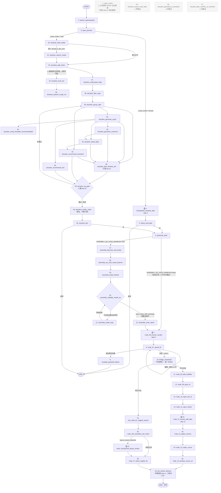

# auto-video-editor 节点冗余分析与合并——设计与执行计划

> 分析对象：`https://github.com/wayyet/auto-video-editor`
> 初版分析日期：2026-09-29 ｜ **修订：2026-09-30（按本地仓库实码重写第 1/2/3/6 节）**
> 分析依据：**2026-09-30 在本地仓库 `E:\Documents\kuaishou\auto-video-editor`（commit `3b33fa7`）逐节点核查实际代码**。
> 初版声明"本次未重新克隆仓库"，其三条核心结论（22 节点 / 删 `atomic_write_file` / join 被执行两次）**已被实际代码推翻**，详见第 1 节与第 3 节。
> 范围说明：只涉及 auto-video-editor **自身**的 50 个 LangGraph 节点及其直接依赖的 `draft_ops/` / `nodes/storyline/` / `jy_common/` 工具层，不涉及 FireRed-OpenStoryline、video-agent-kit 等其他仓库。

> ⚠️ **本文档第 5、7、8 节已作废（2026-09-30）**
> 这三节仍在描述初版的两项改动（"删除 `atomic_writer_file.py`"、"把两条独立 `add_edge` 合并成列表边"）。
> 核查结论是：**两项都不该做 / 已经做完了**（详见第 3.1、3.2 节）。
> 保留原文仅为记录历史判断，实际执行依据请看第 1、2、3.3 节与第 6 节的图。

---

## 1. 背景与范围

auto-video-editor 是一个用 LangGraph 编排的视频剪辑流水线。**实际图节点数是 50 个**（`graph.py` 共 50 处 `g.add_node(`，50 个互不重名），不是初版所说的 22 个。差额来自初版完全没数到的两段：

- **Phase 5 assembly QC 通道**：6 个节点（`assembly_discover_and_probe` → … → `assembly_write_report`），受 `config.ASSEMBLY_QC_GATE_ENABLED` 开关控制（默认 `True`）。
- **Phase 4 auto-mode storyline 子图**：21 个节点（`storyline_load_media` … `storyline_join`），只在 `auto` 模式下经 `_route_mode` 条件边进入；`human` 模式完全不进入。

本次任务是三件事：

1. 找出这 50 个节点里**真正重复的处理逻辑**；
2. 把找到的重复合并；
3. 画出全部节点和工作流。

**结论**：逐节点核对下来，**没有两个图节点在做同一件事**——每个节点操作的是草稿 JSON 里不同的字段或不同的产物，业务上不能合并，也不该合并。**图拓扑零变化**是本次的目标，不是妥协。真正的重复出现在**工具函数层**，共 4 组（R1–R4，见第 3.3 节），全部是"抽公共 helper、节点数不变"级别的改动。

---

## 2. 现状：全部 50 个节点清单

图节点按注册顺序（即 `graph.py` 中 `g.add_node(` 出现顺序）列出。`human` / `auto` 两种模式在 `open_preview` 之后由 `_route_mode` 条件边分叉。

### 2.1 节点全清单（50 个）

| # | 节点名 | 文件 | 模式 / 接边状态 |
|---|---|---|---|
| **准备（human 模式）** ||||
| 1 | `clean_cache` | `nodes/node_01_clean_cache.py` | **孤立**：已注册，但 `START → clean_cache` 的边已剥离（`graph.py:533` 起有注释说明），改由 Web UI 的 `POST /api/system/clean-cache` 端点显式触发。守护测试 `tests/integration/test_no_autoclean_cache.py` |
| 2 | `launch_openstoryline` | `node_02_launch_openstoryline.py` | `START` 入边 |
| 3 | `open_preview` | `node_03_open_preview.py` | 线性；**双模式分叉点**（`_route_mode`） |
| 4 | `checkpoint0_storyline_plan` | `node_checkpoint0_storyline_plan.py` | `interrupt()` 关卡⓪（step 4） |
| 5 | `import_and_plan` | `node_04_import_and_plan.py` | 线性；条件边可直通 `END` |
| 6 | `generate_draft` | `node_05_generate_draft.py` | 汇合点（human 与 auto 两条模式都汇到这里） |
| **关卡① + 护栏** ||||
| 7 | `node_06_human_reorder` | `node_06_human_reorder.py` | `interrupt()` 关卡①（step 6） |
| 8 | `node_07_speed_fit` | `node_07_speed_fit.py` | 条件边，最多 3 次自重试 |
| 9 | `escalate_guardrail_failure` | `graph.py` 内联节点 | → `END` |
| 10 | `bridge_snapshot2` | `graph.py` 内联节点 | 达标后产出快照②，**整条 human 流水线唯一的分叉点** |
| **中文主线（线性 8→13）** ||||
| 11 | `node_08_add_subtitles` | `node_08_add_subtitles.py` | 写 `materials.texts` + `state.asr_segments_zh` |
| 12 | `node_09_inject_fx` | `node_09_inject_fx.py` | 写 `materials.transitions` / `materials.video_effects` |
| 13 | `node_10_inject_text_fx` | `node_10_inject_text_fx.py` | 改 `materials.texts[].style` |
| 14 | `node_11_inject_sticker` | `node_11_inject_sticker.py` | 写 `materials.stickers` + 挂 `extra_material_refs` |
| 15 | `node_12_human_add_bgm` | `node_12_human_add_bgm.py` | `interrupt()` 关卡②（step 12） |
| 16 | `node_13_adjust_volume` | `node_13_adjust_volume.py` | 音量 / 淡入淡出 |
| **Phase 5 assembly QC（开关控制，默认开）** ||||
| 17 | `assembly_discover_and_probe` | `nodes/assembly/node_discover_and_probe.py` | `generate_draft` 之后 |
| 18 | `assembly_asr_and_visual_observe` | `nodes/assembly/node_asr_and_visual_observe.py` | |
| 19 | `assembly_build_timeline` | `nodes/assembly/node_build_timeline.py` | |
| 20 | `assembly_validate_render_qc` | `nodes/assembly/node_validate_render_qc.py` | 条件边（`route_after_assembly_qc`） |
| 21 | `assembly_repair_loop` | `nodes/assembly/node_repair_loop.py` | 重试上限 `ASSEMBLY_QC_MAX_RETRY`（默认 2） |
| 22 | `assembly_write_report` | `nodes/assembly/node_write_report.py` | 软降级出口 → 关卡① |
| **英文分支 + 汇合** ||||
| 23 | `fork_draft_for_english_branch` | `nodes/node_fork_draft_for_english_branch.py` | 从快照②分出独立草稿目录 |
| 24 | `node_14_make_covers` | `node_14_make_covers.py` | 9:16 / 16:9 / 4:3 三比例封面 |
| 25 | `node_15_localize_covers_en` | `node_15_localize_covers_en.py` | 封面英文本地化 |
| 26 | `node_16a_translate_and_check` | `node_16a_translate_and_check.py` | 翻译 + 排版检测（无中断） |
| 27 | `node_checkpoint3_layout_review` | `node_checkpoint3_layout_review.py` | `interrupt()` 关卡③ |
| 28 | `node_17_inject_english_tts` | `node_17_inject_english_tts.py` | 英文 TTS 注入 |
| 29 | `join_before_delivery` | `nodes/node_join_before_delivery.py` | **fan-in 单次触发**（列表语法边） |
| **Phase 4 auto-mode storyline 子图（21 个，仅 auto 模式进入）** ||||
| 30 | `storyline_load_media` | `nodes/storyline/node_load_media.py` | 条件边 `_storyline_route_after_load_media` |
| 31 | `storyline_search_media` | `nodes/storyline/node_search_media.py` | Pexels 旁路（需 `STORYLINE_PEXELS_API_KEY`） |
| 32 | `storyline_search_web_topic` | `nodes/storyline/node_search_web_topic.py` | ⚠️ **已注册但零条边**（死代码） |
| 33 | `storyline_split_shots` | `nodes/storyline/node_split_shots.py` | 条件边（见 3.2 节缺陷） |
| 34 | `storyline_local_asr` | `nodes/storyline/node_local_asr.py` | ⚠️ **当前不可达**（路由缺陷） |
| 35 | `storyline_speech_rough_cut` | `nodes/storyline/node_speech_rough_cut.py` | ⚠️ 传递性不可达（上游不可达） |
| 36 | `storyline_generate_ai_transition` | `nodes/storyline/node_generate_ai_transition.py` | ⚠️ **已注册但零条边**（死代码） |
| 37 | `storyline_understand_clips` | `nodes/storyline/node_understand_clips.py` | |
| 38 | `storyline_filter_clips` | `nodes/storyline/node_filter_clips.py` | |
| 39 | `storyline_group_clips` | `nodes/storyline/node_group_clips.py` | fan-out 4 路 |
| 40 | `storyline_generate_script` | `nodes/storyline/node_generate_script.py` | fan-out 4 路 |
| 41 | `storyline_script_template_recommendation` | `nodes/storyline/node_script_template_recommendation.py` | |
| 42 | `storyline_generate_voiceover` | `nodes/storyline/node_generate_voiceover.py` | |
| 43 | `storyline_select_bgm` | `nodes/storyline/node_select_bgm.py` | |
| 44 | `storyline_recommend_transition` | `nodes/storyline/node_recommend_transition.py` | |
| 45 | `storyline_recommend_text` | `nodes/storyline/node_recommend_text.py` | |
| 46 | `storyline_plan_timeline_pro` | `nodes/storyline/node_plan_timeline_pro.py` | 5 路 fan-in |
| 47 | `storyline_plan_timeline_ai_transition` | `nodes/storyline/node_plan_timeline_ai_transition.py` | ⚠️ **已注册但零条边**（死代码） |
| 48 | `storyline_render_video` | `nodes/storyline/node_render_video.py` | 旁支（ADR-006，不接下游） |
| 49 | `storyline_qa_gate` | `nodes/storyline/qa_gate.py` | 3 路 fan-in；条件边可回 `group_clips` |
| 50 | `storyline_join` | `nodes/storyline/join_storyline.py` | 条件边 → `generate_draft` 或 `END` |

### 2.2 测试基线（2026-09-30 实测）

| 范围 | 结果 |
|---|---|
| `tests/unit` | **全绿**，`pytest` exit=0，805 项，2 项 skip |
| `tests/integration` | `test_interrupt_resume.py` 等关卡相关文件全绿；`test_no_autoclean_cache.py` / `test_week4_graph.py` 需在 assembly QC 循环修复（阶段 0）之后才转绿 |
| `tests/` 全套 | Windows 中文环境下可能触发 pytest 自身 `UnicodeDecodeError`（capture teardown 读到 uvicorn 子进程的 GBK 字节）。规避：`$env:PYTHONIOENCODING='utf-8'`。**已知遗留，不在本计划范围** |

> **一处命名提醒**：早期计划文档里步骤 16 曾写成单一文件 `node_16_translate_subtitles.py`。实际已拆成 `node_16a_translate_and_check.py`（有副作用）+ `node_checkpoint3_layout_review.py`（只做 interrupt），因为 LangGraph 会在每次 resume 时重跑 `interrupt()` 之前的代码。本文档统一使用拆分后的名字。
> 补充：`node_16_translate_subtitles.py` 这个**文件仍在**（纯函数被 16a 与 checkpoint3 复用），但其中的 `node_16_translate_subtitles()` 函数**未注册进图**，只剩单测在用（见 3.3 节）。

---

## 3. 问题诊断：2 处旧判断（均已推翻）+ 4 组真实冗余

### 3.1 旧判断①「两套草稿写入函数功能完全重复」——**不成立**

初版认为 `draft_ops/atomic_writer.py::atomic_write_draft` 与 `draft_ops/atomic_writer_file.py::atomic_write_file` "做的是同一件事，是遗留的重复代码"，并建议删掉后者。**核查后不成立**：

| | `atomic_write_draft` | `atomic_write_file` |
|---|---|---|
| 数据类型 | `content: dict` → `json.dumps` | `data: bytes` → 原样落盘 |
| 写入目标 | 草稿 JSON（`draft_content.json` / `draft_info.json`） | PNG 封面、SRT 字幕等二进制/文本产物 |
| 生产调用方 | 节点 05/07/08/09/10/11/13/16 全部走 `safe_write_draft` 入口 | `node_14`（封面 PNG）、`node_15`（封面本地化）、`node_16`（SRT 字幕） |

两者**职责不同、数据类型不同**，不是重复。删掉 `atomic_write_file` 会让封面与字幕写入直接坏掉。**结论：保留，不动。**

> 初版还有一处已过时的调用方清单（称节点 5/7/8/9/10/11/13 调 `atomic_write_draft`）：实际这 8 个节点（加 node_16）在 Week 5 已全部迁移到 `safe_write_draft` 双写入口。

### 3.2 旧判断②「`join_before_delivery` 被接两条独立边，执行两次」——**已修复**

初版称 `graph.py` 里 `join_before_delivery` 被两条独立 `add_edge()` 接线，LangGraph 会各触发一次、导致执行两次。**当前代码已是列表语法 fan-in**，LangGraph 会等两个上游都到齐才触发一次：

```python
# graph.py:636
g.add_edge(
    ["node_15_localize_covers_en", "node_17_inject_english_tts"],
    "join_before_delivery",
)
```

模块 docstring 里也记录了这次修复。**结论：无需再改。**

> 同理，storyline 子图的 `storyline_plan_timeline_pro`（5 路 fan-in）与 `storyline_qa_gate`（3 路 fan-in）也都已是列表语法。

### 3.3 本次确认的真实冗余：4 组工具函数层样板

以下 4 组才是真正值得合并的重复，全部**不改变图拓扑**。

| 编号 | 冗余 | 收敛落点 | 状态 |
|---|---|---|---|
| **R1** | 6 份逐字相同的草稿读盘 helper `def _load_draft(path): return json.loads(path.read_text(encoding="utf-8"))`（node_07/08/09/10/11/13） | `nodes/_draft_io.py::load_draft` | ✅ 已收敛（`_load_draft` 在 `nodes/` 下已 0 份定义） |
| **R2** | 5 处 `safe_write_draft(draft_path.parent, draft)` + "剪映进程在跑"告警 log 拼接（node_08/09/10/11 + node_13）。其中 **node_13 做了同样的写入却漏掉告警**，是 5 处行为不一致 | `nodes/_draft_io.py::apply_and_write`（node_08/09/10/11）与 `write_draft` + `jianying_running_tags`（node_07/13） | ✅ 已收敛，node_13 告警已补齐 |
| **R3** | `_read_json_artifact` / `_read_groups` / `_read_media` 三个产物读盘 helper 在 `node_plan_timeline_pro.py` 与 `node_plan_timeline_ai_transition.py` 各整块逐字复制一份 | `nodes/storyline/_common.py` | ⚠️ **部分收敛**（commit `9641af8`）——见下方说明 |
| **R4** | 关卡 ⓪/①/② 三处同构的 `_build_interrupt_payload` → `interrupt()` → `_post_resume` 三段式 | `nodes/_checkpoint.py::build_interrupt_payload` + `post_resume` | ✅ 已收敛（`node_checkpoint3_layout_review` 有意不纳入，见下） |

**R3 尚未完全收敛（2026-09-30 复核发现）**：commit `9641af8` 消掉了 `node_plan_timeline_pro.py` / `node_plan_timeline_ai_transition.py` 里的两份逐字复制，但全仓仍有 2 处**语义等价、写法不同**的副本——它们没有调用 `_read_json_artifact`，而是把读盘逻辑内联了一遍：

- `nodes/storyline/node_select_bgm.py::_read_groups`
- `nodes/storyline/node_local_asr.py::_read_media`

（另有 `node_generate_script.py::_read_groups_dict` 是同族但不同返回结构的变体。）

所以验收项"`_read_*` 三函数全仓仅剩 1 份定义"**当前不成立**（`_read_json_artifact` 已达标，另两个各还剩 2–3 份）。这属于阶段 1 的范围，本次未执行；补齐时让上述两处改为 `from nodes.storyline._common import _read_groups / _read_media` 即可，无行为差异。

**两处"看起来该合但不能合"的判断仍然成立**（第 4 节的结论不变）：

- **4 个关卡节点不可合并成一个**：它们分别卡在流程第 4/6/12/16 步，LangGraph 没有"一个节点挂起两次"的用法。只能抽共享 helper，图拓扑不变。
- **node_09 / node_10 / node_11 不可合并成一个**：三者改的是 `materials` 下三个不同数组（转场特效 / 字幕样式 / 贴纸），服务三个不同创意目的。只能抽共享"读-改-写"helper（R1/R2），节点数不变。
- **node_checkpoint3_layout_review 有意不纳入 R4**：它 resume 后多一步 SRT 重写，且返回 delta 字典而非 `{**state}` 全量，结构已偏离样板。已在该文件 docstring 注明。

### 3.4 零生产调用的遗留物（决策：只加注释标记，不删）

删除有回归风险，标记"零调用方"是等价信息量下最安全的选择。已全部在代码里加注释：

| 位置 | 事实 |
|---|---|
| `jy_common/draft_writer.py` | 纯 re-export 壳。生产代码零调用；唯一消费者是 `tests/unit/test_draft_writer_compat.py`，而 `tests/integration/test_e2e_tc07_audio_fades.py:149` 反而**反向断言不再走它** |
| `nodes/node_16_translate_subtitles.py:257` | `node_16_translate_subtitles()` 兼容 shim。`graph.py` 未注册该函数，仅 `tests/unit/test_node_16_translate_subtitles.py` 调用。**注意该文件本身不可删**——纯函数被 16a 与 checkpoint3 复用 |
| `graph.py` `storyline_search_web_topic` | `add_node` 注册但**零条边**引用 |
| `graph.py` `storyline_generate_ai_transition` | `add_node` 注册但**零条边**引用 |
| `graph.py` `storyline_plan_timeline_ai_transition` | **本次核查新增发现**：同样零条边（fan-in 只接了 `storyline_plan_timeline_pro`），初版计划漏列了它 |

另有一处**不可达的活代码**（是缺陷，不是遗留物）：`_storyline_route_after_split_shots` 两个分支返回同一值 `"storyline_understand_clips"`，导致 `storyline_local_asr` 及其下游 `storyline_speech_rough_cut` 永不可达。docstring 写明"阶段 1 才补 `has_audio` 检测"，属已知占位。**本次只加注释说明，不改行为**——补检测会改变 auto 模式的实际执行路径，属功能变更，需单独评审。


---

## 4. 不建议合并的相似结构

以下两处代码结构相似，但**不能合并成一个图节点**，原因分开说明：

| 相似结构 | 为什么不能合并节点 | 能做的事 |
|---|---|---|
| `node_06_human_reorder.py` 和 `node_12_human_add_bgm.py`：都是"先发一次通知→`interrupt()`挂起→记日志"的固定套路 | 两者卡在流程的不同位置（第6步 vs 第12步），合并成一个节点会破坏顺序，LangGraph 也没有"一个节点挂起两次"这种用法 | 把这段样板代码抽成一个共享工厂函数，两个节点各自传参调用，图结构完全不变 |
| `node_09_inject_fx.py` / `node_10_inject_text_fx.py` / `node_11_inject_sticker.py`：都是"读草稿→改一个 `materials.X` 数组→原子写回"的骨架 | 三者改的是三个不同的数组（转场特效 / 字幕样式 / 贴纸），服务三个不同的创意目的，合并成一个节点会让这个节点同时做三件不相关的事，反而更难测试和维护 | 抽一个共享的"改数组+写回"辅助函数，节点数不变 |

> **2026-09-30 落地状态**：上表两行的"能做的事"都已实现——前者收敛为 `nodes/_checkpoint.py`（R4），后者收敛为 `nodes/_draft_io.py`（R1 + R2）。图拓扑与节点数均未变化。

---

## 5. 设计方案：合并后的代码

### 5.1 统一写入函数（对应冗余①）

保留 `atomic_write_draft()`（已有 7 个调用方，改动面最小），删除 `atomic_write_file()`，把 node_16a 的调用点切过去。

```python
# draft_ops/atomic_writer.py
# 唯一的草稿写入入口。原 draft_ops/atomic_writer_file.py::atomic_write_file()
# 功能与本函数完全重复，本次合并后不再单独存在。

import json
import os
import tempfile
from pathlib import Path


def atomic_write_draft(draft_file: Path, content: dict) -> None:
    """临时文件写入 → 校验JSON合法性 → 操作系统级原子重命名覆盖。"""
    serialized = json.dumps(content, ensure_ascii=False, indent=2)
    json.loads(serialized)  # 前置校验：确保生成内容本身合法

    fd, tmp_path = tempfile.mkstemp(
        dir=draft_file.parent, prefix=".draft_tmp_", suffix=".json"
    )
    try:
        with os.fdopen(fd, "w", encoding="utf-8") as f:
            f.write(serialized)
            f.flush()
            os.fsync(f.fileno())
        os.replace(tmp_path, draft_file)
    except Exception:
        if os.path.exists(tmp_path):
            os.remove(tmp_path)
        raise
```

```python
# nodes/node_16a_translate_and_check.py
# 改动前：atomic_write_file(marker_path, marker_data)
# 改动后：
atomic_write_draft(marker_path, marker_data)
```

> ⚠️ 切换前请核对两个函数的参数含义是否完全一致（谁是路径、谁是内容），避免顺序搞反。见第7节步骤2。

### 5.2 修复图连线（对应冗余②）

```python
# graph.py
# 改动前（两条独立边，导致重复执行）：
g.add_edge("node_15_localize_covers_en", "join_before_delivery")
g.add_edge("node_17_inject_english_tts_stub", "join_before_delivery")

# 改动后（一条列表语法的边，LangGraph 会等两个上游都到达才触发一次）：
g.add_edge(
    ["node_15_localize_covers_en", "node_17_inject_english_tts_stub"],
    "join_before_delivery",
)
```

---

## 6. 工作流图

> 2026-09-30 重画：按第 2.1 节的 50 节点全清单绘制，替换初版 22 节点图。
> 编号即第 2.1 节表格的 `#` 列。`⓸` 表示 `interrupt()` 关卡（人工介入后 `Command(resume=True)` 唤醒）。



图例：
- 实线 = 实际存在的边；`-.->` 虚线 = 不可达路径或仅作说明的连接。
- `classDef dead` 的灰虚框 = **已注册但不参与执行**的节点（3 个零边 storyline 节点 + 孤立的 `clean_cache`）。
- 关卡⓪①②③ 需人工在外部（OpenStoryline 网页 / 剪映客户端）操作后 `Command(resume=True)` 唤醒；payload 的 `checkpoint` 字段（`⓪`/`①`/`②`/`③`）被 `resume_utils.py::resume_all_pending` 用于自动匹配 resume 值，**不可改名或改值**。

> 本图已用 mermaid 11.17.2 的 `mermaid.parse()` 实际校验通过（2026-09-30，jsdom 环境），可直接粘贴渲染。

---

## 7. 执行步骤

**步骤1：定位现状**
- 确认 `draft_ops/atomic_writer_file.py::atomic_write_file()` 当前唯一的调用点，就在 `node_16a_translate_and_check.py` 内
- 确认 `graph.py` 中两条指向 `"join_before_delivery"` 的 `add_edge()` 所在行号

**步骤2：合并写入函数**
- 核对 `atomic_write_draft(draft_file, content)` 与 `atomic_write_file(path, data)` 的参数顺序和类型是否一致
- 把 `node_16a_translate_and_check.py` 里对 `atomic_write_file()` 的调用改成 `atomic_write_draft()`
- 跑一次该节点的现有单元测试，确认产出的 JSON 内容和改动前完全一致
- 全仓库搜索确认 `atomic_write_file` 再无其他调用点后，删除 `draft_ops/atomic_writer_file.py`

**步骤3：修复汇合节点重复执行**
- 按第5.2节，把两条独立 `add_edge()` 合并成一条列表语法的边
- 新增一条集成测试：用真实调用计数（不是靠 `status_log` 的去重字段）断言 `join_before_delivery` 对应的处理函数在一次完整运行中只被调用 **1 次**

**步骤4：回归验证**
- 跑现有全部单元测试 + 集成测试，确认无新增失败
- 专项检查：`node_16a` 的翻译流程、`join_before_delivery` 前后的交付流程分别手动走一遍

**步骤5：清理**
- 确认 `draft_ops/atomic_writer_file.py` 已删除且无残留 import
- 更新相关文档（若有引用旧文件名的地方）

---

## 8. 验收标准

- [ ] `atomic_writer_file.py` 已删除，全仓库无遗留引用
- [ ] `node_16a_translate_and_check.py` 写入 marker 的产出内容与改动前一致（回归对比）
- [ ] `join_before_delivery` 在一次完整流程运行中只执行 1 次，用真实调用计数断言验证（不依赖状态去重字段）
- [ ] 现有全部单元测试 + 集成测试保持通过，无新增失败

---

## 9. 风险与回滚

| 风险 | 应对 |
|---|---|
| 两个写入函数参数顺序不完全一致，直接替换调用点会传错参数 | 步骤2里先核对签名，改完先跑该节点单测再删旧文件 |
| 图连线改动后，若两条分支实际执行时间差很大，`join_before_delivery` 触发时机会变（从"先到先执行"变成"等两者都到"） | 这正是修复的目的（防止重复执行），预期行为变化；建议在验收时确认最终交付时间没有明显劣化 |
| 两处改动相互独立 | 出问题可以只回退其中一处，不影响另一处 |

---

## 10. 参考来源

- `《auto-video-editor 开发执行计划代码验证报告》`——冗余②（图连线重复执行 bug）的发现与最小复现脚本出处
- `《剪映核心技能集成 auto-video-editor 开发计划》`——冗余①（写入函数重复）P0 问题的原始定位
- `《AI视频剪辑自动化工作流第4周实施计划》`——`fork_draft_for_english_branch`、节点16拆分理由的设计依据
