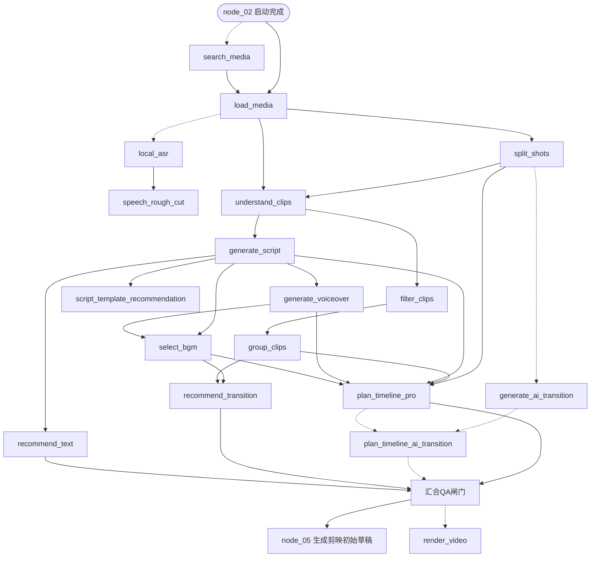

# OpenStoryline 集成模块 LangGraph 确定性化改造设计执行计划

## 0. 文档说明

- **范围**：只做"19个节点 → LangGraph 确定性执行"这一件事（对应确认时选的方案A）。FireRed 前端页面迁移是另一件事，不在本文档内。
- **不改动的东西**：`wayyet/FireRed-OpenStoryline` 这个独立仓库本身。这19个节点各自"怎么调模型、怎么选BGM"的具体算法/Prompt，会从那个仓库搬出来、移植进 `auto-video-editor`，但那个仓库自己的代码不动一行。
- **前置假设**：你已经熟悉 `auto-video-editor` 现有的17步流程（node_01~node_17）、`draft_content.json` 读写机制、`interrupt()`/`Command(resume=)` 机制。这些不重复介绍。
- **代码性质**：本文档里的代码是设计级示意（明确函数签名、State字段、调用顺序），不是可以直接复制运行的最终代码。实际编码时要对照 `auto-video-editor` 和 `FireRed-OpenStoryline` 当前的真实源码调整细节——本文档没有拿到 `auto-video-editor` 仓库最新源码（项目文件里那份 `auto-video-editor` 只是一个 GitHub 链接，不是仓库镜像），所有文件路径引用都基于项目里已有的代码审计报告。

---

## 1. 背景与问题

### 1.1 现状：node_04 是个黑盒

`auto-video-editor` 现在的第4步（`node_04_import_and_plan.py`）做的事情是：调一次 MCP，把"这段视频该怎么剪"整个甩给 FireRed-OpenStoryline，等它回一个 `shot_plan`（或 `storyline_plan`）。

这一步内部，FireRed 实际上跑了一整条链路——搜素材、切镜头、理解画面、筛选、分组、写文案、配音、选BGM、推荐转场、排时间线……这些全部发生在"黑盒"里，`auto-video-editor` 只看得到最后的结果，看不到中间任何一步。

### 1.2 为什么会黑盒：FireRed 内部怎么编排的

FireRed 不是按固定顺序跑这些节点的，它是三层拼起来的：

1. 一份 Skill 文档（自然语言写的SOP），告诉 LLM Agent"通常先做A，B可以跳过，C默认要跑"；
2. 一个 LangChain Agent，运行时自己判断该调哪个工具（也就是这19个节点对应的MCP工具）；
3. `NodeMeta` 里记了每个节点"至少需要什么前置产出"，但这只是下限，不是固定顺序。

结果就是：同一段素材，同一句指令，两次运行，实际调用的节点集合和顺序可能不一样。这不是bug，是设计——"让 Agent 自己决定"本来就是 FireRed 的卖点。但放进一条要交付、要重跑、要能定位问题的生产流水线里，这个特性变成了负担。

### 1.3 两个已经发生过的真实故障

**案例一：35秒限制传不进去。**

`group_clips`（分组）这一步原本没有"总时长预算"这个参数，只有"单组3~20秒"的软约束。10个叙事组各自贴着20秒上限走，最后剪出170.73秒，超了要求的35秒4.9倍。根因是：从用户说"剪35秒"到真正决定每个镜头留多长，中间隔了好几层LLM决策，没有一处把"35秒"这个数字真正当成硬约束往下传。

FireRed那边后来在自己代码里打了补丁（给 `group_clips`、`plan_timeline_pro` 都加了 `target_duration_ms` 参数），但补丁本质还是"给LLM一个预算提示，指望它照办"——不是数学上保证的硬约束。

对比一下 `auto-video-editor` 自己第7步（`/jianying-speed-fit-35s` 护栏节点）的做法：不管上游剪成多少秒，这一步直接算出实际总时长和目标时长的比例，强制缩放每个片段，用图级条件边重试最多3次，超了就升级给人工。这是数学上能保证的硬约束，不依赖任何模型"照办"。

这说明什么：`auto-video-editor` 自己已经在用、也验证过"确定性图 + 硬约束校验"这套打法。这次要做的，就是把这套打法用到FireRed那19个节点上。

**案例二：一个真实bug，三层错误处理全崩。**

`understand_clips`（理解镜头）这一步崩溃过：素材是iPhone拍的HEVC视频，元数据里有一行内容让底层的 `moviepy` 库解析时做了"浮点数 + 字符串"的运算，直接类型错误崩溃。

崩溃之后，两层"兜底"代码各自还有bug：一层错误处理引用了一个还没赋值的变量（`model_name`），另一层也引用了一个还没赋值的变量（`obj`）——原本想记一笔"这个镜头理解失败"，结果自己先崩了，把真实错误信息吞掉了三层，用户界面最后只看到"内部模型出了点小问题"这种没有信息量的提示。

这说明什么：当"决策在哪一步、错误在哪一步处理"都不透明的时候，排查成本会指数级增加。

### 1.4 目标

把这19个节点的**执行顺序和错误处理**，从"FireRed内部LLM运行时决定"，搬到"`auto-video-editor` 自己的LangGraph图里，用固定的边、固定的State结构、固定的错误处理策略"。

具体说：现在的 node_04（一个黑盒节点）会被19个新的、独立的、确定性的 LangGraph 节点取代（实际常跑的是14个左右，其余5个是条件/可选节点）。

### 1.5 明确边界

- 不改 `wayyet/FireRed-OpenStoryline` 仓库。
- 这19个节点各自的"能力"（调哪个模型、用什么Prompt、BGM怎么打分排序）要从那个仓库移植过来，变成 `auto-video-editor` 自己代码库里的普通 Python 函数——移植的是**能力**，不是照搬它的Agent编排机制。
- 前端页面迁移（FireRed的Web UI搬进 `auto-video-editor`）不在这次范围内。

---

## 2. 19个节点清单

"19条"具体指 `FireRed-OpenStoryline` 的 `config.toml` 里 `available_nodes` 实际注册的19个节点类（不含2个内置工具 `read_node_history`、`write_skills`，那两个是给Agent查历史/存Skill用的辅助工具，不是视频处理节点，不纳入这次改造）。

### 2.1 节点总表

按大致执行顺序排列（这个顺序本身就是本次要"钉死"的东西，见第3节）：

| # | 类名 | MCP工具名 | node_kind | 声明依赖 | 一句话功能 |
|---|---|---|---|---|---|
| 1 | LoadMediaNode | `load_media` | load_media | 无 | 加载并索引所有输入素材 |
| 2 | SearchMediaNode | `search_media` | search_media | 无 | 在线搜素材（Pexels），补充空镜 |
| 3 | SearchWebTopicNode | `search_web_topic` | search_web_topic | 无 | 搜网页话题参考资料 |
| 4 | SplitShotsNode | `split_shots` | split_shots | load_media | 按场景变化把视频切成镜头 |
| 5 | LocalASRNode | `local_asr` | local_asr | load_media | 本地语音识别，出带时间戳文本 |
| 6 | SpeechRoughCutNode | `speech_rough_cut` | speech_rough_cut | local_asr | 口播粗剪：去口头禅、去重复 |
| 7 | GenerateAITransitionNode | `generate_ai_transition` | generate_ai_transition | split_shots | AI生成转场镜头（默认关闭） |
| 8 | UnderstandClipsNode | `understand_clips` | understand_clips | load_media, split_shots | 给每个镜头生成描述/语义标签 |
| 9 | FilterClipsNode | `filter_clips` | filter_clips | understand_clips | 按用户需求筛选镜头 |
| 10 | GroupClipsNode | `group_clips` | group_clips | filter_clips | 把镜头组织成叙事组并排序 |
| 11 | GenerateScriptNode | `generate_script` | generate_script | understand_clips | 生成文案/旁白脚本 |
| 12 | ScriptTemplateRecomendation | `script_template_recommendation` | script_template_rec | generate_script | 推荐文案模板 |
| 13 | GenerateVoiceoverNode | `generate_voiceover` | tts | generate_script | 生成AI配音 |
| 14 | SelectBGMNode | `select_bgm` | music_rec | understand_clips | 选BGM，支持节拍分析 |
| 15 | RecommendTransitionNode | `recommend_transition` | transition_rec | group_clips | 推荐转场效果 |
| 16 | RecommendTextNode | `recommend_text` | text_rec | generate_script | 推荐字幕字体/样式 |
| 17 | PlanTimelineProNode | `plan_timeline_pro` | plan_timeline_pro | split_shots, group_clips, generate_script, tts, music_rec | 排视频/字幕/配音/BGM四条轨道 |
| 18 | PlanTimelineAITransitionNode | `plan_timeline_ai_transition` | plan_timeline_ai_transition | generate_ai_transition, plan_timeline_pro | 结合AI转场的时间线编排 |
| 19 | RenderVideoNode | `render_video` | render_video | load_media, plan_timeline, transition_rec, text_rec | 渲染导出（FireRed自己的MP4，非剪映） |

"声明依赖"这一列来自 FireRed 代码里 `NodeMeta.require_prior_kind` 字段——这是"至少需要什么"，不是"实际会先做什么"，两者的差别下面细说。

### 2.2 两份不完全一致的依赖信息

设计这19个节点的执行顺序时，手上有两份材料，但它们不完全一致：

**材料A：声明依赖**（上表"声明依赖"列，来自源码里的 `NodeMeta`）。这是"理论上的最小前置条件"。

**材料B：一次真实运行的执行图**（你上传的 `video-editing-workflow.md`，从 `workflow.json` 导出，14个节点）。这是"某一次真实运行，Agent实际选择的顺序"。

两者对不上的地方，举两个例子：

| 节点 | 材料A说的依赖 | 材料B里实际观察到的依赖 |
|---|---|---|
| select_bgm | understand_clips | generate_script **和** generate_voiceover |
| recommend_transition | group_clips | select_bgm |

也就是说：真实运行时，Agent自己"加码"了——选BGM之前，它不只等"理解完镜头"，还等"文案和配音都出来了"才选（这样选出来的BGM能配合配音的节奏和长度，是更合理的编辑判断）；推荐转场之前，它还等BGM选完了（转场可以卡BGM的节拍）。这两个"加码"都是有道理的编辑逻辑，只是材料A（代码声明的最低要求）没写出来。

**本次设计的原则**：拓扑（先后顺序）以材料B（真实执行图）为准，因为它体现了更合理的编辑逻辑；材料A只用来给材料B没覆盖到的5个节点（search_web_topic、local_asr、speech_rough_cut、generate_ai_transition、plan_timeline_ai_transition）补边——这5个材料B里没出现过。

### 2.3 待核实项（开工前需要确认，不是本文档能替你决定的）

| 编号 | 问题 | 为什么重要 |
|---|---|---|
| ① | `plan_timeline_pro` 这一节点，材料B（workflow.json）里显示的id是 `plan_timeline`（没有`_pro`后缀），跟 `available_nodes` 里实际注册的 `PlanTimelineProNode` 对不上 | 不确定是workflow.json展示时把后缀去掉了，还是那次真实运行用的其实是基础版 `PlanTimelineNode`（这个类不在19个注册节点里）。这决定了要移植的是"专业版"还是"基础版"排轨逻辑，两者时间轴算法不同 |
| ② | select_bgm / recommend_transition"加码"的依赖是不是每次运行都这样，还是那一次运行的偶然选择 | 决定这两条边要不要真的钉死成固定顺序，还是保留成可配置的 |
| ③ | render_video节点要不要真的接进 `auto-video-editor` 的图里 | 现有架构决定（ADR-006）是"FireRed的render_video只做能力探测，不接管剪映落盘"——这次改造如果把它纳入确定性图，需要明确产物去哪、跟node_05是什么关系，见3.5节 |
| ④ | local_asr / speech_rough_cut 产出的清洗后转写文本，具体接到哪个下游节点 | 材料B（14节点执行图）完全没覆盖ASR这条支线，不清楚它是喂给generate_script，还是只做参考展示，需要产品侧先定用途 |

---

## 3. 目标架构

### 3.1 总体思路

新增19个（视配置可能是14~19个，取决于条件节点是否启用）LangGraph节点，放在 `auto-video-editor` 现有的 node_02（启动/健康检查）之后、node_05（生成剪映初始草稿）之前，取代现在的单一 node_04。

命名建议：新建一个 `nodes/storyline/` 目录，每个节点一个文件，文件名和函数名用 `node_kind` 对齐（比如 `node_kind=understand_clips` → 文件 `nodes/storyline/node_understand_clips.py`，函数 `understand_clips_node`），这样和 FireRed 源码里的命名一一对应，方便移植时对照。

State 里新增一个 `storyline_*` 字段族（避免跟已有字段混淆），具体字段见第4节。

### 3.2 图拓扑



图例：实线＝固定必经边；虚线＝条件边（业务规则决定走不走，比如没配Pexels Key就跳过search_media、AI转场默认关闭）。代码里这些用条件边（`add_conditional_edges`）实现，是"择一执行"，不是两条互相独立、都会触发的 `add_edge`。

### 3.3 节点命名与文件组织

```text
auto-video-editor/
├── nodes/
│   ├── storyline/                          # 新增目录
│   │   ├── __init__.py
│   │   ├── node_load_media.py
│   │   ├── node_search_media.py
│   │   ├── node_search_web_topic.py
│   │   ├── node_split_shots.py
│   │   ├── node_local_asr.py
│   │   ├── node_speech_rough_cut.py
│   │   ├── node_generate_ai_transition.py
│   │   ├── node_understand_clips.py
│   │   ├── node_filter_clips.py
│   │   ├── node_group_clips.py
│   │   ├── node_generate_script.py
│   │   ├── node_script_template_recommendation.py
│   │   ├── node_generate_voiceover.py
│   │   ├── node_select_bgm.py
│   │   ├── node_recommend_transition.py
│   │   ├── node_recommend_text.py
│   │   ├── node_plan_timeline_pro.py
│   │   ├── node_plan_timeline_ai_transition.py
│   │   ├── node_render_video.py
│   │   └── join_storyline.py               # 汇合+QA闸门
│   ├── node_01_clean_cache.py               # 已有，不动
│   ├── node_02_launch_openstoryline.py      # 改造，见3.6节
│   ├── node_04_import_and_plan.py           # 废弃，被上面19个节点取代
│   ├── node_05_generate_draft.py            # 已有，改输入来源
│   └── ...
├── storyline/                                # 已有目录（ADR-003的契约层），复用
│   ├── contract.py
│   ├── mapper.py
│   └── firered_adapter.py                    # 这次会大幅改造，见3.6节
└── storyline_capabilities/                   # 新增：移植过来的模型调用/算法
    ├── vlm_client.py                          # understand_clips用
    ├── llm_script_gen.py                      # generate_script用
    ├── bgm_selector.py                        # select_bgm用，含resource/bgms/meta.json移植
    ├── font_recommender.py                    # recommend_text用
    ├── timeline_planner.py                    # plan_timeline_pro用
    └── ...
```

### 3.4 逐节点实现要点

每个节点的实现方式分三类，直接决定了移植工作量：

**A类：纯确定性处理，不调模型（4个）**——`load_media`（读取素材元数据）、`split_shots`（场景切分算法，如TransNetV2）、`search_media`（调Pexels API）、`search_web_topic`（调网页搜索API）。这几个从FireRed搬过来基本是"复制代码+改导入路径"，不涉及Prompt移植。

**B类：调LLM/VLM，需要移植Prompt（7个）**——`understand_clips`、`filter_clips`、`group_clips`、`generate_script`、`script_template_recommendation`、`recommend_transition`、`recommend_text`。这几个的核心是 `prompts/tasks/<节点名>/zh/system.md` 这类Prompt文件，需要连Prompt一起搬，并接入 `auto-video-editor` 现有的AI Gateway（复用已有的Semantic Kernel + Polly v8熔断，不用重新接一遍模型调用链路）。

**C类：调专用服务/资源库（8个）**——`local_asr`（ASR模型）、`speech_rough_cut`（依赖local_asr结果）、`generate_voiceover`（TTS）、`select_bgm`（需要`resource/bgms/meta.json`资源库+音频特征分析）、`generate_ai_transition`（第三方AIGC视频生成API）、`plan_timeline_pro`、`plan_timeline_ai_transition`（排轨算法，`TimeLine`类）、`render_video`（MoviePy+FFmpeg合成）。这几个工作量最大，要么要搬运资源文件（BGM库、字体库），要么依赖第三方服务。

4 + 7 + 8 = 19，跟第2节的总数对得上。下表把19个节点按这个分类标注，方便排优先级（B类和C类共15个，是主要工作量）：

| 节点 | 类别 | 关键依赖资源 |
|---|---|---|
| load_media | A | — |
| search_media | A | Pexels API Key |
| search_web_topic | A | 搜索API |
| split_shots | A | TransNetV2模型权重 |
| understand_clips | B | VLM Prompt |
| filter_clips | B | LLM Prompt |
| group_clips | B | LLM Prompt |
| generate_script | B | LLM Prompt + 文案模板 |
| script_template_recommendation | B | `resource/script_templates/` |
| recommend_transition | B | LLM Prompt |
| recommend_text | B | LLM Prompt + `resource/fonts/font_info.json` |
| local_asr | C | ASR模型（`torchaudio`依赖） |
| speech_rough_cut | C | 依赖local_asr输出 |
| generate_ai_transition | C | 第三方AIGC视频生成API（成本高） |
| generate_voiceover | C | TTS服务（火山引擎/MiniMax等，参考现有`docs/source/*/api-key.md`） |
| select_bgm | C | `resource/bgms/meta.json` + 音频特征分析 |
| plan_timeline_pro | C | `TimeLine`排轨算法 |
| plan_timeline_ai_transition | C | 依赖generate_ai_transition |
| render_video | C | MoviePy + FFmpeg |

### 3.5 render_video的特殊处理

按现有ADR-006（"剪映落盘 + 最终交付继续由 `auto-video-editor` 拥有"），`render_video` 这次**只搬过来当一个可选的、独立的LangGraph节点**，不放在通往node_05的主链路上——它的输出是FireRed自己格式的MP4文件，用来做端到端冒烟测试（"这19个节点接起来到底能不能出一个能看的东西"），不是正式交付物。正式交付物还是走node_05开始的剪映草稿路径。

这意味着图里 `render_video` 是一个"旁支"：`汇合QA闸门` 节点产出后，可以选择性地额外跑一次 `render_video` 用于验证，但不阻塞 node_05 往下走。

### 3.6 迁移路径：两阶段，不是一步到位

19个节点里，B类和C类加起来15个，涉及Prompt移植、资源库移植、第三方服务对接，工作量不小。一次性做完再上线，风险和周期都太长。

**阶段一：图先确定，节点内部先"借用"FireRed。**

先把19个节点的Python函数框架和State字段建好，图的边按3.2节钉死。每个节点函数内部，暂时还是通过MCP调FireRed已经注册好的那个具体工具（比如`understand_clips`节点函数内部调`call_tool("understand_clips", ...)`），而不是调FireRed的Agent对话入口。

这样做的好处：FireRed内部该节点的模型调用、Prompt、资源库都还在正常工作，不用等移植完成；但"先调用哪个、后调用哪个"已经由 `auto-video-editor` 的图决定了，不再是FireRed的Agent临时决定——**光是这一步，就已经达成"确定性执行"这个目标**。

这个阶段还是需要FireRed进程跑起来提供MCP服务，跟"完全解耦"这个更大目标（另一份关于前端迁移的文档提到过）还没到终点，但是一个可以先上线、先验证图拓扑对不对的中间态。

**阶段二：逐节点替换成本地实现。**

按3.4节的A→B→C类顺序（A类最简单，先做），把每个节点内部"调MCP"的那行代码，换成"直接调本地移植过来的模型/算法"。换完一个节点，那个节点就不再依赖FireRed进程；全部19个换完，`node_02_launch_openstoryline.py` 和现有的 `mcp_clients/openstoryline_client.py` 就可以整个删掉，达成完全解耦。

这个顺序可以按节点独立推进，不用等全部换完才能测试——每换一个，跑一遍集成测试确认图还能正常走完就行。

---

## 4. State 设计

### 4.1 新增字段

沿用现有 `WorkflowState`（`state.py`），新增一组 `storyline_*` 字段，19个节点各自的产出用 `NotRequired[Optional[...]]` 包装（跟现有代码的既有约定一致——只加字段不删字段，新字段一定要有默认值，否则老的checkpoint恢复时会报`KeyError`）。

| 字段 | 类型 | 写入节点 | 说明 |
|---|---|---|---|
| `storyline_media_artifact` | `NotRequired[Optional[str]]` | load_media | 素材清单的产物路径（URI，不是内容本身） |
| `storyline_shots_artifact` | `NotRequired[Optional[str]]` | split_shots | 镜头切分结果路径 |
| `storyline_understanding_artifact` | `NotRequired[Optional[str]]` | understand_clips | 镜头理解结果路径 |
| `storyline_filtered_clips` | `NotRequired[Optional[str]]` | filter_clips | 筛选后镜头清单路径 |
| `storyline_groups_artifact` | `NotRequired[Optional[str]]` | group_clips | 分组结果路径 |
| `storyline_script_artifact` | `NotRequired[Optional[str]]` | generate_script | 文案脚本路径 |
| `storyline_voiceover_artifact` | `NotRequired[Optional[str]]` | generate_voiceover | 配音音频路径 |
| `storyline_bgm_selection` | `NotRequired[Optional[dict]]` | select_bgm | 选中的BGM信息（含节拍时间戳，体积小，直接存State） |
| `storyline_transition_plan` | `NotRequired[Optional[dict]]` | recommend_transition | 转场建议 |
| `storyline_text_style_plan` | `NotRequired[Optional[dict]]` | recommend_text | 字幕样式建议 |
| `storyline_timeline_plan` | `NotRequired[Optional[str]]` | plan_timeline_pro | 最终时间线，接给node_05的产物路径 |
| `storyline_asr_artifact` | `NotRequired[Optional[str]]` | local_asr | ASR转写结果路径（条件节点） |
| `storyline_rough_cut_artifact` | `NotRequired[Optional[str]]` | speech_rough_cut | 粗剪后转写结果路径（条件节点） |
| `storyline_ai_transition_artifact` | `NotRequired[Optional[str]]` | generate_ai_transition | AI转场素材路径（条件节点，默认不产出） |
| `storyline_web_topic_artifact` | `NotRequired[Optional[str]]` | search_web_topic | 话题参考资料路径（条件节点） |
| `storyline_render_smoke_test_path` | `NotRequired[Optional[str]]` | render_video | 冒烟测试产物路径，不接入下游 |
| `storyline_status_log` | `NotRequired[list[str]]` | 全部19个节点 | 每个节点完成时append一条，用于联调测试校验"是不是按预期顺序跑的、有没有重跑" |
| `storyline_error_log` | `NotRequired[list[dict]]` | 全部19个节点 | 结构化错误记录，每条含`node_kind / error_code / message / retry_count` |

### 4.2 TypedDict定义

```python
# state.py（在现有WorkflowState基础上新增，不改动已有字段）
from typing import TypedDict, Optional
from typing_extensions import NotRequired


class StorylineErrorEntry(TypedDict):
    node_kind: str
    error_code: str          # 复用现有StorylineErrorCode的6类定义
    message: str
    retry_count: int


class StorylineState(TypedDict, total=False):
    storyline_media_artifact: NotRequired[Optional[str]]
    storyline_shots_artifact: NotRequired[Optional[str]]
    storyline_understanding_artifact: NotRequired[Optional[str]]
    storyline_filtered_clips: NotRequired[Optional[str]]
    storyline_groups_artifact: NotRequired[Optional[str]]
    storyline_script_artifact: NotRequired[Optional[str]]
    storyline_voiceover_artifact: NotRequired[Optional[str]]
    storyline_bgm_selection: NotRequired[Optional[dict]]
    storyline_transition_plan: NotRequired[Optional[dict]]
    storyline_text_style_plan: NotRequired[Optional[dict]]
    storyline_timeline_plan: NotRequired[Optional[str]]
    storyline_asr_artifact: NotRequired[Optional[str]]
    storyline_rough_cut_artifact: NotRequired[Optional[str]]
    storyline_ai_transition_artifact: NotRequired[Optional[str]]
    storyline_web_topic_artifact: NotRequired[Optional[str]]
    storyline_render_smoke_test_path: NotRequired[Optional[str]]
    storyline_status_log: NotRequired[list]
    storyline_error_log: NotRequired[list]


# WorkflowState 合并 StorylineState，与现有字段（draft_path、shot_plan等）并存
class WorkflowState(StorylineState, total=False):
    # ...现有字段保持不动
    pass
```

### 4.3 Checkpoint体积控制

跟现有 `storyline/contract.py`（ADR-003）的原则一样：State里**只存URI/ID/摘要**，完整内容存文件系统。比如 `storyline_understanding_artifact` 存的是一个文件路径（比如 `outputs/{job_id}/storyline/understanding.json`），不是理解结果的原始JSON内容——不然19个节点的产出全塞进State，Checkpoint（存到SQLite/Postgres里的那份状态快照）会越滚越大，恢复速度会变慢。

`storyline_bgm_selection`、`storyline_transition_plan`、`storyline_text_style_plan` 这三个例外，因为体积本来就小（BGM信息、转场建议、字幕样式，都是几十到几百字节的结构化数据），直接存State更方便节点间传递。

---

## 5. 确定性保证机制

### 5.1 固定边代替LLM自选

图的边（3.2节的拓扑）用 `graph.add_edge(...)` 写死，不用条件边做"LLM决定下一步"这种事。唯一允许的条件分支是**业务规则**触发的分支（比如"有没有配置Pexels Key，决定要不要跑search_media"），不是"LLM判断该不该跑"。

### 5.2 硬约束怎么做

参考现有node_07（`/jianying-speed-fit-35s`）的模式：约束校验放在**图级条件边**里，不是节点内部悄悄处理。比如 `plan_timeline_pro` 产出后，加一个校验节点，检查总时长是否超预算，超了就回退重新分组（回到`group_clips`重跑，带上收紧后的预算），而不是像FireRed现在这样"把预算当提示词塞给LLM，指望它照办"。

### 5.3 幂等设计

复用项目里已经验证过的两条经验（这两条不是新发明的，是之前联调LangGraph人工关卡时踩出来的）：

- **幂等判断要查真实产物，不能查State字段。** 比如某个节点要判断"这一步是不是已经跑过了"，得去查磁盘上那个产物文件在不在，不能查State里的一个布尔标记——因为标记要等节点 `return` 之后才会被写进Checkpoint，如果节点在写标记之前就被中断，重放时标记还是旧值，会导致误判"没跑过"而重复执行。
- **有副作用的操作（真实调用模型/API）跟人工中断点要分成两个节点。** 这19个节点目前设计里没有人工中断点，但如果以后要加（比如"BGM选完了，先让人确认一下"），必须遵循这条：调API的节点和`interrupt()`的节点必须是两个不同的LangGraph节点，不能写在一起，否则每次resume都会把API重新调一遍。

### 5.4 错误分类与重试

复用现有 `storyline/contract.py` 里 `StorylineErrorCode` 的6类错误码体系（`PROCESS_START_FAILED / MCP_CONNECT_FAILED / TOOL_NOT_FOUND / TOOL_EXECUTION_FAILED / TOOL_EXECUTION_TIMEOUT / CONTRACT_INVALID`），19个节点统一往 `storyline_error_log` 里写结构化记录，不允许 `except Exception: return {}` 这种吞掉错误的写法——这是1.3节案例二暴露的问题（错误处理代码自身有bug，把真实原因盖住），必须靠"错误信息结构化、字段固定、不允许裸吞异常"这条规则杜绝。

### 5.5 State字段兼容性

新增的这些 `storyline_*` 字段全部用 `NotRequired[Optional[...]]`，节点内部读取一律用 `.get(key, 默认值)`，不用 `state[key]` 直接取——这条规则在项目里已经因为"老checkpoint恢复时KeyError"这个真实问题被验证过，这次新增字段必须照做。

---

## 6. 分阶段执行计划

### 6.1 总览

| 阶段 | 内容 | 覆盖节点 | 预计工作量 |
|---|---|---|---|
| 阶段0 | 图拓扑与State骨架搭建，节点函数先走MCP直连 | 全部19个（骨架） | 3~4天 |
| 阶段1 | A类节点本地化 | load_media, search_media, search_web_topic, split_shots | 2~3天 |
| 阶段2 | B类节点本地化（第一批：理解与筛选） | understand_clips, filter_clips, group_clips | 4~5天 |
| 阶段3 | B类节点本地化（第二批：文案与推荐） | generate_script, script_template_recommendation, recommend_transition, recommend_text | 4~5天 |
| 阶段4 | C类节点本地化（配音与BGM） | generate_voiceover, select_bgm | 3~4天 |
| 阶段5 | C类节点本地化（时间线与可选节点） | plan_timeline_pro, local_asr, speech_rough_cut, generate_ai_transition, plan_timeline_ai_transition | 5~6天 |
| 阶段6 | render_video接入（旁支，仅冒烟测试）+ 整体联调 | render_video + 全链路 | 3天 |
| 阶段7 | 拆除MCP依赖，删除过渡代码 | node_02、mcp_clients/openstoryline_client.py | 1~2天 |

合计约25~32个工作日（单人估算）。如果有第二个人并行（比如一人做B类的Prompt移植，一人做C类的资源库/服务对接），可以压缩到3~4周。

### 6.2 阶段0：图拓扑与State骨架（详细任务）

**目标**：先把图跑起来，节点函数内部先直接透传调用FireRed的MCP工具（阶段一，见3.6节），验证拓扑正确、State字段无KeyError。

```python
# nodes/storyline/_mcp_passthrough.py
# 阶段0/1临时用：给还没本地化的节点，提供一个统一的MCP直连壳子
# 阶段二逐个节点替换成本地实现之后，这个文件整个删掉

from typing import Any
from mcp_clients.openstoryline_client import OpenStorylineMCPClient


async def call_storyline_tool(
    client: OpenStorylineMCPClient,
    tool_name: str,
    artifact_id: str,
    **kwargs: Any,
) -> dict:
    """
    直接调FireRed已注册的某个具体MCP工具（不走它的Agent对话入口）。
    对应3.6节"阶段一：图先确定，节点内部先借用FireRed"。
    """
    result = await client.call_tool(tool_name, {"artifact_id": artifact_id, **kwargs})
    if result.get("isError"):
        raise RuntimeError(f"{tool_name} 执行失败: {result.get('summary')}")
    return result["tool_excute_result"]
```

```python
# nodes/storyline/node_understand_clips.py（阶段0/1版本，走MCP透传）
from nodes.storyline._mcp_passthrough import call_storyline_tool
from state import WorkflowState


async def understand_clips_node(state: WorkflowState, *, client) -> dict:
    status_log = list(state.get("storyline_status_log", []) or [])
    error_log = list(state.get("storyline_error_log", []) or [])

    try:
        result = await call_storyline_tool(
            client,
            "understand_clips",
            artifact_id=state["job_id"],
            shots_artifact_id=state["storyline_shots_artifact"],
        )
    except Exception as e:  # noqa: BLE001 —— 必须结构化记录，不能裸吞
        error_log.append({
            "node_kind": "understand_clips",
            "error_code": "TOOL_EXECUTION_FAILED",
            "message": str(e),
            "retry_count": 0,
        })
        return {**state, "storyline_error_log": error_log}

    status_log.append("understand_clips_done")
    return {
        **state,
        "storyline_understanding_artifact": result["artifact_path"],
        "storyline_status_log": status_log,
    }
```

```python
# graph.py 片段：19个节点的边（阶段0起就按3.2节的拓扑写死）
g.add_node("storyline_load_media", load_media_node)
g.add_node("storyline_split_shots", split_shots_node)
g.add_node("storyline_understand_clips", understand_clips_node)
g.add_node("storyline_filter_clips", filter_clips_node)
g.add_node("storyline_group_clips", group_clips_node)
g.add_node("storyline_generate_script", generate_script_node)
g.add_node("storyline_generate_voiceover", generate_voiceover_node)
g.add_node("storyline_select_bgm", select_bgm_node)
g.add_node("storyline_recommend_transition", recommend_transition_node)
g.add_node("storyline_recommend_text", recommend_text_node)
g.add_node("storyline_script_template_rec", script_template_rec_node)
g.add_node("storyline_plan_timeline_pro", plan_timeline_pro_node)
g.add_node("storyline_join", join_storyline_node)

g.add_edge("node_02_launch_openstoryline", "storyline_load_media")
g.add_edge("storyline_load_media", "storyline_split_shots")
g.add_edge("storyline_split_shots", "storyline_understand_clips")
g.add_edge("storyline_load_media", "storyline_understand_clips")  # 双前置
g.add_edge("storyline_understand_clips", "storyline_filter_clips")
g.add_edge("storyline_filter_clips", "storyline_group_clips")
g.add_edge("storyline_understand_clips", "storyline_generate_script")
g.add_edge("storyline_generate_script", "storyline_script_template_rec")
g.add_edge("storyline_generate_script", "storyline_generate_voiceover")
g.add_edge("storyline_generate_script", "storyline_recommend_text")
g.add_edge("storyline_generate_script", "storyline_select_bgm")
g.add_edge("storyline_generate_voiceover", "storyline_select_bgm")
g.add_edge("storyline_select_bgm", "storyline_recommend_transition")
g.add_edge("storyline_group_clips", "storyline_recommend_transition")

# plan_timeline_pro 有5个前置，用列表语法一次性汇合（避免重复触发，
# 这是项目里已经踩过的坑：多个独立add_edge指向同一节点会各自触发一次）
g.add_edge(
    ["storyline_split_shots", "storyline_group_clips", "storyline_generate_script",
     "storyline_generate_voiceover", "storyline_select_bgm"],
    "storyline_plan_timeline_pro",
)

# 汇合节点同理，用列表语法
g.add_edge(
    ["storyline_plan_timeline_pro", "storyline_recommend_transition", "storyline_recommend_text"],
    "storyline_join",
)
g.add_edge("storyline_join", "node_05_generate_draft")
```

> 这里特意用列表语法（`add_edge([...], "目标节点")`）而不是分别调用多次 `add_edge`——项目之前审计 `auto-video-editor` 代码时发现过一个真实bug：两条独立的 `add_edge` 指向同一个汇合节点，会导致汇合节点被触发两次（先到的分支触发一次，这时另一分支数据还没写进state；后到的分支再触发一次）。列表语法能保证只触发一次，这是LangGraph官方推荐写法，必须从一开始就用对，不要等联调时才发现。

**验收标准**：

- [ ] 全部19个节点函数能被 `StateGraph` 正确编译（不报边缺失/循环依赖）
- [ ] 用一份测试素材跑通MCP透传模式全链路，最终能产出 `storyline_timeline_plan`
- [ ] `storyline_status_log` 按3.2节拓扑顺序append，没有重复/乱序
- [ ] 故意让某个节点抛异常，确认 `storyline_error_log` 记录完整（node_kind/error_code/message都有），不会被吞掉

### 6.3 阶段1：A类节点本地化（详细任务）

A类节点不涉及模型调用，工作量主要是"把FireRed对应源码复制过来，改导入路径和输出格式"。

以 `split_shots` 为例：

```python
# storyline_capabilities/shot_splitter.py
# 从 FireRed-OpenStoryline/src/open_storyline/nodes/core_nodes/split_shots.py 移植
# 核心算法（场景检测）原样保留，只改：
#   1. 输入输出不再走NodeState/ArtifactStore，改成普通函数参数+返回值
#   2. 不再依赖FireRed的config.py，改读auto-video-editor自己的config.py

from pathlib import Path


def split_shots(media_path: str, output_dir: Path) -> list[dict]:
    """
    按场景变化切分镜头，返回镜头列表：
    [{"shot_id": "...", "start_ms": int, "end_ms": int}, ...]
    """
    # 场景检测模型权重路径、切分阈值等参数，从auto-video-editor的config.py读取
    ...
```

```python
# nodes/storyline/node_split_shots.py（阶段1本地化版本，替换阶段0的MCP透传版本）
from pathlib import Path

from storyline_capabilities.shot_splitter import split_shots
from draft_ops.atomic_writer import atomic_write_draft  # 复用现有原子写入
from state import WorkflowState


def split_shots_node(state: WorkflowState) -> dict:
    status_log = list(state.get("storyline_status_log", []) or [])
    output_dir = Path(state["storyline_outputs_root"]) / "shots"

    shots = split_shots(state["video_input_path"], output_dir)

    artifact_path = output_dir / "shots.json"
    # 原子写入，复用现有draft_ops/atomic_writer.py同一套"临时文件→校验→原子重命名"模式
    atomic_write_draft(artifact_path, {"shots": shots})

    status_log.append("split_shots_done")
    return {
        **state,
        "storyline_shots_artifact": str(artifact_path),
        "storyline_status_log": status_log,
    }
```

**验收标准**：

- [ ] 4个A类节点（load_media / search_media / search_web_topic / split_shots）本地跑通，不再依赖MCP调用
- [ ] 产出格式跟阶段0的MCP透传版本兼容（下游B/C类节点还没本地化，仍然读同样的Artifact格式）
- [ ] 单元测试覆盖：素材不存在、素材格式不支持、切分结果为空这几种边界情况

### 6.4 阶段2~5：B/C类节点本地化

这几个阶段的模式相同，每个节点重复以下步骤，不逐个展开代码（篇幅原因），按6.3节的模式套：

1. 从FireRed源码里找到对应节点文件（`src/open_storyline/nodes/core_nodes/<name>.py`）和对应Prompt（`prompts/tasks/<name>/zh/system.md`，如果有）。
2. 把模型调用部分改接 `auto-video-editor` 现有的AI Gateway（复用Semantic Kernel + Polly v8熔断那条链路，不重新写一套超时重试逻辑）。
3. 把资源库（BGM库、字体库、文案模板）复制到 `auto-video-editor` 自己的 `resource/` 目录下。
4. 按6.3节的模式写LangGraph节点函数，替换掉阶段0的MCP透传版本。
5. 跑集成测试，确认整条链路仍然能走完，产出内容跟MCP透传版本产出的内容大体一致（允许因为移植后Prompt微调导致文案措辞略有差异，但结构必须一致）。

**逐节点需要特别注意的点**：

| 节点 | 特别注意 |
|---|---|
| generate_script | Prompt里可能引用了FireRed自己的few-shot风格库（仿写功能），如果要保留"用范文定义文案风格"这个能力，范文库也要一起搬 |
| select_bgm | `resource/bgms/meta.json`的标签体系（scene/genre/mood/lang四维）要原样保留，节拍分析算法（音频特征提取相关库）依赖要装齐 |
| generate_voiceover | TTS供应商配置（MiniMax/字节跳动等）从FireRed的 `config.toml` 挪到 `auto-video-editor` 自己的配置文件，API Key管理方式要跟现有 `.env` 机制统一 |
| plan_timeline_pro | 排轨算法（`TimeLine`类）逻辑最复杂，涉及配音时长对齐、BGM节拍对齐、目标总时长裁剪，建议单独留出2天专门测试边界情况（配音超长、BGM没有明显节拍等） |
| generate_ai_transition | 依赖第三方AIGC视频生成服务，成本高、有随机性——按现有ADR-005保持默认关闭，只在显式开启时才本地化调用 |

### 6.5 阶段6：render_video接入 + 整体联调

```python
# nodes/storyline/node_render_video.py
# 按3.5节：这是旁支节点，不卡住node_05

async def render_video_node(state: WorkflowState) -> dict:
    """
    仅用于冒烟测试：验证19个节点接起来的产物，
    真能合成一个能看的视频。不是正式交付路径。
    """
    if not state.get("storyline_enable_render_smoke_test", False):
        return state  # 默认不跑

    output_path = render_video(state["storyline_timeline_plan"])
    return {**state, "storyline_render_smoke_test_path": output_path}
```

联调测试场景（跟项目里已有的interrupt/resume联调测试同一套方法论）：

| 场景 | 验证内容 |
|---|---|
| 全链路正常跑通 | 一份测试素材，从load_media到plan_timeline_pro全部本地化节点跑完，产出可以被node_05正确读取 |
| 某节点异常重试 | 故意让generate_script第一次调用失败，确认按错误分类正确重试，不重复执行已完成的上游节点 |
| render_video冒烟测试 | 开启`storyline_enable_render_smoke_test`，确认能产出一个可播放的MP4（这一步产物只用来人工抽查，不接入后续任何节点） |
| 时长硬约束 | 素材总时长明显超预算，确认5.2节的回退重分组机制生效 |

### 6.6 阶段7：拆除MCP依赖

全部19个节点都本地化完成后：

- 删除 `nodes/storyline/_mcp_passthrough.py`
- 删除 `mcp_clients/openstoryline_client.py`
- 改造 `node_02_launch_openstoryline.py`：不再拉起FireRed子进程，如果还需要保留"清理FireRed遗留缓存"这类逻辑，单独拆成一个轻量函数
- 删除 `requirements.txt`/`pyproject.toml`里跟MCP协议相关、只为连FireRed用的依赖（`mcp` SDK等，如果 `auto-video-editor` 自己没有其他地方用到MCP协议的话）

到这一步，`auto-video-editor` 对 FireRed-OpenStoryline 的运行时依赖归零，跟另一份前端迁移文档里"完全解耦、可以独立启动"的要求就完全对上了。

---

## 7. 测试与验收标准

| 检查项 | 验收标准 |
|---|---|
| 图拓扑确定性 | 同一份输入，跑10次，`storyline_status_log`的节点顺序完全一致 |
| 硬约束生效 | 故意给超长素材，确认最终时长在预算内，不依赖任何模型"照办" |
| 错误不被吞 | 故意在19个节点里各触发一次异常，`storyline_error_log`都能记录完整信息（不出现1.3节案例二那种"未赋值变量崩溃"） |
| Checkpoint体积 | 跑完全链路后检查Checkpoint文件大小，大文件确认走的是URI而不是内联进State |
| 老Checkpoint兼容 | 用改造前的老State结构生成一个Checkpoint，改造后的代码用`.get()`兜底能正常resume，不报KeyError |
| 完全解耦（阶段7后） | 停掉FireRed-OpenStoryline的所有进程，`auto-video-editor` 仍能独立跑完这19个节点 |

---

## 8. 风险清单

| 风险 | 影响 | 缓解 |
|---|---|---|
| 2.3节待核实项①（plan_timeline vs plan_timeline_pro）未澄清就开工 | 移植错版本的排轨算法，返工成本高 | 开工前先在FireRed实际环境里跑一次、打印真实node_kind确认，不要只看workflow.json里的显示名 |
| B/C类节点的Prompt移植后效果跟原版有差异 | 文案/BGM推荐质量下降 | 移植后用同一批测试素材对比新旧版本产出，人工抽查，不只看"跑没跑通" |
| 资源库（BGM/字体/文案模板）版权归属未确认 | 直接复制FireRed的 `resource/` 目录可能有许可证问题 | 开工前确认这些资源文件的许可证是否允许迁移到另一个代码库；如不确定，先只迁移代码逻辑，资源库让用户自己重新配置 |
| 第三方服务（TTS/AIGC转场）的API Key、计费方式需要在 `auto-video-editor` 这边重新配置一套 | 阶段4/5卡在配置环节 | 提前在阶段0/1就把这些API Key的配置方式定下来，不要等到对应节点开发时才发现没有Key |
| 阶段0~6开发期间，FireRed-OpenStoryline仓库自己如果继续更新 | 移植的代码跟最新版行为不一致 | 移植开始前锁定一个commit作为参照基准，整个改造期间不追新版本 |

---

## 9. 参考来源

- `AI视频剪辑自动化工作流开发执行计划.md`（项目主计划）
- `FireRed-OpenStoryline剪映技能清单与auto-video-editor实现对照报告.md`
- `FireRed-OpenStoryline_视频剪辑工作流与节点映射技术分析.md`
- `storyline_tools_inventory.md`（19/22节点清单与MCP工具名来源）
- `auto-video-editor_FireRed集成_代码核查报告.md`（`available_nodes` 实际19个节点的核实来源）
- `OpenStoryline视频超时长35秒分析.md`（案例一：170秒 vs 35秒）
- `FireRed-OpenStoryline_节点失败故障分析报告.md`（案例二：understand_clips崩溃链）
- `architecture_decision_record.md`（ADR-005 AI转场默认关闭、ADR-006 渲染归属）
- 用户上传：`video-editing-workflow.md`（本次拓扑设计的材料B来源）

---

*本文档是设计与执行计划，不是可以直接复制运行的最终代码；2.3节"待核实项"和第8节"风险清单"里标注的点，建议开工前逐条确认。*
