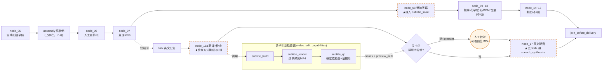

# video-agent-kit 九个 MCP 工具迁移至 auto-video-editor 设计文档

> **文档性质**：设计执行计划，供直接编码参考
> **前置文档**：`docs/integration/video-agent-kit集成auto-video-editor设计执行计划.md`（398行，已完成，把 video-edit-assembly 技能自带的 8 个工具搬进了 `assembly_capabilities/`）
> **核验方式**：本文档不是只读上传的分析文档就下笔——`auto-video-editor` 与 `video-agent-kit`（`0.4.3` 子目录）两个仓库均已在本次会话中 `git clone` 到本地，下文所有文件路径、行号、函数签名均为直接读取源码所得，不是转述。
> **范围**：只覆盖《video-agent-kit_MCP使用场景与迁移分析》一文中点名的 9 个工具，不重新讨论已经完成的 8 个 assembly 工具，也不涉及 video-edit-agent/video-edit-assembly 技能层本身。

---

## 1. 背景：这 9 个工具是什么

用户上传的分析文档标题写"7 个重点工具"，但正文 7.4 节又建议把字幕能力拆成 4 个动作（scout / build / render / validate）。7 减去被拆的 1 个（subtitle_build 单独算，不动）、加上拆出来的 2 个新动作，得到的正是"9 个"：

| 序号 | 工具名（文档写法） | 源码真实函数 | 所在文件 |
|---|---|---|---|
| 1 | video_watch_segment | `video_watch_segment` | `mcp/ve_tools/video_observe.py:117` |
| 2 | video_read_frames | `video_read_frames` | `mcp/ve_tools/frame_zoom.py:143` |
| 3 | video_basic_operation | `video_basic_operation` | `mcp/ve_tools/basic_ops.py:32` |
| 4 | subtitle_scout | `subtitle_scout` | `mcp/ve_tools/subtitle_scout.py:46` |
| 5 | subtitle_build | `subtitle_build` | `mcp/ve_tools/subtitle.py:95` |
| 6 | subtitle_render（7.4节建议拆出） | `subtitle_render` | `mcp/ve_tools/subtitle.py:971` |
| 7 | subtitle_validate（7.4节建议拆出） | **`subtitle_qc`** | `mcp/ve_tools/subtitle.py:1090` |
| 8 | speech_synthesize | `speech_synthesize` | `mcp/ve_tools/tts.py:51` |
| 9 | tts_generate | `tts_generate` | `mcp/ve_tools/tts.py:46` |

**需要先纠正一处**：上传文档 7.4 节把 QC 动作叫作 `subtitle_validate`，这是作者自己起的名字，不是源码里的真名。核实 `mcp/video_edit_server.py` 的工具注册表后确认，第 50 行注册的真实工具名是 **`subtitle_qc`**，第 49 行是 `subtitle_render`——两个都是 video-agent-kit 已经注册好的真实 MCP 工具，不是凭空提议的新功能。本文档后续统一用 `subtitle_qc`，不再用 `subtitle_validate` 这个名字，避免和实际代码对不上。

---

## 2. 和已完成的 assembly 集成是什么关系

先说清楚边界，避免看起来像重复工作。

`docs/integration/video-agent-kit集成auto-video-editor设计执行计划.md` 已经把 video-edit-assembly 技能自带的 8 个工具搬进了 `assembly_capabilities/`：`inspect_media`、`analyze_media`、`speech_transcribe`、`video_ingest`、`validate_timeline`、`timeline_diff`、`render_preview`、`qc_preview`。这 8 个工具目前已经接成 `graph.py` 里 `node_05_generate_draft` 之后、`node_06_human_reorder` 之前的一条常开质检链（`assembly_discover_and_probe → assembly_asr_and_visual_observe → assembly_build_timeline → assembly_validate_render_qc → assembly_repair_loop/assembly_write_report`）。

本文档要迁移的 9 个工具，和上面 8 个**没有一个是同一个函数**。这不是巧合——那份设计执行计划的 §3.2 明确写了排除理由：

> `video_watch_segment`（局部重看片段）—— 只属于 video-edit-agent，assembly 自己的 8 个工具里没有它
> `video_basic_operation`（裁剪/拼接/变速等底层操作）—— 同上，assembly 不需要
> `speech_synthesize`/`tts_generate`（配音合成）—— 同上；且 auto-video-editor 已有自己的英文配音节点（第 17 步）

也就是说：**这次的 9 个工具，正是上次那份计划刻意划出去、留到"以后再说"的那批**。`video_read_frames`、`subtitle_scout`、`subtitle_build`、`subtitle_render`、`subtitle_qc` 五个则是 assembly 8 工具清单里从未出现过的（assembly 只用到了粗粒度的 `video_ingest` 看一遍全片，没有细粒度重看/字幕这类能力）。本次实测全仓库 `grep`，除了 `assembly_capabilities/visual_observe.py` 里能搜到 `watch_segment`/`read_frames` 这两个词（是 `video_ingest` 内部用到的相似概念，不是同一个函数），其余 7 个工具的名字在 `auto-video-editor` 现有代码里一次都没出现过——确认是纯增量，不存在覆盖或冲突。

---

## 3. auto-video-editor 里已经有的 3 个天然接入点

这不是凭空找地方塞代码，而是这 3 处本来就等着这批能力：

### 3.1 `nodes/node_17_inject_english_tts_stub.py` —— 目前是假的
文件名自己写着 `_stub`。内容是硬编码写一段静音 WAV 占位，代码注释原话是"用户决策(2026-09-09)：Week 5 继续 stub，真实 FireRedTTS2 合成 + 动态变速补偿留 Week 6+"。第 17 步"注入英文 AI 配音"从项目立项第一天的技术选型表（`AI视频剪辑自动化工作流开发执行计划.md` 第 2 节）起就写的是 FireRedTTS2，从没变过——只是一直没人写。`speech_synthesize`/`tts_generate` 正好是这个缺口的候选实现骨架。

### 3.2 `nodes/node_08_add_subtitles.py` —— 字幕样式写死
该节点调用 `jy_common/asr_client.py::call_asr2s()` 拿到 ASR 分句结果后，字幕样式（字号、描边、位置）是一份固定字典，不管视频内容是什么都用同一套参数。`subtitle_scout` 恰好做的就是"看一眼画面再决定字号/安全区/是否要避开人脸"，能把这份写死的样式换成随内容变化的推荐值。

### 3.3 关卡③排版检查 —— 只测宽度，没有真渲染
`nodes/node_16_translate_subtitles.py` 里的 `validate_layout()` 函数（第 67 行起）用 PIL 的 `_try_load_font` + `font.getbbox()` 逐句测量像素宽度，超过 `max_width_px` 就报 `overflow`。`nodes/node_16a_translate_and_check.py` 第 81-82 行固定传 `font_path=None, font_size=48`，检查结果写进 `state["layout_issues"]`/`["layout_issues_detected"]`，触发关卡③人工校对。

这套检查只能测"宽不宽"，测不出字幕重叠、阅读速度是否跟得上、有没有整句丢字，更拿不出一段真烧好字幕的视频给人看。`subtitle_render` + `subtitle_qc` 组合起来正好能把这三个短板全部补上，而且 `layout_issues`/`layout_issues_detected` 这两个 state 字段的名字和用途完全不用改——只换检查方式，不换 LangGraph 那层的契约，关卡③的 `interrupt()`/`Command(resume=True)` 逻辑零改动。

---

## 4. 目录规划

沿用上一份设计执行计划定下的命名习惯（新分类目录和现有目录对称命名）：

```
auto-video-editor/
├── assembly_capabilities/          # 已存在，8个assembly工具
├── storyline_capabilities/         # 已存在，FireRed节点解耦搬运
├── video_edit_capabilities/        # ★本文档新增
│   ├── run_context.py              # 不新建，直接 import assembly_capabilities.run_context
│   ├── result.py                   # 不新建，直接 import assembly_capabilities.result
│   ├── visual_evidence.py          # video_watch_segment + video_read_frames
│   ├── media_operation.py          # video_basic_operation（8个子操作）
│   ├── subtitle_style.py           # scout/build/render 共用的样式解析辅助（源码里叫 sty，具体模块名见第12节待核实项）
│   ├── subtitle_scout.py
│   ├── subtitle_build.py
│   ├── subtitle_render.py
│   ├── subtitle_qc.py
│   └── speech_synthesize.py        # speech_synthesize + tts_generate 别名
├── nodes/
│   ├── assembly/                   # 已存在
│   ├── storyline/                  # 已存在
│   ├── node_17_inject_english_tts.py   # 由 node_17_inject_english_tts_stub.py 改造（去掉_stub后缀）
│   ├── node_08_add_subtitles.py        # 原地增强，不新建文件
│   ├── node_16_translate_subtitles.py  # 原地增强 validate_layout 的调用方式
│   └── node_16a_translate_and_check.py # 原地增强
└── jy_common/
    └── tts_client.py                # ★新增：FireRedTTS2 真实直连客户端（对称 asr_client.py）
```

`video_edit_capabilities/` 里的 `run_context.py`/`result.py` 特意写"不新建"——这是第 6 节决策②要讲的复用原则，先在目录树里标出来避免有人真的去复制一份。

---

## 5. 架构决策

### 决策① 只搬函数逻辑，不搬协议依赖

`video-agent-kit` 里每个工具函数签名都是 `def xxx(args: dict, ctx: RunContext) -> ToolResult`——这是 MCP Server 的调用约定，不是 auto-video-editor 的 LangGraph 节点约定。迁移时只把函数体里的**业务逻辑**搬过来，包一层普通 Python 函数（或者直接在 LangGraph 节点里当内部工具函数调用），不引入 `mcp` 包依赖，不起 MCP Server 进程。这条和上一份 assembly 设计执行计划的决策①完全一致，这次沿用，不重新论证。

### 决策② RunContext / ToolResult 直接复用，不重复搬运

9 个工具全部依赖 `ctx: RunContext` 和返回值 `ToolResult`，而这两样东西 assembly 集成时已经搬过一次（`assembly_capabilities/run_context.py`、`result.py`）。9 个工具里没有一个用到比 assembly 已裁剪版本更多的 `RunContext` 能力——除了下面决策③要单独处理的一个例外。所以 `video_edit_capabilities/` 下的这两个文件**只做 `from assembly_capabilities.run_context import RunContext` 转发**，不复制代码，避免两份 `RunContext` 以后修改时逐渐分叉。

### 决策③ `video_watch_segment` 的隐式"上一次视频"分支必须禁用，调用方一律显式传 `video_path`

源码里 `video_watch_segment`（`video_observe.py:117`）有两条分支：

```python
if args.get("video_path"):
    video_path = ctx.resolve(args["video_path"])
    ...
else:
    if ctx.active_video_path is None:
        return ToolResult(text="[ERROR] No active video. Call video_ingest first, or pass video_path.")
    if ctx.active_video_changed():
        return ToolResult(text="[ERROR] active video file changed since it was last observed. ...")
    src = ctx.active_video_path
    ...
```

第二条分支依赖 `ctx.active_video_path`/`ctx.active_video_changed()`——这是"同一个 RunContext 里之前调用过 `video_ingest`，记得上次看的是哪个视频"这类跨调用记忆。assembly 集成决策④已经明确写了："每个节点各自 `RunContext(session_kind='pipeline')` 新建一份，不做跨节点的记忆复用"，裁剪版 `RunContext` 本来就没有实现 `active_video_path` 这套状态。

**后果**：任何调用 `video_watch_segment` 的地方，`args` 里必须显式带 `video_path`，不能指望它"记得上次看的视频"。这不是 bug，是裁剪版 RunContext 的既定设计，写文档里明说，避免以后有人调用时省略 `video_path` 却拿到一句看不懂的报错。`video_read_frames`（`frame_zoom.py:143`）没有这个隐式分支，`video_path` 本来就是必填项，不受影响。

### 决策④ 字幕四件套只做"质检 + 预览"，不替代剪映草稿作为交付主链

这是最容易走偏的一点，必须先定死。`subtitle_build`/`subtitle_render` 的下游格式是 `cues[] + style{}` 的 JSON，最终经 `ffmpeg` + `libass` **烧录**进一个独立 MP4——这条链路和剪映的 `draft_content.json` / `materials.texts[]` 是两套完全不同的字幕表达方式，互不兼容。

本项目从立项文档起就反复确认过一件事：最终成片必须走剪映（为了 VIP 特效/转场/贴纸/音乐库和客户端自动导出），`draft_ops/`、`node_08`~`node_17` 这一整条链的产物才是真正交付的东西。`FireRed-OpenStoryline剪映技能清单与auto-video-editor实现对照报告.md` 也印证过同一原则："auto-video-editor 走的是 LangGraph 全自动节点 + 本地处理，其余工具仅做参考"。

所以本次迁移的字幕四个工具，定位是：
- `subtitle_scout`：只产出"样式推荐值"（字号/安全区/是否避人脸），喂给 `node_08` 的样式字典做参考，不接管字幕轨道本身的写入。
- `subtitle_build`/`subtitle_render`/`subtitle_qc`：只用于关卡③——产出一段独立的、字幕烧录好的预览 MP4 + 一份结构化 QC 问题列表，给人工审核参考着看；**审核通过与否仍然只影响 `state["layout_issues_detected"]`，不会去改剪映草稿里的字幕内容**。真正下发到剪映草稿的字幕文本/时间轴，仍然由 `node_08`/`node_16` 现有逻辑负责写入 `materials.texts[]`。

一句话：这四个工具在这里干的是"拍一张预览照片给人看清楚"，不是"接管拍板权"。

### 决策⑤ `speech_synthesize` 只搬"骨架"，不搬"后端"——真正干活的部分要换成 FireRedTTS2 直连

这一条是本次核实里发现的最容易踩的坑，必须重点说明。

`speech_synthesize`（`tts.py:51`）内部的重试/多供应商候选骨架（`provider_candidates()`、指数退避重试、`allowed_providers`/`preferred_provider` 校验）是通用、自包含的纯 Python 逻辑，这部分可以直接搬。但它真正"发出合成请求"这一步，`call_tts_provider()`（`tts.py:119`）里是三选一：

```python
def call_tts_provider(provider, args, ctx, *, sample_mode):
    if provider == "cloud_tts":
        if remote_speech_configured():
            return remote_speech_synthesize(args, ctx, sample_mode=sample_mode)   # ① 走 VE_SPEECH_MCP_URL 远程代理
        from .zcode_speech import zcode_speech_status
        if zcode_speech_status(ctx)["available"]:
            return zcode_official_speech_synthesize(args, ctx, sample_mode=sample_mode)  # ② ZCode 平台官方通道
        return genericize_result(cloud_tts_tts(args, ctx, sample_mode=sample_mode))  # ③ 通用直连 HTTP（唯一自包含的实现）
```

①②两条都不是自包含代码——①依赖 `VE_SPEECH_MCP_URL` 指向的一个外部"语音 MCP"服务，②依赖 ZCode 这个特定平台的宿主注入身份认证，两者都会引入"auto-video-editor 要跑通配音必须先连另一个平台/服务"这种隐性依赖，和本项目"完全解耦、可独立启动"的既定要求（见 `openstoryline-decoupling.md` 同一原则）直接冲突。

③ `cloud_tts_tts()`（`tts.py:463`）是唯一真正自包含、直连 HTTP 的实现，靠 `cloud_tts_config()`（`tts.py:405`）读取几个环境变量：`VE_SPEECH_TTS_ENDPOINT`/`VE_CLOUD_TTS_ENDPOINT`、`VE_SPEECH_TTS_API_KEY`/`VE_CLOUD_TTS_API_KEY`、`VE_SPEECH_TTS_MODEL`/`VE_CLOUD_TTS_MODEL`、`VE_SPEECH_TTS_VOICE`/`VE_CLOUD_TTS_VOICE`。但它的函数原文档字符串自己写得很清楚：

> "this backend ships no endpoint and no model default: it is a legacy escape hatch for deployments that bring their own speech service, and the kit does not name or presume a vendor."

也就是说，它请求体的字段形状（`speech_rate`/`pitch_rate`/固定的 `/api/v3/tts/create` 路径）是照着某个通用商用云厂商的接口约定写的，**不是** FireRedTTS2 的原生 API 形状（FireRedTTS2 是自托管模型服务，接口约定和商用云 TTS 完全不同）。

**决定**：`video_edit_capabilities/speech_synthesize.py` 只搬 `speech_synthesize`/`tts_generate` 的入参校验 + 多候选重试骨架 + `ToolResult` 返回结构，`call_tts_provider()` 里三选一的分支全部去掉，换成唯一一条：直接调用新增的 `jy_common/tts_client.py::call_firered_tts()`（和 ASR 的 `jy_common/asr_client.py::call_asr2s()` 走同一种"本地服务 HTTP 直连"模式，不走 MCP，也不走商用云厂商网关）。

### 决策⑥ 字幕相关三个新增第三方依赖，其中一个有特殊安装方式

`subtitle_build`（中文分词断句）、`subtitle_scout`（镜头切分辅助）、字体校验分别依赖 `jieba`、`scenedetect`、`fonttools`，这三个包 assembly 迁移时没有引入过（assembly 8 个工具只用到 `opencv-python-headless`/`numpy`/`pillow`/`requests`）。具体版本和安装方式见第 9 节，这里先记一条最容易漏掉的坑：`scenedetect` **必须加 `--no-deps` 安装**，否则它会把自带的 GUI 版 `opencv-python` 一起装上，和已经装好的 `opencv-python-headless`（assembly 依赖）打架。

---

## 6. 逐工具迁移规格

以下 9 张表，每张给出：真实签名、核心依赖、迁移到 auto-video-editor 后的改动点、调用者。

### 6.1 video_watch_segment

| 项 | 内容 |
|---|---|
| 源码位置 | `mcp/ve_tools/video_observe.py:117` |
| 签名 | `def video_watch_segment(args: dict, ctx: RunContext) -> ToolResult` |
| 一句话功能 | 对一段视频里指定的时间窗口，用比常规更高的帧率重新采样，返回带时间戳的图片序列——用于"这一段感觉不对，再仔细看一遍"这类场景 |
| 依赖 | 无第三方包，纯 `ctx.resolve()` + 帧提取（走 `video_ingest` 同一套抽帧底层） |
| 迁移改动 | 去掉"隐式上次视频"分支（决策③），只保留显式 `video_path` 分支；文件落到 `video_edit_capabilities/visual_evidence.py` |
| 调用者 | `nodes/assembly/node_repair_loop.py`（可选增强，见第 10 节阶段五）——QC 发现问题时用它对可疑片段做更细粒度复核，比现在只靠 `qc_preview` 的证据更精确 |

迁移后的骨架（决策③已把隐式分支删掉，只保留显式 `video_path`）：

```python
# video_edit_capabilities/visual_evidence.py（节选之一）
from assembly_capabilities.run_context import RunContext
from assembly_capabilities.result import ToolResult

def video_watch_segment(args: dict, ctx: RunContext) -> ToolResult:
    """按窗口重采样看细节。args.video_path 必填——裁剪版RunContext没有active_video_path，
    不支持"沿用上次视频"这条隐式路径（决策③）。"""
    video_path = args.get("video_path")
    if not video_path:
        return ToolResult(text="[ERROR] video_path is required (implicit active-video path removed)")
    resolved = ctx.resolve(video_path)
    windows = parse_watch_segments(args)   # 单窗口/批量窗口两种入参形状，原样搬运
    fps = args.get("fps")
    if not fps:
        return ToolResult(text="[ERROR] fps is required")
    return _sample_windows_at_fps(resolved, windows, fps)   # 抽帧实现原样搬运
```

### 6.2 video_read_frames

| 项 | 内容 |
|---|---|
| 源码位置 | `mcp/ve_tools/frame_zoom.py:143` |
| 签名 | `def video_read_frames(args: dict, ctx: RunContext) -> ToolResult` |
| 一句话功能 | 按给定时间戳列表返回原始分辨率的单帧图片（可选区域裁剪 + 1.0~4.0 倍放大），用于看清楚画面里的文字/细节，不是用于判断内容 |
| 依赖 | `PIL`（已装） |
| 迁移改动 | 无隐式分支问题（`video_path` 本来就是必填），基本原样搬运；落到 `video_edit_capabilities/visual_evidence.py` |
| 调用者 | 同 6.1，与 `video_watch_segment` 配套使用：先用 `video_watch_segment` 扫一遍找到可疑时刻，再用 `video_read_frames` 放大看清细节 |

```python
# video_edit_capabilities/visual_evidence.py（节选之二，与6.1同文件）
def video_read_frames(args: dict, ctx: RunContext) -> ToolResult:
    video_path = ctx.resolve(args["video_path"])   # 必填，原样搬运
    timestamps = args["timestamps"]
    region = args.get("region")                    # 可选：{"x","y","w","h"} 区域裁剪
    upscale = min(max(args.get("upscale", 1.0), 1.0), 4.0)   # 源码本身限定 1.0~4.0
    max_width = args.get("max_width")
    max_frames = args.get("max_frames")
    return _extract_original_res_frames(video_path, timestamps, region, upscale, max_width, max_frames)
```

### 6.3 video_basic_operation

| 项 | 内容 |
|---|---|
| 源码位置 | `mcp/ve_tools/basic_ops.py:32`（操作枚举在 18 行：`VIDEO_OPERATIONS = {trim, splice, speed, crop, scale, rotate, flip, freeze_frame}`） |
| 签名 | `def video_basic_operation(args: dict, ctx: RunContext) -> ToolResult` |
| 一句话功能 | 8 种底层 ffmpeg 操作的统一入口：裁剪时间段、拼接、变速（0.1~8.0倍）、裁切画面、缩放、旋转、翻转、抽取定格帧 |
| 依赖 | `ffmpeg`/`ffprobe` 在 PATH 里（`shutil.which` 检查，缺失直接报错，不静默跳过） |
| 迁移改动 | 原样搬运，8 个子操作分派逻辑不用动；落到 `video_edit_capabilities/media_operation.py`。源码自带"输出必须有视频流"的兜底校验（防止 ffmpeg 退出码 0 但产出空文件），这条防御逻辑一并保留 |
| 调用者 | 通用工具函数，暂不强制接入现有 17 步任何一步（本次范围只做到"可用"，不做到"处处替换"）。可选场景：`node_05_generate_draft` 前置的素材归一化（比如混剪素材宽高比不一致时先统一裁切），留作阶段五可选项 |

```python
# video_edit_capabilities/media_operation.py（节选）
import shutil
from assembly_capabilities.run_context import RunContext
from assembly_capabilities.result import ToolResult

VIDEO_OPERATIONS = {"trim", "splice", "speed", "crop", "scale", "rotate", "flip", "freeze_frame"}
SPEED_MIN, SPEED_MAX = 0.1, 8.0   # 与源码保持一致的变速倍数边界

def video_basic_operation(args: dict, ctx: RunContext) -> ToolResult:
    op = args.get("operation")
    if op not in VIDEO_OPERATIONS:
        return ToolResult(text=f"[ERROR] unsupported operation: {op}, expected one of {sorted(VIDEO_OPERATIONS)}")
    if shutil.which("ffmpeg") is None or shutil.which("ffprobe") is None:
        return ToolResult(text="[ERROR] ffmpeg/ffprobe not found on PATH")
    result = _OPERATION_DISPATCH[op](args, ctx)   # 8个子操作各自实现原样搬运，不动分派表
    if not _output_has_video_stream(result):      # 防止 ffmpeg 退出码0但产出空文件
        return ToolResult(text="[ERROR] output produced no video stream")
    return result
```

### 6.4 subtitle_scout

| 项 | 内容 |
|---|---|
| 源码位置 | `mcp/ve_tools/subtitle_scout.py:46` |
| 签名 | `def subtitle_scout(args: dict, ctx: RunContext) -> ToolResult` |
| 一句话功能 | 探测镜头切点（`detect_shot_cuts`）、在安全时刻采样画面帧，结合画布尺寸解析出一套字幕样式推荐（字号、安全区带宽 `caption_band`、颜色对比度） |
| 依赖 | `ffmpeg`/`ffprobe`；`scenedetect`（镜头切点检测） |
| 迁移改动 | 原样搬运核心逻辑；返回的样式推荐需要转换成 `node_08` 现有样式字典能识别的字段名（阶段二编码时对照，见第 7.1 节） |
| 调用者 | `nodes/node_08_add_subtitles.py`（新增调用点，见 7.1 节） |

```python
# video_edit_capabilities/subtitle_scout.py（节选）
def subtitle_scout(args: dict, ctx: RunContext) -> ToolResult:
    video_path = ctx.resolve(args["video_path"])
    width, height = _probe_dimensions(video_path)          # ffprobe
    shot_cuts = detect_shot_cuts(video_path)                # 依赖 scenedetect
    sample_frames = pick_safe_sample_timestamps(shot_cuts)
    style = subtitle_style.resolve_style(
        preset=args.get("preset"),
        overrides=args.get("style_overrides"),
        video_width=width, video_height=height,
    )
    return ToolResult(text="ok", data={"style": style, "shot_cuts": shot_cuts})
```

### 6.5 subtitle_build

| 项 | 内容 |
|---|---|
| 源码位置 | `mcp/ve_tools/subtitle.py:95` |
| 签名 | `def subtitle_build(args: dict, ctx: RunContext) -> ToolResult` |
| 一句话功能 | 输入 ASR 转写文本 + 原视频，产出断句合理的字幕 cue 列表（`cues[]`）。断句用动态规划综合考虑标点、中文分词词边界（`jieba`）、阅读速度，并把时间戳吸附到音频里的真实停顿处 |
| 依赖 | `ffmpeg`/`ffprobe`；`jieba`（中文分词）；`fonttools`（预渲染前的字体覆盖度检查，提前拦下"渲染出来是方块字"的问题） |
| 迁移改动 | 这里必须**同时传 `transcript_path` 和 `video_path`**——源码写得很明确："cue timing is snapped to pauses in its audio"，只给转写文本、不给视频，断句时机会不准。落到 `video_edit_capabilities/subtitle_build.py` |
| 调用者 | 关卡③预览链路的第一步（见 7.2 节），输入用 `state["subtitle_segments_en"]`（英文分支已有的翻译结果）转成 `transcript_path` |

```python
# video_edit_capabilities/subtitle_build.py（节选）
def subtitle_build(args: dict, ctx: RunContext) -> ToolResult:
    transcript_path = args.get("transcript_path")
    video_path = args.get("video_path")
    if not transcript_path or not video_path:
        return ToolResult(text="[ERROR] both transcript_path and video_path are required")
    segments = _load_transcript_segments(transcript_path)
    audio_pauses = _detect_audio_pauses(ctx.resolve(video_path))       # 用于吸附断句时机
    cues = _segment_into_cues(segments, audio_pauses, use_jieba=True)  # 依赖 jieba 分词
    uncovered = _check_font_coverage(cues, args.get("style_overrides"))  # 依赖 fonttools
    if uncovered:
        return ToolResult(text=f"[ERROR] font missing glyphs: {uncovered}")
    return ToolResult(text="ok", data={"subtitles_path": _write_subtitles_json(cues)})
```

### 6.6 subtitle_render

| 项 | 内容 |
|---|---|
| 源码位置 | `mcp/ve_tools/subtitle.py:971` |
| 签名 | `def subtitle_render(args: dict, ctx: RunContext) -> ToolResult` |
| 一句话功能 | 把 `subtitle_build` 产出的 `cues[]+style{}` 重新生成 ASS 字幕文件，用 ffmpeg 烧录（`mode="burn"`）或软字幕（`mode="soft"`）或两者都要（`mode="both"`）合成到视频里 |
| 依赖 | `ffmpeg` **必须带 libass**（`subtitles`/`ass` 滤镜）——源码原话"Fail fast: subtitle burn-in needs libass; minimal builds drop it and only fail after reading the whole video"，也就是说这个检查是特意提前做的，不是可选优化 |
| 迁移改动 | 原样搬运；输出路径默认 `out/subtitled.mp4`，落到 `video_edit_capabilities/subtitle_render.py` |
| 调用者 | 关卡③预览链路第二步：产出人工能直接打开看的预览视频 |

```python
# video_edit_capabilities/subtitle_render.py（节选）
import subprocess

def _ffmpeg_has_libass() -> bool:
    out = subprocess.run(["ffmpeg", "-hide_banner", "-filters"], capture_output=True, text=True).stdout
    return " subtitles " in out or " ass " in out

def subtitle_render(args: dict, ctx: RunContext) -> ToolResult:
    if not _ffmpeg_has_libass():   # 提前失败，别等整段视频读完再报错（源码同款设计）
        return ToolResult(text="[ERROR] ffmpeg build lacks libass; cannot burn subtitles")
    video_path = ctx.resolve(args["video_path"])
    cues, style = _load_subtitles_json(args["subtitles_path"])
    ass_path = subtitle_style.build_ass(cues, style)        # 从cue列表重新生成ASS
    mode = args.get("mode", "burn")                          # burn / soft / both
    output_path = _run_ffmpeg(video_path, ass_path, mode, args.get("output_path", "out/subtitled.mp4"))
    return ToolResult(text="ok", data={"output_path": output_path})
```

### 6.7 subtitle_qc（即上传文档误写的 subtitle_validate）

| 项 | 内容 |
|---|---|
| 源码位置 | `mcp/ve_tools/subtitle.py:1090` |
| 签名 | `def subtitle_qc(args: dict, ctx: RunContext) -> ToolResult` |
| 一句话功能 | 两部分检查：确定性部分（重叠、超宽、阅读速度、掉字，用 `check_cues()`/`check_coverage()` 代码直接判断）+ 证据部分（从烧录后的视频里抽最多 `max_evidence_frames`（默认 12）张关键帧，交给人/Agent 看"文字是不是压到了嘴、背景对比度够不够"这类代码判断不了的问题）。函数自己的注释说得很实在："The checks catch what a machine can prove... the evidence frames exist because the rest... can only be settled by looking, and the agent has to look" |
| 依赖 | 无新增（复用 `subtitle_render` 已经产出的视频） |
| 迁移改动 | 原样搬运；`check_cues`/`check_coverage`/`sample_cue_frames` 三个辅助函数一起搬。落到 `video_edit_capabilities/subtitle_qc.py` |
| 调用者 | 关卡③预览链路第三步，**替换**掉 `node_16_translate_subtitles.py::validate_layout()` 现在只测宽度的做法（见 7.2 节） |

```python
# video_edit_capabilities/subtitle_qc.py（节选）
def subtitle_qc(args: dict, ctx: RunContext) -> ToolResult:
    subtitles_path = args.get("subtitles_path")
    if not subtitles_path:
        return ToolResult(text="[ERROR] subtitles_path is required")
    cues, _style = _load_subtitles_json(subtitles_path)
    issues = check_cues(cues) + check_coverage(cues)    # 确定性检查：重叠/超宽/语速/掉字
    evidence_frames: list[str] = []
    if args.get("video_path"):                          # video_path可选，但给了才能产出证据帧
        evidence_frames = sample_cue_frames(
            ctx.resolve(args["video_path"]), cues,
            max_frames=args.get("max_evidence_frames", 12),
        )
    return ToolResult(text="ok", data={"issues": issues, "evidence_frames": evidence_frames})
```

### 6.8 speech_synthesize

| 项 | 内容 |
|---|---|
| 源码位置 | `mcp/ve_tools/tts.py:51` |
| 签名 | `def speech_synthesize(args: dict, ctx: RunContext) -> ToolResult` |
| 一句话功能 | 文本转语音的统一入口：入参校验（text/speed/allowed_providers/retries/retry_backoff_seconds）+ 多供应商候选 + 指数退避重试（`TTS_RETRY_BACKOFF_SECONDS=3.0`，重试间隔 `retry_backoff * 2^attempt`） |
| 依赖 | 决策⑤已定：真正发请求的部分换成 `jy_common/tts_client.py` |
| 迁移改动 | 见决策⑤，`call_tts_provider()` 三选一分支整体替换为一条 FireRedTTS2 直连；落到 `video_edit_capabilities/speech_synthesize.py` |
| 调用者 | `nodes/node_17_inject_english_tts.py`（决策⑤替换 stub，见 7.3 节） |

```python
# video_edit_capabilities/speech_synthesize.py（节选，决策⑤：三选一已换成一条直连）
import time
from assembly_capabilities.run_context import RunContext
from assembly_capabilities.result import ToolResult

TTS_RETRY_BACKOFF_SECONDS = 3.0   # 与源码同值

def speech_synthesize(args: dict, ctx: RunContext) -> ToolResult:
    text = (args.get("text") or "").strip()
    if not text:
        return ToolResult(text="[ERROR] text is required")
    candidates = provider_candidates(args.get("preferred_provider"), args.get("allowed_providers") or [])
    retries = int(args.get("retries", 2))
    backoff = float(args.get("retry_backoff_seconds", TTS_RETRY_BACKOFF_SECONDS))
    last_error = "no provider candidates"
    for provider in candidates:
        for attempt in range(retries + 1):
            try:
                from jy_common.tts_client import call_firered_tts   # 唯一的真实后端调用
                audio = call_firered_tts(text, voice=args.get("voice"), speed=args.get("speed"))
                return ToolResult(text="ok", data=audio)
            except Exception as exc:                                 # 网络/服务端异常统一进重试
                last_error = f"{provider}: {exc}"
                if attempt < retries:
                    time.sleep(backoff * (2 ** attempt))             # 指数退避，与源码一致
    return ToolResult(text=f"[ERROR] all TTS attempts failed: {last_error}")
```

### 6.9 tts_generate

| 项 | 内容 |
|---|---|
| 源码位置 | `mcp/ve_tools/tts.py:46` |
| 签名 | `def tts_generate(args: dict, ctx: RunContext) -> ToolResult` |
| 一句话功能 | 纯兼容别名，源码原文只有一行：`return speech_synthesize(args, ctx)`，函数自带文档字符串写"Compatibility wrapper. Paid TTS is exposed as speech_synthesize." |
| 依赖 | 无 |
| 迁移改动 | 同样只搬一行；不要在 auto-video-editor 里把它实现成第二份独立逻辑——这是上传文档自己也提醒过的点（"不要同时迁移成两个独立实现"），源码本身就是这么写的，直接照抄这个"零逻辑"的转发关系即可 |
| 调用者 | 无直接调用者，仅作为对外接口兼容层保留 |

```python
# video_edit_capabilities/speech_synthesize.py（节选，与6.8同文件）
def tts_generate(args: dict, ctx: RunContext) -> ToolResult:
    """纯兼容别名：照抄源码的零逻辑转发关系，不要另起第二份实现。"""
    return speech_synthesize(args, ctx)
```

### 6.10 单元测试设计一览

每个迁移过来的函数都要有对应单测，覆盖"正常路径 + 该工具最容易出问题的边界"。下表是测试用例清单（`tests/unit/test_video_edit_capabilities/` 目录下按工具分文件）：

| 工具 | 用例 | 预期 |
|---|---|---|
| `video_watch_segment` | 不传 `video_path` | 返回 `[ERROR] video_path is required`，不抛异常（决策③的显式断言） |
| `video_watch_segment` | 传合法 `video_path` + 单个窗口 + `fps=4` | 返回按窗口采样的图片路径列表，时间戳单调递增 |
| `video_read_frames` | `upscale=10.0`（越界） | 被限制到 4.0，不报错 |
| `video_read_frames` | 传 `region` 区域裁剪 | 输出图片尺寸等于 `region` 乘以放大倍数 |
| `video_basic_operation` | `operation="unknown"` | 返回 `[ERROR] unsupported operation` |
| `video_basic_operation` | mock `shutil.which` 返回 `None` | 返回 `[ERROR] ffmpeg/ffprobe not found on PATH`，不静默跳过 |
| `video_basic_operation` | `operation="speed"` 且倍数 `0.05`（低于 0.1 下限） | 被拒绝并给出边界提示 |
| `subtitle_scout` | 一段 30 秒真实测试视频 | 返回 `style` 字典（含字号/安全区）与非空 `shot_cuts` 列表 |
| `subtitle_scout` | mock `scenedetect` 导入失败 | 返回 `[ERROR]`，不抛异常（供 `node_08` 走降级分支） |
| `subtitle_build` | 只传 `transcript_path` 不传 `video_path` | 返回 `[ERROR] both ... required` |
| `subtitle_build` | 含中文长句的转写文本 | 断句不切断 `jieba` 词边界，单条 cue 不超过最大字数 |
| `subtitle_render` | mock `_ffmpeg_has_libass` 返回 `False` | 立即返回 `[ERROR]`，不启动任何 ffmpeg 子进程（验证"提前失败"） |
| `subtitle_render` | `mode="burn"` 真实渲染 | 产出 `out/subtitled.mp4`，文件大小 > 0，含视频流 |
| `subtitle_qc` | 人为构造两条时间重叠的 cue | `issues` 里含 `overlap` 类问题 |
| `subtitle_qc` | 不传 `video_path` | 只返回确定性检查结果，`evidence_frames` 为空列表，不报错 |
| `speech_synthesize` | 空 `text` | 返回 `[ERROR] text is required` |
| `speech_synthesize` | mock `call_firered_tts` 前两次抛异常、第三次成功 | 最终成功，累计 `time.sleep` 调用次数为 2，退避间隔按 `3s→6s` 递增 |
| `speech_synthesize` | mock `call_firered_tts` 始终抛异常 | 返回 `[ERROR] all TTS attempts failed`，含最后一次错误信息 |
| `tts_generate` | 任意合法入参 | 返回值与直接调用 `speech_synthesize` 完全一致（验证零逻辑转发） |

---

## 7. 现有节点改动清单

先用一张图看清这批改动落在 17 步流程的哪几个位置（虚线框是本次要动的三处，其余节点一律不动）：



要点：关卡③的 `interrupt()`/`Command(resume=True)` 机制、`layout_issues`/`layout_issues_detected` 两个 state 字段完全不变——图里只有"检查怎么做"变了，"检查完怎么走"没变。

### 7.1 `nodes/node_08_add_subtitles.py`——接入 subtitle_scout

改动方式：在现有固定样式字典赋值之前，插入一次 `subtitle_scout` 调用；调用失败（比如 ffmpeg 缺失/环境未装 `scenedetect`）时**必须**退回原来写死的默认值，不能让这一步的失败拖垮整条主链——这是本项目从节点 6/13 起一直坚持的降级原则。

```python
# nodes/node_08_add_subtitles.py（改动片段，原逻辑不动，仅在样式赋值前插入）
from video_edit_capabilities.subtitle_scout import subtitle_scout

def _resolve_subtitle_style(video_path: str) -> dict:
    """能拿到内容感知的样式就用，拿不到就退回写死的默认值。"""
    default_style = _DEFAULT_STYLE_DICT  # 原有写死的那份，保留作为兜底
    try:
        result = subtitle_scout({"video_path": video_path}, ctx=_new_run_context())
        if result.text.startswith("[ERROR]"):
            return default_style
        return {**default_style, **result.data.get("style", {})}
    except Exception:
        return default_style
```

### 7.2 关卡③预览链路——`subtitle_build` → `subtitle_render` → `subtitle_qc` 替换 `validate_layout`

`nodes/node_16_translate_subtitles.py` 里的 `validate_layout()` 不删除（保留作为 `subtitle_qc` 不可用时的降级兜底，同样遵循"能力增强、原逻辑留作兜底"的一贯做法），但 `nodes/node_16a_translate_and_check.py` 的调用点改为优先走新链路：

```python
# nodes/node_16a_translate_and_check.py（改动片段）
from video_edit_capabilities.subtitle_build import subtitle_build
from video_edit_capabilities.subtitle_render import subtitle_render
from video_edit_capabilities.subtitle_qc import subtitle_qc

def _check_layout_via_subtitle_qc(transcript_path: str, video_path: str) -> tuple[list[dict], str | None]:
    """返回 (issues, preview_video_path)；任一步失败则返回 (None, None) 交给旧的 validate_layout 兜底。"""
    build_result = subtitle_build({"transcript_path": transcript_path, "video_path": video_path}, ctx=_new_run_context())
    if build_result.text.startswith("[ERROR]"):
        return None, None
    subtitles_path = build_result.data["subtitles_path"]

    render_result = subtitle_render({"video_path": video_path, "subtitles_path": subtitles_path, "mode": "burn"}, ctx=_new_run_context())
    if render_result.text.startswith("[ERROR]"):
        return None, None
    preview_path = render_result.data["output_path"]

    qc_result = subtitle_qc({"subtitles_path": subtitles_path, "video_path": preview_path}, ctx=_new_run_context())
    if qc_result.text.startswith("[ERROR]"):
        return None, None
    return qc_result.data.get("issues", []), preview_path
```

`state["layout_issues"]`/`state["layout_issues_detected"]` 两个字段名和用途完全不变，关卡③的 `interrupt()`/`Command(resume=True)` 逻辑零改动——只是这两个字段现在由更强的检查产出，并且人工在关卡③收到的通知里能多附一个 `preview_path`，直接打开看烧录好的字幕效果，不用再只读一份文字问题列表。

### 7.3 `nodes/node_17_inject_english_tts_stub.py` → `node_17_inject_english_tts.py`

去掉文件名的 `_stub` 后缀，`graph.py` 里的 `add_node`/`add_edge` 引用同步改名。函数体从"写死静音 WAV"换成真实调用：

```python
# nodes/node_17_inject_english_tts.py（新文件，替代原 stub）
from video_edit_capabilities.speech_synthesize import speech_synthesize

def node_17_inject_english_tts(state: WorkflowState) -> dict:
    text = state["subtitle_segments_en_text"]  # 已有的英文文案拼接结果
    result = speech_synthesize(
        {"text": text, "preferred_provider": "cloud_tts", "retries": 3},
        ctx=_new_run_context(),
    )
    if result.text.startswith("[ERROR]"):
        state["error_log"].append(f"[node_17] TTS失败: {result.text}")
        return {**state, "en_dub_audio_path": None}  # 失败仍要让主链能继续到交付，不阻塞
    return {**state, "en_dub_audio_path": result.data["audio_path"]}
```

**动态变速补偿**（音画时长差异）本次不在范围内——`speech_synthesize` 只负责"合成出声音"，时长和镜头对不上时怎么调整播放速度，仍然是《AI视频剪辑自动化工作流开发执行计划.md》第 11 节风险清单里"步骤17音画时长不匹配"这条老风险的后续工作，不要和这次的迁移范围混在一起。

### 7.4 `jy_common/tts_client.py`（新增文件）

对称 `jy_common/asr_client.py::call_asr2s()` 的既有模式：

```python
# jy_common/tts_client.py
import os
import requests

FIRERED_TTS_ENDPOINT = os.environ.get("FIRERED_TTS_ENDPOINT", "http://127.0.0.1:8010/synthesize")
# 端口8010为占位示例（紧邻ASR的8009），实际端口需在第1周环境验证阶段核实FireRedTTS2真实部署配置

def call_firered_tts(text: str, *, voice: str | None = None, speed: float | None = None) -> dict:
    """直连本地FireRedTTS2服务，返回 {"audio_path": str, "duration_ms": int}。
    不经过任何MCP协议、不依赖video-agent-kit的云端TTS网关。
    """
    resp = requests.post(
        FIRERED_TTS_ENDPOINT,
        json={"text": text, "voice": voice, "speed": speed},
        timeout=120,
    )
    resp.raise_for_status()
    return resp.json()
```

`video_edit_capabilities/speech_synthesize.py` 里 `call_tts_provider()` 的三选一分支，替换成唯一一行调用 `call_firered_tts()`，其余重试/候选骨架不动。

---

## 8. 依赖新增清单

| 包 | 版本要求 | 安装方式 | 用途 |
|---|---|---|---|
| `jieba` | `>=0.42.1` | 常规 `pip install` | `subtitle_build` 中文分词断句 |
| `fonttools` | `>=4.40.0` | 常规 `pip install` | 字幕烧录前的字体 cmap 覆盖度校验（拦截"渲染出方块字"） |
| `scenedetect` | `>=0.6` | **必须 `--no-deps`**：`pip install --no-deps "scenedetect>=0.6"` | `subtitle_scout` 镜头切点检测 |

`scenedetect` 不加 `--no-deps` 会连带装上 GUI 版 `opencv-python`，和 assembly 集成已经装好的 `opencv-python-headless` 冲突——这条来自 video-agent-kit 自己 `README.md` 第 71/76 行的明确提醒，不是本文档猜测。

环境检查还需要新增一项：**ffmpeg 必须编译时带 `libass`**（`subtitles`/`ass` 滤镜），否则 `subtitle_render` 会在处理完整段视频、耗时几分钟之后才报错，而不是提前拦截。这一点和本项目此前实际踩过的 `docs/ffprobe找不到问题排查与修复.md` 是同一类"PATH/编译选项在这台 Windows 机器上没配对"的问题，建议第 1 周环境验证清单里加一条 `ffmpeg -filters | findstr subtitles` 检查项。

新增环境变量（`jy_common/tts_client.py` 用）：`FIRERED_TTS_ENDPOINT`（默认 `http://127.0.0.1:8010/synthesize`，真实端口待核实）。

---

## 9. 分阶段实施计划

### 9.1 阶段总览

| 阶段 | 内容 | 交付物 |
|---|---|---|
| 阶段一（约1天） | 装好 3 个新依赖（含 `scenedetect --no-deps`）；核实 ffmpeg 是否带 libass；把 `video_watch_segment`/`video_read_frames`/`video_basic_operation` 三个纯函数搬进 `video_edit_capabilities/`（决策③的隐式分支删除） | 环境核查清单、3 个已搬运文件 + 各自单测 |
| 阶段二（约1.5天） | 搬 `subtitle_scout`/`subtitle_build`/`subtitle_render`/`subtitle_qc`；确认 `sty`（样式辅助模块）的真实文件名并一并搬运（见第 12 节待核实项） | 4 个字幕工具文件 + 单测；一段真实视频跑通 scout→build→render→qc 全链路 |
| 阶段三（约1天） | 新增 `jy_common/tts_client.py`；改造 `speech_synthesize`（决策⑤三选一→一条直连） | TTS 客户端 + 改造后的 speech_synthesize，含 mock FireRedTTS2 服务的集成测试 |
| 阶段四（约1.5天） | 落地 7.1（node_08 接入 scout）、7.2（关卡③替换检查方式）、7.3（node_17 去 stub） 三处节点改动 | 改动后的 3 个节点文件；`layout_issues`/`layout_issues_detected` 字段契约不变的回归测试 |
| 阶段五（约1天，可选） | `node_repair_loop` 接入 `video_watch_segment`/`video_read_frames` 做更精细复核；`node_05` 前置接入 `video_basic_operation` 做素材归一化 | 视团队优先级决定是否本次一并做 |
| 阶段六（约0.5天） | 端到端联调：一条真实素材跑通全 17 步 + 新增质检链，人工确认关卡③能收到预览视频 | 联调报告 |

### 9.2 按天排期（单人，不含阶段五）

| 天 | 上午 | 下午 |
|---|---|---|
| Day 1 | 装 `jieba`/`fonttools`/`scenedetect --no-deps`；跑 `ffmpeg -filters` 核实 libass；建 `video_edit_capabilities/` 目录与 `__init__.py` | 搬 `video_watch_segment`/`video_read_frames`（`visual_evidence.py`）+ `video_basic_operation`（`media_operation.py`），写 6.10 节对应单测 |
| Day 2 | 定位 `sty` 模块真实文件名并搬运（`subtitle_style.py`）；搬 `subtitle_scout` | 搬 `subtitle_build`；跑通"转写文本 + 真实视频 → cue 列表"最小路径 |
| Day 3 | 搬 `subtitle_render`、`subtitle_qc`；一段真实视频跑通 scout→build→render→qc 全链路 | 补字幕四工具的单测；检查烧录出来的预览视频画面是否正常 |
| Day 4 | 用 FireRedTTS2 真实服务跑一次最小请求，核对响应字段；写 `jy_common/tts_client.py` | 改造 `speech_synthesize`（三选一→一条直连）+ `tts_generate` 别名，含 mock 服务的重试单测 |
| Day 5 | 改 `node_08`（接入 scout + 降级兜底）；改 `node_16a`（qc 链 + 旧检查兜底） | 改 `node_17`（去 stub）+ `graph.py` 引用改名；跑既有 `tests/unit`、`tests/integration` 全量回归 |
| Day 6 上午 | 端到端联调：一条真实素材跑完全流程，重点确认关卡③通知里带预览视频路径 | 写联调报告；核对第 11 节验收清单逐项打勾 |

### 9.3 每阶段结束时的验证命令

所有命令均为 PowerShell 语法（本项目运行环境为 Windows）：

```powershell
# 阶段一：依赖与 libass 检查
python -c "import jieba, fontTools, scenedetect; print('deps ok')"
ffmpeg -hide_banner -filters | findstr /i "subtitles ass"

# 阶段一：三个纯函数单测
python -m pytest tests\unit\test_video_edit_capabilities\test_visual_evidence.py -v
python -m pytest tests\unit\test_video_edit_capabilities\test_media_operation.py -v

# 阶段二：字幕四工具单测
python -m pytest tests\unit\test_video_edit_capabilities\ -k "subtitle" -v

# 阶段三：TTS 骨架单测（含重试退避）
python -m pytest tests\unit\test_video_edit_capabilities\test_speech_synthesize.py -v

# 阶段四：既有回归（关卡①②③ interrupt/resume 必须全绿）
python -m pytest tests\integration\test_interrupt_resume.py -v
python -m pytest tests\unit -v
```

若中文路径出现乱码，先执行 UTF-8 修复（沿用本项目已有做法，见 `/windows-shell-commands`）：

```powershell
[Console]::OutputEncoding = [System.Text.UTF8Encoding]::new($false)
$env:PYTHONUTF8 = '1'
```

---

## 10. 风险清单

| 风险 | 影响 | 缓解方案 |
|---|---|---|
| FireRedTTS2 真实接口形状未核实 | `jy_common/tts_client.py` 的请求/响应字段可能要改 | 阶段三开工前先用真实 FireRedTTS2 服务跑一次最小请求，核对返回字段，而不是假设 |
| `sty` 样式辅助模块具体文件名未定 | `subtitle_scout`/`subtitle_build`/`subtitle_render` 都 import 了它，搬运时可能漏搬 | 阶段二开工第一步先 `grep -rn "import.*as sty\|from .* import.*sty" mcp/ve_tools/subtitle*.py` 确认真实模块路径 |
| ffmpeg 不带 libass | `subtitle_render` 会跑到最后一步才报错，浪费一整段视频的处理时间 | 阶段一环境核查明确加入 libass 滤镜检查项（第 8 节） |
| `scenedetect` 误装成默认版（不带 `--no-deps`） | 拉入 GUI 版 opencv，和 assembly 依赖的 headless 版冲突 | 阶段一安装脚本里显式写 `--no-deps`，代码走查确认 |
| node_17 从 stub 换成真实调用后，音画时长不匹配 | 英文配音可能比镜头长/短，这是迁移范围外的老问题（主计划文档第 11 节风险清单已有） | 本次不解决，仅确保 TTS 合成本身能跑通；时长补偿留给后续单独排期 |
| `video_basic_operation`/`video_watch_segment` 暂不强制接入现有节点 | 迁移完但没人用，价值打折扣 | 阶段五列为可选项，不阻塞本次交付；后续按需再排期 |

---

## 11. 验收标准

- [ ] 3 个新依赖装好，`scenedetect` 确认走了 `--no-deps`
- [ ] `ffmpeg -filters` 确认带 `subtitles`/`ass`
- [ ] `video_watch_segment`/`video_read_frames`/`video_basic_operation` 三个函数在 `video_edit_capabilities/` 下可独立调用并通过单测（含决策③的显式 `video_path` 校验）
- [ ] 用一段真实视频跑通 `subtitle_scout → subtitle_build → subtitle_render → subtitle_qc` 全链路，产出预览 MP4 和结构化 QC 问题列表
- [ ] `node_08_add_subtitles.py` 接入 `subtitle_scout` 后，ffmpeg/scenedetect 缺失时能正确退回原有默认样式，不中断主链
- [ ] 关卡③走新检查链路后，`state["layout_issues"]`/`["layout_issues_detected"]` 字段契约不变，`interrupt()`/`Command(resume=True)` 回归测试通过
- [ ] `node_17_inject_english_tts.py` 能通过 `jy_common/tts_client.py` 真实调用 FireRedTTS2（或至少 mock 服务）产出音频文件，不再写静音占位
- [ ] `tts_generate` 确认只是一行转发，没有被实现成第二份独立逻辑

---

## 12. 待核实清单（累加进第 2 周 PoC 或阶段一开工前）

1. FireRedTTS2 真实部署的接口形状（HTTP 路径/请求体字段/端口）—— `FIRERED_TTS_ENDPOINT` 目前是占位值
2. `subtitle_scout`/`subtitle_build`/`subtitle_render` 共用的样式辅助模块（源码里以 `sty` 为别名导入）的真实文件名
3. `subtitle_scout` 返回的样式推荐字段名，和 `node_08` 现有样式字典字段名之间的映射关系（阶段二编码时对照确认，本文档 7.1 节的示例代码字段名为占位）

---

## 13. 参考来源

- 上传文档：《video-agent-kit_MCP使用场景与迁移分析》
- `wayyet/auto-video-editor`（本次会话 `git clone` 直接核实）：
  - `docs/integration/video-agent-kit集成auto-video-editor设计执行计划.md`（398 行，assembly 8 工具集成方案，决策①②④⑤已引用）
  - `assembly_capabilities/run_context.py`、`result.py`、`visual_observe.py`（746行）、`media_probe.py`（377行）、`qc_preview.py`（481行）
  - `nodes/node_08_add_subtitles.py`、`node_16_translate_subtitles.py`、`node_16a_translate_and_check.py`、`node_17_inject_english_tts_stub.py`
  - `jy_common/asr_client.py`（TTS 客户端对称参考）
- `wayyet/video-agent-kit`（`0.4.3` 子目录，本次会话 `git clone` 直接核实）：
  - `mcp/video_edit_server.py`（工具注册表，第 49/50 行 `subtitle_render`/`subtitle_qc`）
  - `mcp/ve_tools/video_observe.py:117`、`frame_zoom.py:143`、`basic_ops.py:18,32`、`subtitle_scout.py:46`、`subtitle.py:95,971,1090`、`tts.py:46,51,119,405,432,463`
  - `requirements.txt:10,12,14-16`、`README.md:67-76`、`skills/env-setup/scripts/env_doctor.py:380-415`

---

*本文档由 AI 辅助生成，第 12 节"待核实清单"建议在阶段一开工前逐项确认，尤其是 FireRedTTS2 真实接口形状——这一项目前只有占位值，没有真实验证。*
