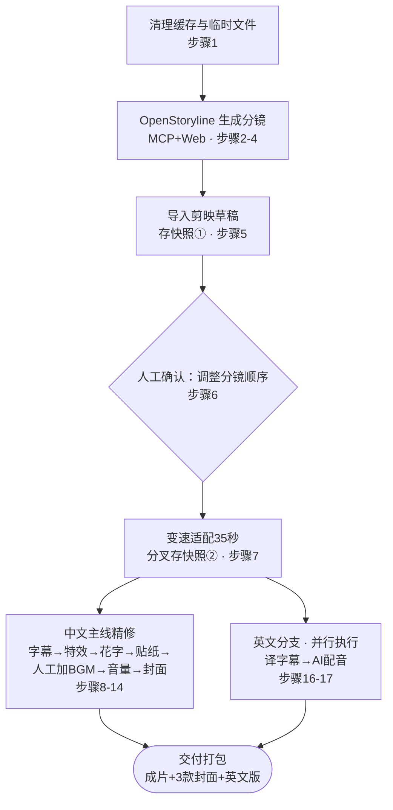

# AI 视频剪辑工作流编排设计（RFC）

**状态**：Draft，待架构评审
**范围**：将现有 17 步视频剪辑技能流程（FireRed-OpenStoryline 分镜 → 剪映草稿精修 → 中英文双语交付）从"人工触发、单次执行"演进为可复用、可观测、可规模化的编排系统
**关联草稿**：`吉隆坡武吉免登_纯视频` 及其中文主线成片

---

## 摘要

现有 17 步流程已经拆解成职责清晰的 skill，编排层要解决的其实是四件事：把隐藏的依赖和分叉显式化、分清哪些步骤必须过剪映 GUI、选一个能扛住"人工关卡可能等好几天"这种场景的执行底座、让失败可回滚可审计。本文档给出结构分析、执行计划、技术选型（含理由）、风险清单和分阶段落地建议，供评审讨论。

---

## 1. 背景：现状工作流（As-Is）

1. 参考 `缓存与临时文件分析` 文档，清理旧缓存文件。Skill：`/kuaishou-clean-cache`
2. 启动 FireRed-OpenStoryline 的 MCP、网页程序。Skill：`/openstoryline-launcher`
3. 用 VS Code 的 Edge 插件启动 OpenStoryline
4. 用 FireRed-OpenStoryline 导入视频，输出分镜头
5. 导入最新草稿到剪映。Skill：`/openstoryline-to-jianying`
6. 等待人工调整视频草稿顺序
7. 常规变速或曲线变速，使每个分镜时间轴不超过 35 秒。Skill：`/jianying-speed-fit-35s`
8. 给剪映草稿加字幕。Skill：`/jianying-add-subtitles`
9. 剪映 VIP 加转场、特效。Skill：`/jianying-inject-fx`
10. 剪映 VIP 修改字幕花字和动画。Skill：`/jianying-inject-text-fx`
11. 剪映 VIP 字幕加贴纸。Skill：`/jianying-inject-tts-sticker`
12. 等待人工用剪映 VIP 加 BGM
13. 剪映 VIP 调整音量（**当前无对应 skill**）
14. 剪映 VIP 制作 9:16 竖屏封面，本地制作 16:9 和 4:3 横屏封面。Skill：`/jianying-make-cover`
15. 根据中文竖屏封面，本地把底图改为英文版 9:16 封面，全程不进剪映。Skill：`/jianying-cover-localize-en`
16. 对草稿 `吉隆坡武吉免登_纯视频` 译制英文字幕，需要 GUI 操作时停下通知。Skill：`/jianying-translate-subtitles`
17. 注入英文 AI 配音，不加贴纸。Skill：`/jianying-inject-english-tts`

---

## 2. 依赖关系与关键结构分析

表面上是一条直线，但认真读依赖关系，有几处需要显式化：

- **三个人工关卡**：步骤 6（强制）、步骤 12（强制）、步骤 16（条件——"如需在剪映界面操作再通知"，说明当前设计已默认优先走无人值守路径）。
- **一个未写出的分叉点**：步骤 16 操作的是 `吉隆坡武吉免登_纯视频` 这个独立草稿，但 17 步里没有一步明确"从主线复制出这份纯视频草稿"。本文档的假设是：分叉必须发生在步骤 7（变速适配 35 秒）**之后**、步骤 8（加中文字幕）**之前**——这样中英文两个版本的节奏、时长完全一致，中文字幕又还没烘焙进画面。建议把这个复制动作显式加成"步骤 7.5"。
- **剪映 VIP 的 GUI 边界**：步骤 9、10、11、12、13，以及 14 的一部分都标注"使用剪映 VIP"，大概率意味着这些操作依赖账号付费权益解析的云端素材（花字 / 贴纸 / 转场 / BGM 库），无法只靠手写 JSON 伪造。步骤 16 那句"如需在剪映界面操作，停下来通知我"印证了同一件事：设计者已经清楚"能走草稿文件"和"必须走 GUI"是两类完全不同的操作。
- **一个缺口**：步骤 13（调整音量 VIP）没有对应的 skill，其余 VIP 步骤都有。
- **步骤 3 的设计意图待确认**：结合 OpenStoryline 自身强调透明、人机协同、会话式精修的定位，用 VS Code Edge 插件打开一个可见浏览器，更可能是为了让人工在分镜生成过程中实时观察、随时插话，而不只是"起个浏览器"。需要确认这一判断是否成立（见附录 A）。

### 2.1 17 步分类表

| # | 步骤 | 自动化方式 | 依赖 / 备注 |
|---|---|---|---|
| 1 | 清理缓存 | Skill（headless 脚本） | 无外部依赖，适合做幂等的 pre-flight |
| 2 | 启动 OpenStoryline MCP+Web | Skill + 进程 / 容器管理 | 建议用官方 Docker 镜像替代裸 `python -m` 进程 |
| 3 | VS Code Edge 打开 OpenStoryline Web | 浏览器自动化（IDE 耦合） | 若为人工可视化介入，合理；若只是起浏览器，Playwright 更适合无人值守 |
| 4 | 导入视频 → 输出分镜 | MCP 工具调用 | 依赖 2、3 暴露的 MCP server |
| 5 | 导入草稿到剪映 | Skill（直接写 draft_content.json） | 建议在此打**快照①** |
| 6 | 人工调整分镜顺序 | 人工关卡（强制） | 完成前无法确定最终时长，必须在 7 之前 |
| 7 | 变速适配 35 秒 | Skill（draft JSON 运算 + 回写） | **建议在此后打快照②并分叉出"纯视频"草稿** |
| 8 | 加中文字幕 | Skill（draft JSON） | 中文主线分支起点 |
| 9 | 转场 / 特效 VIP | 剪映 VIP GUI 自动化 | 依赖 8 |
| 10 | 花字 / 动画 VIP | 剪映 VIP GUI 自动化 | 依赖 9 |
| 11 | 贴纸 VIP | 剪映 VIP GUI 自动化 | 依赖 10 |
| 12 | 人工加 BGM VIP | 人工关卡（强制） | 依赖 11 |
| 13 | 调整音量 VIP | 剪映 VIP GUI 自动化 | **无对应 skill，需要补** |
| 14 | 制作封面（VIP 做 9:16 + 本地 16:9/4:3） | 混合（VIP GUI + 本地脚本） | 依赖 13；若封面不含 fx/BGM 效果，理论上可提前并行做 |
| 15 | 英文封面本地化 | 本地脚本（纯图像处理） | 依赖 14 产出的中文 9:16 封面 |
| 16 | "纯视频"草稿字幕译英 | Skill（draft JSON，必要时人工） | 依赖 7 的快照②，**与 8-14 完全并行，不依赖它们** |
| 17 | 注入英文 AI 配音（不加贴纸） | Skill（TTS + draft JSON） | 依赖 16 |

---

## 3. 编排执行计划

阶段 0-3 是单线（缓存清理 → 分镜生成 → 导入剪映 → 人工排序 → 变速适配），没有并行空间，因为每一步都真实依赖前一步的产出。真正值得抓的是分叉之后：**英文分支（16-17）一旦拿到快照②就和中文主线的 8-14 完全解耦**，可以整段并行跑，不需要等中文那边做完转场、贴纸、BGM、音量、封面才开始翻译字幕。步骤 15 依赖 14 的中文封面产出没法更早，但本身很快，不会成为瓶颈。

---

## 4. 技术选型与理由

### 4.1 宏观编排引擎：Temporal

对比 LangGraph、n8n、Dify、Airflow/Prefect 之后，推荐 Temporal：

- 人工关卡等待时长不确定——步骤 6 可能 5 分钟调完顺序，步骤 12 的 BGM 人工挑选可能拖几天。Temporal 的 workflow 可以被持久化挂起，靠外部 Signal 恢复，挂起期间不占任何计算资源，也没有"会话超时"顾虑；轮询或占着一个 LLM 会话等人工回复都不划算。
- pyJianYingDraft 的官方说明很明确：Windows 下支持包括草稿生成、模板模式和自动导出在内的全部功能，Linux/macOS 只支持草稿生成和模板模式，不支持自动导出，生成的草稿仍需要用 Windows 版剪映导出。这意味着凡是要碰剪映桌面客户端本体的活（导出、大概率还有 VIP 花字 / 贴纸 / 转场的云端资源解析），都得跑在 Windows worker 上；其余（MCP 调用、图像处理、字幕翻译）可以留在 Linux 容器里。Temporal 按 task queue 路由到不同 worker 池的机制，正好对应这个"按操作系统拆分执行环境"的真实约束，LangGraph、n8n 这类更偏单一运行时的编排工具做起来会别扭得多。
- 这条流水线本质是"通用业务流程 + 桌面 GUI 自动化"，LLM 推理只是其中几步，不是全部。LangGraph 的心智模型是"LLM 调用组成的图"，硬塞进 GUI 自动化和长时间人工挂起是逆着框架设计意图；Temporal 把"workflow 即代码"作为通用心智模型，LLM 调用只是其中一种普通 activity，更贴合。
- n8n、Dify 在简单 API 编排上很好用，但复杂分支 + 代码级可测试性 + 多语言 worker 这几件事上会比较吃力，可视化 JSON 流程也不利于常规代码评审。

不是说 LangGraph 没用——**在 Temporal 某个 activity 内部**，如果某一步需要多轮推理 / 工具调用（比如 OpenStoryline 自己的 agent 循环），用 LangGraph 或直接调它的 MCP server 都合适，只是它不该是最外层的编排者。

### 4.2 技能执行层：内容决策与机械执行分离

每个碰草稿的 skill 建议拆成两半：一半是 LLM 输出结构化决策（例如"00:03-00:07 插入推近转场，花字用 XX 样式"，输出成 JSON 过 schema 校验），另一半是纯代码函数，吃这份 JSON 去改 draft_content.json 或驱动 GUI。好处：

- "AI 部分"可单独换模型、调 prompt，不牵动文件操作代码；
- "机械部分"可脱离 LLM 单独做单元测试和重放调试，省钱省时间；
- 天然有审计轨迹——AI 决策了什么、实际写盘了什么是两条分开可查的记录。

若这些内容决策类调用要接现有 AI Gateway，建议直接走 Semantic Kernel 那层连接器，复用已有的 cost-aware / capability-based 路由和 Polly v8 熔断，不用为这一条流水线单独接一遍调用链路。

### 4.3 剪映草稿操作层：pyJianYingDraft 为主，GUI 兜底

能不进 GUI 就不进 GUI。pyJianYingDraft 覆盖草稿生成、模板复制、转场、花字、淡入淡出这些基础操作，步骤 5、7、8 都可以走这条路径直接读写 draft_content.json / draft_meta_info.json。真正必须碰 GUI 的是 9-13、14 的 VIP 部分——大概率涉及需要账号权益解析的云端资源 ID，硬写 JSON 要么没权益、要么 ID 对不上。pyJianYingDraft 自带的 `Jianying_controller().export_draft()` 本身就是靠剪映客户端提前打开并停在草稿列表页来触发导出的，换句话说，"绕不开 GUI"这件事，官方生态自己也是这么处理的，不是没有更好的办法。

真正要碰 GUI 时，优先探测控件树自动化（类似 UIAutomation / FlaUI），探测不到再退化到视觉坐标驱动（截图 + 定位再点击）。剪映这类消费级 App 大概率是自绘 UI，标准可访问性树未必完整，视觉兜底建议提前预留。另需注意业务风险：高频、模式化的 GUI 点击容易触发消费级 App 的风控，建议 GUI 步骤之间加随机延时，避免固定间隔的机械循环。

### 4.4 OpenStoryline 接入层：官方 Docker 镜像 + 重新评估 VS Code 依赖

官方提供预构建的 Docker 镜像，容器起来后直接在 7860 端口访问 Web 界面，MCP server 也在同一套部署里，用这个替代裸 python 进程会更适合放进编排系统——启动、健康检查、重启都能用标准容器工具管，不用操心 Python 虚拟环境。

步骤 3 的 VS Code Edge 插件，取决于意图：如果是想让人工实时看 OpenStoryline 的会话式分镜过程，保留一个真实浏览器 session 是对的，只是不一定非挂在 VS Code 的 Edge 工具上，可以是编排系统主动推给人工的一个独立链接。如果纯粹是"起个浏览器"，Playwright 做有头 / 无头自动化更适合无人值守，不需要 IDE 进程常驻。

另需记录：OpenStoryline 自身支持把一次完整编辑流程存成可复用的 Skill，换素材直接套用就能复刻同一种风格，用于批量创作。若未来要把这条流水线跑成"每周产出 N 条同风格短视频"，这个原生能力比在外部重新拼一套批处理逻辑省事得多，建议留到规模化阶段直接复用。

### 4.5 人工介入层

- **现状**：这套 skill 本身就是给 Claude Code 这类 agent 用的，人工关卡最自然的实现就是对话轮次——做完一段就停下来等下一句话，零额外基础设施。
- **规模化以后**：换成 IM 机器人（企业微信 / 飞书）推送草稿预览 + 按钮，人工点击触发 Webhook，Webhook 再给 Temporal 发 Signal 恢复流程，不需要有人盯着对话窗口。

### 4.6 状态与版本管理

每个关键节点对草稿目录做一次 git commit（导入后、人工排序后、变速后……），免费拿到回滚和 diff。"纯视频"分支的分叉点，直接对应 pyJianYingDraft 的模板复制式操作——有现成 API 可落地这一步，不是抽象的"要做版本管理"。

### 4.7 可观测性

若 sandbox session → Kafka → Doris 的埋点链路已经在跑，这里每个 activity 的开始 / 结束 / 耗时 / 是否触发了 GUI，可以复用同一条链路，用 draft_id / video_id 类似的维度聚合，不用重新搭一套监控。GUI 相关步骤（9-14）建议额外存操作前后截图，纯文本日志基本定位不了是哪个控件出的问题。

### 4.8 技术选型汇总

| 层 | 选型 | 为什么 |
|---|---|---|
| 宏观编排引擎 | Temporal（Python + .NET SDK） | Signal 做人工关卡、task queue 分 Windows/Linux worker 池、挂起不占算力 |
| 决策执行体 | Claude Agent 作为 Temporal Activity，经现有 AI Gateway 调用 | 复用已有 cost-aware 路由和熔断，不单独接链路 |
| 剪映草稿操作 | pyJianYingDraft 直接读写 draft_content.json | 比 GUI 快、可单元测试；VIP / 导出仍需 Windows + 客户端 |
| VIP GUI 兜底 | Windows 专属 worker 池，控件树优先，视觉坐标兜底 | 官方生态本身也是这么处理导出的 |
| OpenStoryline 接入 | 官方 Docker 镜像；Web UI 仅在需要人工观察时保留 | 不必绑定 VS Code 进程，容器更适合编排 |
| 人工关卡 | 现状用对话轮次；规模化换 IM 机器人 + Webhook → Signal | 等待时长不确定，轮询 / 占会话都不划算 |
| 版本快照 | 每节点 git commit；分叉用模板复制 | 免费拿回滚、diff、审计 |
| 可观测性 | 复用现有 Kafka → Doris 链路，按 draft_id 聚合 | 不重复造监控 |

---

## 5. 风险与待补全事项

| 风险 / 缺口 | 影响 | 建议 |
|---|---|---|
| 步骤 13 缺对应 skill | 与其余 VIP 步骤不对齐，流程会在此中断 | 补一个 `/jianying-adjust-volume` 类 skill |
| "纯视频"分支分叉时机隐含未显式化 | 依赖默契，容易被后续修改破坏 | 显式加"步骤 7.5：分叉纯视频草稿" |
| 英文分支封面范围未定义 | 若最终需要英文横版封面会临时补救 | 参照步骤 14 思路补一条本地生成分支 |
| 剪映消费级 App 的风控 / ToS 边界 | 高频固定节奏的 GUI 自动化可能触发异常检测 | GUI 步骤间加随机延时，保留人工确认作为过渡期缓冲 |
| 剪映导出 / 部分 VIP 操作 Windows-only | 影响 worker 池部署形态 | 单独维护 Windows worker 池，与 Linux 池按 task queue 区分 |

---

## 6. 分阶段落地建议

1. **现在**：不改动任何东西，用 Claude Code / Cowork 会话按顺序把 17 个 skill 跑一遍，人工关卡就是对话暂停——这本来就是这套 skill 设计的初衷，跑通它比先搭 Temporal 更重要。
2. **接下来**：把机械性的 skill（草稿 JSON 读写、变速计算、封面本地生成）抽成独立、有单元测试的脚本 / CLI，跟"要不要调用 LLM"这件事解耦，方便调试复用。
3. **规模化产出多条视频时**：把整体包进 Temporal，人工关卡换成 IM + Signal，OpenStoryline 的 Editing Skill Archiving 拿来复用剪辑风格——这时候才真正称得上是一条"数字员工"视频生产线。

---

## 附录 A：待评审确认的开放问题

- 是否现阶段就投入 Temporal，还是先跑通交互式版本、积累实际耗时数据再决定？
- 步骤 3 的 VS Code Edge 依赖是否为有意为之的人工可视化设计？如果是，是否需要固定为独立链接而非绑定 IDE 进程？
- 英文分支是否需要横版封面（16:9 / 4:3）？
- 步骤 13 的 skill 由谁负责补齐，接口约定是否与步骤 9-12 一致？

## 附录 B：参考资料

- FireRed-OpenStoryline（开源仓库，架构、MCP server、Docker 镜像、Claude Code Skills 集成说明）：https://github.com/FireRedTeam/FireRed-OpenStoryline
- pyJianYingDraft（剪映草稿 Python 操作库，含 Windows/Linux 能力差异说明）：https://github.com/GuanYixuan/pyJianYingDraft
